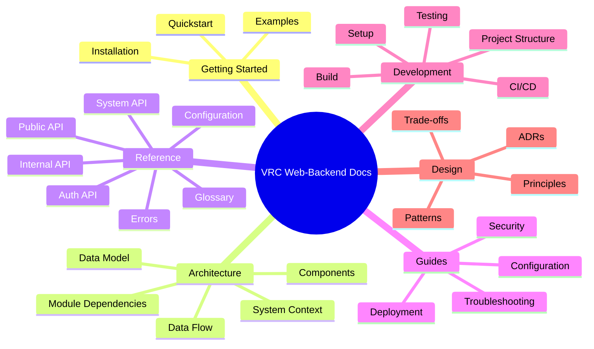

# VRC Web-Backend Documentation

Welcome to the VRC Web-Backend documentation. This is the central navigation hub for all project documentation.

> **Language / 言語**: [English](../en/README.md) | [日本語](../ja/README.md)

## Quick Links

| I want to... | Go to |
|---|---|
| Get started quickly | [Quickstart](getting-started/quickstart.md) |
| Understand the architecture | [Architecture Overview](architecture/README.md) |
| Look up an API endpoint | [API Reference](reference/api/README.md) |
| Configure the project | [Configuration Guide](guides/configuration.md) |
| Set up for development | [Dev Setup](development/setup.md) |
| Understand a design decision | [ADRs](design/adr/README.md) |
| Troubleshoot a problem | [Troubleshooting](guides/troubleshooting.md) |

## Documentation Map

## All Documents

### Getting Started

| Document | Audience | Description |
|----------|----------|-------------|
| [Installation](getting-started/installation.md) | Users/Ops | All installation methods (Docker, manual) |
| [Quickstart](getting-started/quickstart.md) | Users | Get running in under 5 minutes |
| [Examples](getting-started/examples.md) | Users/Devs | Curated API usage examples |

### Architecture

| Document | Audience | Description |
|----------|----------|-------------|
| [Overview](architecture/README.md) | All | High-level system design with diagrams |
| [System Context](architecture/system-context.md) | Architects | C4 Level 1: system in its environment |
| [Components](architecture/components.md) | Devs | Internal component breakdown |
| [Data Model](architecture/data-model.md) | Devs | Database schema with ER diagram |
| [Data Flow](architecture/data-flow.md) | Devs | How data moves through the system |
| [Module Dependencies](architecture/module-dependency.md) | Devs | Module relationship graph |
| [State Management](architecture/state-management.md) | Devs | State machines and lifecycles |

### Reference

| Document | Audience | Description |
|----------|----------|-------------|
| [API Overview](reference/api/README.md) | Devs | API conventions and overview |
| [Public API](reference/api/public.md) | Devs | Unauthenticated public endpoints |
| [Internal API](reference/api/internal.md) | Devs | Session-authenticated endpoints |
| [System API](reference/api/system.md) | Devs | Machine-to-machine endpoints |
| [Auth API](reference/api/auth.md) | Devs | Discord OAuth2 flow |
| [Admin API](reference/api/admin.md) | Devs | Administration endpoints |
| [Configuration](reference/configuration.md) | Ops | Every config option |
| [Environment Variables](reference/environment.md) | Ops | All env vars |
| [Errors](reference/errors.md) | All | Error codes and resolutions |
| [Glossary](reference/glossary.md) | All | Domain terminology |

### Guides

| Document | Audience | Description |
|----------|----------|-------------|
| [Configuration](guides/configuration.md) | Users/Ops | How to configure the system |
| [Deployment](guides/deployment.md) | Ops | Production deployment procedures |
| [Troubleshooting](guides/troubleshooting.md) | All | Common problems and fixes |
| [Security](guides/security.md) | Ops/Security | Security model and hardening |

### Development

| Document | Audience | Description |
|----------|----------|-------------|
| [Dev Setup](development/setup.md) | Contributors | Development environment setup |
| [Build](development/build.md) | Contributors | Build system guide |
| [Testing](development/testing.md) | Contributors | Test strategy and execution |
| [CI/CD](development/ci-cd.md) | Contributors | Pipeline documentation |
| [Project Structure](development/project-structure.md) | Contributors | Codebase navigation |

### Design

| Document | Audience | Description |
|----------|----------|-------------|
| [Principles](design/principles.md) | All | Design philosophy |
| [Patterns](design/patterns.md) | Devs | Patterns used and rationale |
| [Trade-offs](design/trade-offs.md) | Architects | Key trade-offs documented |
| [ADRs](design/adr/README.md) | All | Architecture decisions log |

## See Also

- [Root README](../../README.md)
- [Contributing Guide](../../CONTRIBUTING.md)
- [System Specification](../../specs/README.md)
- [Security Policy](../../SECURITY.md)
