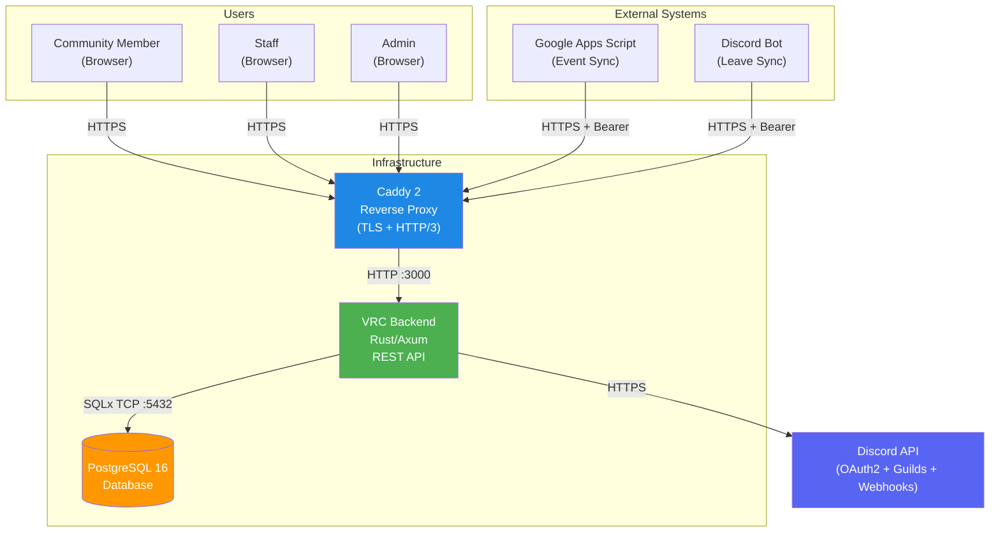
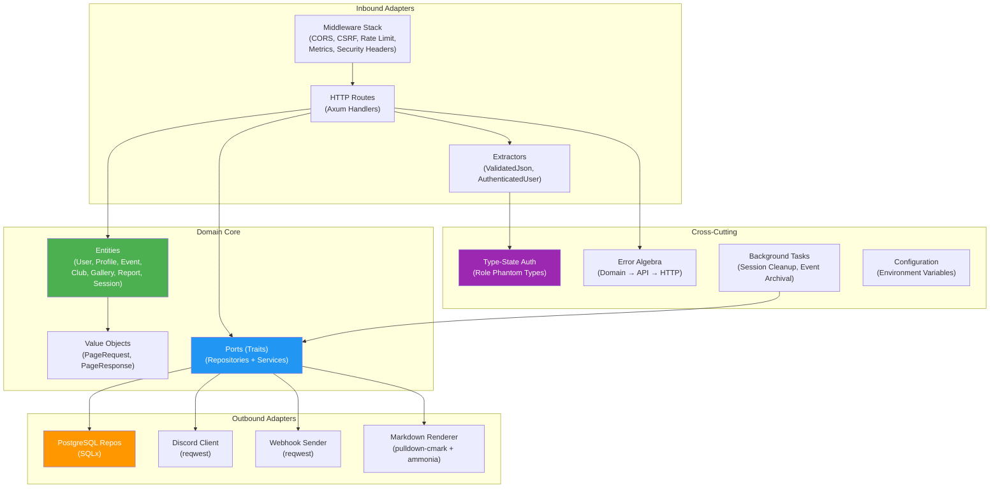

# Architecture Overview

> **Audience**: Developers, Architects, Contributors
>
> **Navigation**: [Docs Home](../README.md) > Architecture

## System Context

The VRC Web-Backend is a monolithic Rust/Axum REST API that powers the VRChat October Class Reunion community website. It sits behind a Caddy reverse proxy and communicates with Discord for authentication, PostgreSQL for persistence, and external systems (GAS, Discord Bot) for data synchronization.

## High-Level Architecture

The backend follows **hexagonal architecture** (ports and adapters) with strict layer separation:

## API Layers

The backend exposes four distinct API layers, each with its own authentication, rate limiting, and caching strategy:

| Layer | Path Prefix | Auth Method | Rate Limit | Cache |
|-------|-------------|-------------|------------|-------|
| **Public** | `/api/v1/public/*` | None | 60 req/min per IP, burst 10 | `public, max-age=30` |
| **Internal** | `/api/v1/internal/*` | Session Cookie | 120 req/min per user/IP, burst 20 | `private, no-store` |
| **System** | `/api/v1/system/*` | Bearer Token | 30 req/min global, burst 5 | None |
| **Auth** | `/api/v1/auth/*` | None | 10 req/min per IP, burst 3 | None |

## Key Design Decisions

| Decision | Summary | ADR |
|----------|---------|-----|
| Hexagonal Architecture | Domain core has zero external dependencies; all I/O goes through port traits | [ADR-0001](../design/adr/0001-hexagonal-architecture.md) |
| Type-State Authorization | Role permissions encoded as phantom types; invalid access is a compile error | [ADR-0002](../design/adr/0002-type-state-authorization.md) |
| Compile-Time SQL | Every query verified against live schema via SQLx offline mode | [ADR-0003](../design/adr/0003-compile-time-sql.md) |
| Algebraic Error Types | Each API layer has its own error enum; conversions are total (no catch-all) | [ADR-0004](../design/adr/0004-algebraic-error-types.md) |
| Formal Verification | Critical domain logic verified with Kani bounded model checking | [ADR-0005](../design/adr/0005-formal-verification.md) |

## Component Index

| Component | Location | Responsibility |
|-----------|----------|---------------|
| Domain Entities | `vrc-backend/src/domain/entities/` | Business objects (User, Profile, Event, Club, Gallery, Report, Session) |
| Domain Ports | `vrc-backend/src/domain/ports/` | Repository and service trait definitions |
| Value Objects | `vrc-backend/src/domain/value_objects/` | Pagination, validated types |
| HTTP Routes | `vrc-backend/src/adapters/inbound/routes/` | Axum handlers for all API layers |
| Middleware | `vrc-backend/src/adapters/inbound/middleware/` | CSRF, rate limiting, metrics, security headers, request ID |
| Extractors | `vrc-backend/src/adapters/inbound/extractors/` | ValidatedJson, ValidatedQuery |
| PostgreSQL Repos | `vrc-backend/src/adapters/outbound/postgres/` | SQLx-based repository implementations |
| Discord Client | `vrc-backend/src/adapters/outbound/discord/` | OAuth2, guild check, webhook sender |
| Markdown Renderer | `vrc-backend/src/adapters/outbound/markdown/` | pulldown-cmark + ammonia sanitization |
| Auth System | `vrc-backend/src/auth/` | Role phantom types, AuthenticatedUser extractor |
| Error System | `vrc-backend/src/errors/` | DomainError, ApiError, InfraError |
| Background Tasks | `vrc-backend/src/background/` | Session cleanup, event archival scheduler |
| Configuration | `vrc-backend/src/config/` | AppConfig from environment variables |
| Proc Macros | `vrc-macros/src/` | `#[handler]`, `#[derive(Validate)]`, `#[derive(ErrorCode)]` |

## Related Documents

- [System Context (C4 Level 1)](system-context.md)
- [Component Details](components.md)
- [Module Dependencies](module-dependency.md)
- [Data Model](data-model.md)
- [Data Flow](data-flow.md)
- [State Management](state-management.md)
- [Design Principles](../design/principles.md)
