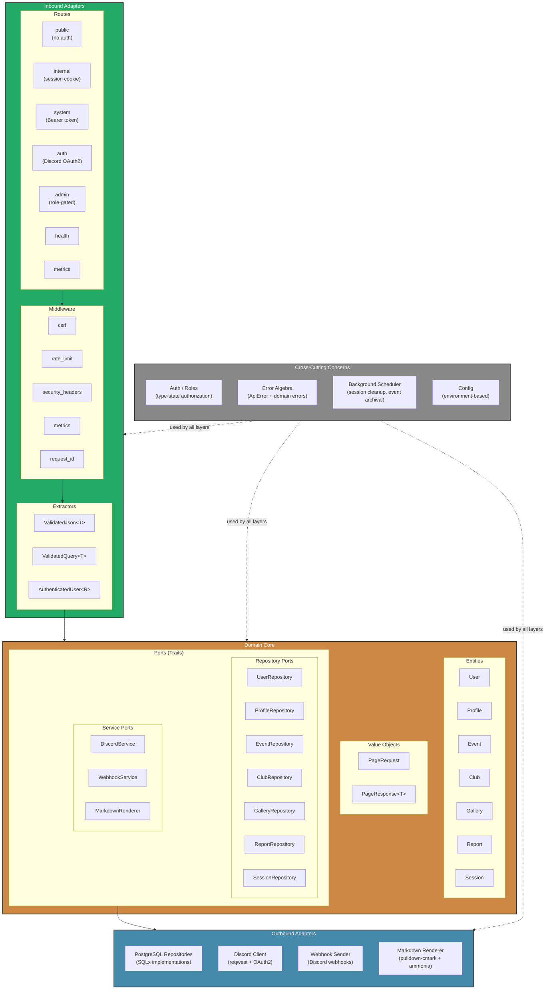

# Component Breakdown (C4 Level 2)

> **Navigation**: [Docs Home](../README.md) > [Architecture](README.md) > Components

## Overview

This document details the internal components of the VRC Backend, organized according to the hexagonal (ports & adapters) architecture. The system is structured into four layers: Inbound Adapters, Domain Core, Outbound Adapters, and Cross-Cutting Concerns.

## Component Diagram



## Inbound Adapters

### Routes

The API is divided into distinct route groups based on authentication and authorization requirements:

| Route Group | Path Prefix | Authentication | Purpose |
|------------|-------------|----------------|---------|
| **Public** | `/api/v1/public` | None | Read-only access to published events, public profiles, club listings |
| **Internal** | `/api/v1/internal` | Session cookie | Authenticated user operations — profile editing, club management, image uploads, report submission |
| **System** | `/api/v1/system` | Bearer token | Machine-to-machine integration — GAS event sync, Discord Bot member events |
| **Auth** | `/api/v1/auth` | Discord OAuth2 | Login, logout, callback, session refresh |
| **Admin** | `/api/v1/admin` | Session cookie + `admin`/`super_admin` role | User management, role changes, system administration |
| **Health** | `/health` | None | Liveness and readiness probes for container orchestration |
| **Metrics** | `/metrics` | Internal only | Prometheus-compatible metrics endpoint |

### Middleware Stack

Middleware is applied in a specific order to every request:

| Middleware | Order | Description |
|-----------|-------|-------------|
| **`request_id`** | 1st | Generates a unique `X-Request-Id` header for every request. Propagated to logs and error responses for traceability. |
| **`security_headers`** | 2nd | Sets `X-Content-Type-Options`, `X-Frame-Options`, `Strict-Transport-Security`, `X-XSS-Protection`, and `Content-Security-Policy` headers. |
| **`metrics`** | 3rd | Records request count, latency histograms, and response status codes per route. |
| **`rate_limit`** | 4th | Per-IP and per-route rate limiting using a token bucket algorithm. Protects against abuse and DoS. |
| **`csrf`** | 5th | Double-submit cookie CSRF protection for state-mutating requests (`POST`, `PUT`, `PATCH`, `DELETE`). Exempt: System API (Bearer auth), Auth endpoints. |

### Extractors

Custom Axum extractors that combine deserialization with validation:

| Extractor | Description |
|-----------|-------------|
| **`ValidatedJson<T>`** | Deserializes JSON body and runs `#[derive(Validate)]` rules. Returns `422 Unprocessable Entity` with structured error details on failure. |
| **`ValidatedQuery<T>`** | Same as above but for query string parameters. Used for pagination and filtering. |
| **`AuthenticatedUser<R>`** | Type-state extractor parameterized by minimum role `R`. Looks up session from cookie, verifies user status is `active`, and checks role hierarchy. Phantom type `R` is one of `Member`, `Staff`, `Admin`, `SuperAdmin`. |

## Domain Core

### Entities

| Entity | Description | Key Fields |
|--------|-------------|------------|
| **User** | Core identity linked to a Discord account. Stores role and status. | `id`, `discord_id`, `username`, `role`, `status`, `created_at`, `updated_at` |
| **Profile** | User-editable profile information. Supports Markdown bios rendered to sanitized HTML. | `user_id`, `display_name`, `bio_markdown`, `bio_html`, `avatar_url`, `is_public`, `updated_at` |
| **Event** | VRChat community event synced from GAS or created via admin API. | `id`, `title`, `description`, `start_time`, `end_time`, `world_link`, `status`, `created_at` |
| **Club** | Community sub-group with membership management. | `id`, `name`, `description`, `owner_id`, `is_active`, `created_at` |
| **Gallery** | Image uploaded by users, subject to staff approval. | `id`, `user_id`, `image_url`, `caption`, `status`, `uploaded_at`, `reviewed_at` |
| **Report** | User-submitted report against profiles, events, clubs, or gallery images. | `id`, `reporter_id`, `target_type`, `target_id`, `reason`, `status`, `created_at`, `resolved_at` |
| **Session** | Authenticated session tied to a user. Stores cookie token and expiry. | `id`, `user_id`, `token_hash`, `expires_at`, `created_at`, `last_accessed_at` |

### Value Objects

| Value Object | Description |
|-------------|-------------|
| **`PageRequest`** | Encapsulates pagination parameters (`page`, `per_page`) with validated bounds. |
| **`PageResponse<T>`** | Generic paginated response containing `items: Vec<T>`, `total`, `page`, `per_page`, and computed `total_pages`. |

### Ports (Traits)

Repository ports define the persistence contract. Service ports define external service contracts. All ports are `async` traits using `Result<T, DomainError>`.

**Repository Ports:**

| Port | Key Operations |
|------|---------------|
| `UserRepository` | `find_by_id`, `find_by_discord_id`, `upsert`, `update_role`, `update_status`, `list_paginated` |
| `ProfileRepository` | `find_by_user_id`, `upsert`, `set_visibility`, `list_public_paginated` |
| `EventRepository` | `find_by_id`, `upsert`, `update_status`, `list_published_paginated`, `archive_stale` |
| `ClubRepository` | `find_by_id`, `create`, `update`, `add_member`, `remove_member`, `list_paginated` |
| `GalleryRepository` | `find_by_id`, `create`, `update_status`, `list_by_user`, `list_pending` |
| `ReportRepository` | `find_by_id`, `create`, `update_status`, `list_paginated` |
| `SessionRepository` | `find_by_token`, `create`, `delete`, `delete_all_for_user`, `cleanup_expired` |

**Service Ports:**

| Port | Key Operations |
|------|---------------|
| `DiscordService` | `exchange_code`, `fetch_user`, `check_guild_membership` |
| `WebhookService` | `send_event_notification`, `send_report_alert` |
| `MarkdownRenderer` | `render_to_html` (Markdown → sanitized HTML) |

## Outbound Adapters

| Adapter | Implements | Technology | Details |
|---------|-----------|------------|---------|
| **PostgreSQL Repositories** | All 7 `*Repository` traits | SQLx + PostgreSQL 16 | Compile-time–verified SQL queries. Connection pooling via `PgPool`. Transactions for multi-step operations. |
| **Discord Client** | `DiscordService` | `reqwest` + OAuth2 | Handles OAuth2 code exchange, user info fetching, and guild membership verification against Discord's REST API. |
| **Webhook Sender** | `WebhookService` | `reqwest` | Sends rich embed notifications to configured Discord webhook URLs for events and reports. |
| **Markdown Renderer** | `MarkdownRenderer` | `pulldown-cmark` + `ammonia` | Converts Markdown to HTML via `pulldown-cmark`, then sanitizes with `ammonia` to prevent XSS. |

## Cross-Cutting Concerns

### Auth / Roles (Type-State Authorization)

The authorization system uses Rust's type system to enforce role checks at compile time:

```
SuperAdmin > Admin > Staff > Member
```

The `AuthenticatedUser<R>` extractor uses phantom types to guarantee that a handler can only be called by users with the required minimum role. Role hierarchy is checked at extraction time — if the user's role is below `R`, the request is rejected with `403 Forbidden` before the handler body executes.

### Error Algebra

Errors are structured into three layers:

| Layer | Type | Description |
|-------|------|-------------|
| **API** | `ApiError` | HTTP-facing errors with status code, error code, and human-readable message. Generated via `#[derive(ErrorCode)]`. |
| **Domain** | `DomainError` | Business logic errors (e.g., `UserSuspended`, `EventAlreadyArchived`). |
| **Infrastructure** | `InfraError` | Database, network, and external service failures. Mapped to `ApiError` at the boundary. |

### Background Scheduler

Runs periodic tasks on configurable intervals:

| Task | Default Interval | Description |
|------|-------------------|-------------|
| **Session Cleanup** | Every 1 hour | Deletes expired sessions from the database. |
| **Event Archival** | Every 24 hours | Transitions events older than the configured threshold (30/60 days) from `published` to `archived`. |

### Config

Environment-based configuration loaded at startup. Supports `.env` files for development and environment variables in production. Validated eagerly — the server refuses to start if required config is missing or malformed.

---

## Related Documents

- [System Context](system-context.md) — C4 Level 1: system boundary and external actors
- [Data Model](data-model.md) — Entity-relationship diagram and full schema
- [Data Flow](data-flow.md) — Sequence diagrams for key interactions
- [Module Dependencies](module-dependency.md) — Source code module graph
- [State Management](state-management.md) — Entity lifecycle state machines
