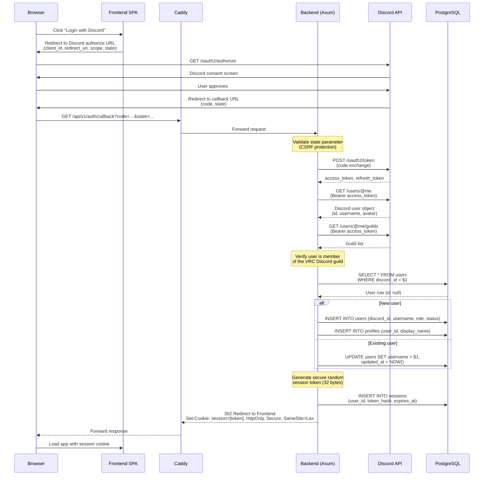
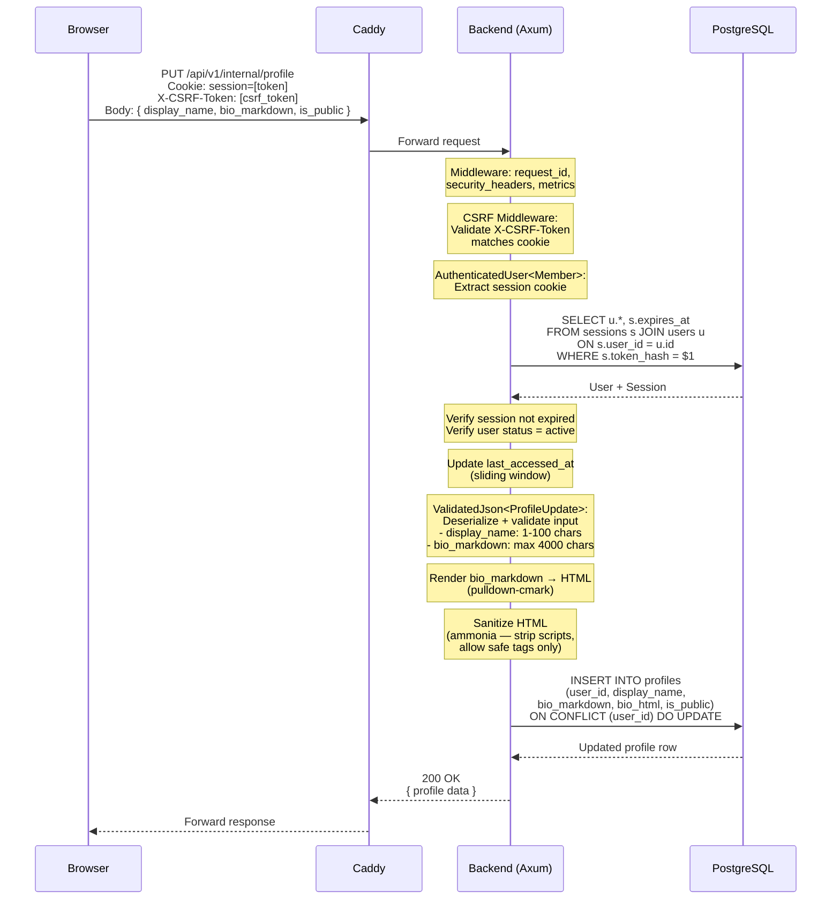
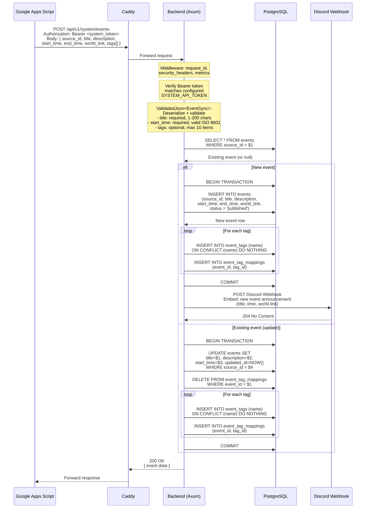
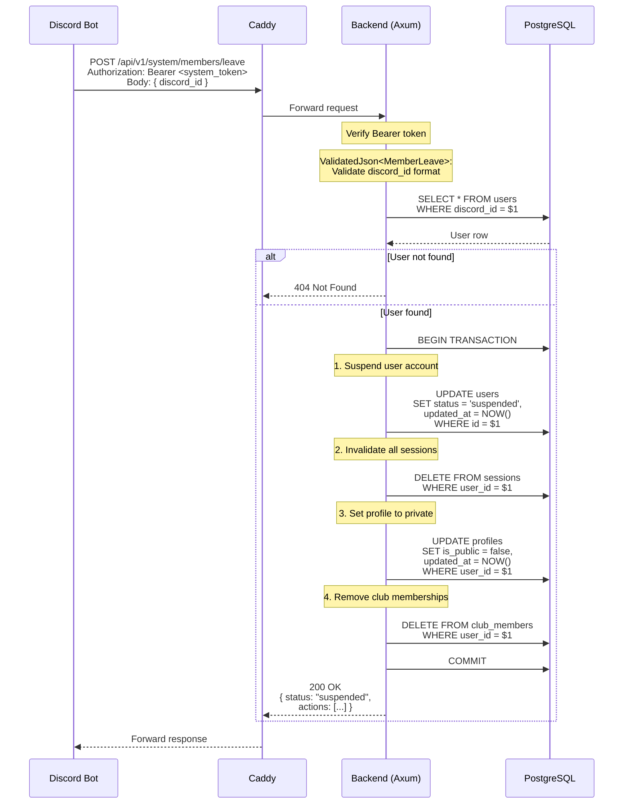

# Data Flow

> **Navigation**: [Docs Home](../README.md) > [Architecture](README.md) > Data Flow

## Overview

This document describes the data flow for four key interactions in the VRC Backend. Each flow is illustrated with a Mermaid sequence diagram showing the complete request/response path, including authentication, validation, database operations, and side effects.

---

## 1. Discord OAuth2 Login

The authentication flow uses Discord's OAuth2 Authorization Code Grant. The backend exchanges the authorization code for tokens, fetches user information, verifies guild membership, and establishes a session.

### Key Points

- The `state` parameter prevents CSRF attacks during the OAuth2 flow
- Only the SHA-256 hash of the session token is stored in the database
- The session cookie is `HttpOnly`, `Secure`, and `SameSite=Lax`
- Guild membership is required — non-members receive `403 Forbidden`
- New users are auto-provisioned with `member` role and a default profile

---

## 2. Profile Update (Internal API)

An authenticated user updates their profile. The flow includes CSRF validation, session authentication, input validation, Markdown rendering, HTML sanitization, and database persistence.

### Key Points

- CSRF protection uses the double-submit cookie pattern
- Input validation is performed by the `ValidatedJson` extractor (via `#[derive(Validate)]`)
- Markdown is rendered server-side and sanitized with `ammonia` to prevent XSS
- Both `bio_markdown` (source) and `bio_html` (rendered) are stored to avoid re-rendering on reads
- The `UPSERT` pattern handles both first-time profile creation and subsequent updates

---

## 3. Event Sync from Google Apps Script

GAS pushes event data to the System API. The backend verifies the Bearer token, validates the payload, upserts the event with its tags, and sends a Discord webhook notification for new events.

### Key Points

- System API uses a static Bearer token (shared secret) — no session management
- The `source_id` field enables idempotent upserts — repeated syncs do not create duplicates
- Tag management uses insert-or-ignore for tag normalization and replace-all for mappings
- All database operations within a sync are wrapped in a transaction
- Discord webhook notification is sent only for new events (not updates)
- If the webhook fails, the event is still created — webhook delivery is best-effort

---

## 4. Member Leave (Discord Bot → System API)

When a member leaves or is banned from the Discord guild, the bot notifies the backend. The backend cascades the departure across all related entities in a single transaction.

### Key Points

- All cascading changes are wrapped in a single database transaction for atomicity
- The user is **suspended**, not deleted — data is preserved for potential reactivation
- All active sessions are immediately invalidated, forcing logout on all devices
- Profile is set to private to hide the departed member's information
- Club memberships are removed, but the user's owned clubs remain (deactivated separately if needed)
- Gallery images and reports are **not** deleted — they remain for audit purposes
- If the user returns to the guild and logs in again, their status can be reactivated by an admin

---

## Related Documents

- [System Context](system-context.md) — Actors and external systems involved in these flows
- [Components](components.md) — Internal components that process each step
- [Data Model](data-model.md) — Database tables and relationships touched by each flow
- [State Management](state-management.md) — State transitions triggered by these flows
- [Module Dependencies](module-dependency.md) — Code modules involved in request processing
