# Data Model

> **Navigation**: [Docs Home](../README.md) > [Architecture](README.md) > Data Model

## Overview

This document describes the complete data model for the VRC Backend, including entity relationships, field definitions, PostgreSQL custom enum types, and indexing strategy. All tables use `UUID` primary keys (v7, time-sortable) and `TIMESTAMPTZ` for temporal fields.

## Entity-Relationship Diagram

```mermaid
erDiagram
    users {
        UUID id PK
        VARCHAR discord_id UK "NOT NULL, unique"
        VARCHAR username "NOT NULL"
        user_role role "NOT NULL, default member"
        user_status status "NOT NULL, default active"
        TIMESTAMPTZ created_at "NOT NULL"
        TIMESTAMPTZ updated_at "NOT NULL"
    }

    profiles {
        UUID user_id PK,FK "references users(id)"
        VARCHAR display_name "NOT NULL"
        TEXT bio_markdown "nullable"
        TEXT bio_html "nullable"
        VARCHAR avatar_url "nullable"
        BOOLEAN is_public "NOT NULL, default true"
        TIMESTAMPTZ updated_at "NOT NULL"
    }

    sessions {
        UUID id PK
        UUID user_id FK "references users(id)"
        VARCHAR token_hash "NOT NULL, unique"
        TIMESTAMPTZ expires_at "NOT NULL"
        TIMESTAMPTZ created_at "NOT NULL"
        TIMESTAMPTZ last_accessed_at "NOT NULL"
    }

    events {
        UUID id PK
        VARCHAR title "NOT NULL"
        TEXT description "nullable"
        TIMESTAMPTZ start_time "NOT NULL"
        TIMESTAMPTZ end_time "nullable"
        VARCHAR world_link "nullable"
        event_status status "NOT NULL, default draft"
        VARCHAR source_id "nullable, unique (GAS ID)"
        TIMESTAMPTZ created_at "NOT NULL"
        TIMESTAMPTZ updated_at "NOT NULL"
    }

    event_tags {
        UUID id PK
        VARCHAR name "NOT NULL, unique"
        TIMESTAMPTZ created_at "NOT NULL"
    }

    event_tag_mappings {
        UUID event_id PK,FK "references events(id)"
        UUID tag_id PK,FK "references event_tags(id)"
    }

    reports {
        UUID id PK
        UUID reporter_id FK "references users(id)"
        report_target_type target_type "NOT NULL"
        UUID target_id "NOT NULL"
        TEXT reason "NOT NULL"
        report_status status "NOT NULL, default pending"
        UUID reviewer_id FK "nullable, references users(id)"
        TEXT reviewer_note "nullable"
        TIMESTAMPTZ created_at "NOT NULL"
        TIMESTAMPTZ resolved_at "nullable"
    }

    clubs {
        UUID id PK
        VARCHAR name "NOT NULL"
        TEXT description "nullable"
        UUID owner_id FK "references users(id)"
        BOOLEAN is_active "NOT NULL, default true"
        TIMESTAMPTZ created_at "NOT NULL"
        TIMESTAMPTZ updated_at "NOT NULL"
    }

    club_members {
        UUID club_id PK,FK "references clubs(id)"
        UUID user_id PK,FK "references users(id)"
        TIMESTAMPTZ joined_at "NOT NULL"
    }

    gallery_images {
        UUID id PK
        UUID user_id FK "references users(id)"
        VARCHAR image_url "NOT NULL"
        VARCHAR caption "nullable"
        gallery_image_status status "NOT NULL, default pending"
        UUID reviewer_id FK "nullable, references users(id)"
        TIMESTAMPTZ uploaded_at "NOT NULL"
        TIMESTAMPTZ reviewed_at "nullable"
    }

    users ||--o| profiles : "has one"
    users ||--o{ sessions : "has many"
    users ||--o{ reports : "submits"
    users ||--o{ clubs : "owns"
    users ||--o{ club_members : "joins"
    users ||--o{ gallery_images : "uploads"

    events ||--o{ event_tag_mappings : "tagged with"
    event_tags ||--o{ event_tag_mappings : "applied to"

    clubs ||--o{ club_members : "has members"

    reports }o--|| users : "reviewed by"
    gallery_images }o--o| users : "reviewed by"
```



## PostgreSQL Custom Enum Types

```sql
CREATE TYPE user_role AS ENUM ('member', 'staff', 'admin', 'super_admin');

CREATE TYPE user_status AS ENUM ('active', 'suspended');

CREATE TYPE event_status AS ENUM ('draft', 'published', 'cancelled', 'archived');

CREATE TYPE report_status AS ENUM ('pending', 'reviewed', 'dismissed');

CREATE TYPE report_target_type AS ENUM ('profile', 'event', 'club', 'gallery_image');

CREATE TYPE gallery_image_status AS ENUM ('pending', 'approved', 'rejected');
```

## Entity Descriptions

### `users`

The core identity table. Each row represents a community member linked to their Discord account via `discord_id`. The `role` field determines authorization level across the platform. The `status` field controls whether the user can interact with the system.

- **One-to-one** with `profiles` (user's public-facing information)
- **One-to-many** with `sessions` (a user may have multiple active sessions across devices)
- **One-to-many** with `reports` (as reporter), `clubs` (as owner), `gallery_images` (as uploader)

### `profiles`

Editable profile information for each user. Uses the `user_id` as both primary key and foreign key (1:1 relationship). The `bio_markdown` field stores the user's original Markdown input, while `bio_html` stores the rendered and sanitized HTML output. Profiles can be toggled between public and private via `is_public`.

### `sessions`

Stores authenticated sessions. The `token_hash` is a SHA-256 hash of the session cookie value — the plaintext token is never stored. Sessions have a configurable TTL enforced via `expires_at`. The `last_accessed_at` field supports sliding expiry windows. Expired sessions are cleaned up by the background scheduler.

### `events`

Community events, primarily synced from Google Apps Script. The `source_id` field stores the GAS-side identifier for idempotent upserts. Events follow a lifecycle: `draft` → `published` → `cancelled` or `archived`. The background scheduler automatically archives events past their configured age threshold.

### `event_tags` / `event_tag_mappings`

A many-to-many tag system for events. Tags are normalized into the `event_tags` table and associated via the `event_tag_mappings` junction table. This allows filtering events by tag on the public API.

### `reports`

User-submitted reports against various content types. The `target_type` enum discriminates the kind of content being reported, while `target_id` references the specific entity. Reports are reviewed by staff or admins, who can set the status to `reviewed` (action taken) or `dismissed` (no action needed) and leave a `reviewer_note`.

### `clubs`

Community sub-groups with an owner and membership roster. The `owner_id` references the user who created the club. Clubs can be deactivated via `is_active` without deleting associated data.

### `club_members`

Junction table for club membership. Composite primary key of `(club_id, user_id)` prevents duplicate memberships. `joined_at` tracks when the user joined.

### `gallery_images`

User-uploaded images that require staff approval before becoming publicly visible. The moderation workflow uses `gallery_image_status` to track the review state. `reviewer_id` and `reviewed_at` record who approved/rejected the image and when.

## Index Strategy

### Primary Key Indexes

All `id` columns have implicit B-tree indexes from the `PRIMARY KEY` constraint.

### Unique Indexes

| Table | Column(s) | Purpose |
|-------|-----------|---------|
| `users` | `discord_id` | Fast lookup during OAuth2 login |
| `sessions` | `token_hash` | Fast session lookup on every authenticated request |
| `events` | `source_id` | Idempotent upsert from GAS (partial index, `WHERE source_id IS NOT NULL`) |
| `event_tags` | `name` | Prevent duplicate tag names |

### Foreign Key Indexes

All foreign key columns have explicit B-tree indexes to support efficient JOIN operations and cascade deletes:

| Table | Column | References |
|-------|--------|------------|
| `sessions` | `user_id` | `users(id)` |
| `reports` | `reporter_id` | `users(id)` |
| `reports` | `reviewer_id` | `users(id)` |
| `clubs` | `owner_id` | `users(id)` |
| `club_members` | `club_id` | `clubs(id)` |
| `club_members` | `user_id` | `users(id)` |
| `gallery_images` | `user_id` | `users(id)` |
| `gallery_images` | `reviewer_id` | `users(id)` |
| `event_tag_mappings` | `event_id` | `events(id)` |
| `event_tag_mappings` | `tag_id` | `event_tags(id)` |

### Query-Optimized Indexes

| Table | Column(s) | Type | Purpose |
|-------|-----------|------|---------|
| `events` | `status, start_time` | B-tree composite | Public event listing — filter by `published` status, order by `start_time` |
| `events` | `status, updated_at` | B-tree composite | Background archival — find `published` events older than threshold |
| `gallery_images` | `status` | B-tree (partial: `WHERE status = 'pending'`) | Staff review queue — list pending images |
| `reports` | `status` | B-tree (partial: `WHERE status = 'pending'`) | Staff report queue — list pending reports |
| `sessions` | `expires_at` | B-tree | Background cleanup — find expired sessions |
| `profiles` | `is_public` | B-tree (partial: `WHERE is_public = true`) | Public profile listing |

---

## Related Documents

- [Components](components.md) — How entities map to domain layer and repository ports
- [Data Flow](data-flow.md) — How data moves through the system in key use cases
- [State Management](state-management.md) — Lifecycle state machines for each entity
- [System Context](system-context.md) — Database's role in the overall architecture
- [Module Dependencies](module-dependency.md) — How repository implementations are wired
