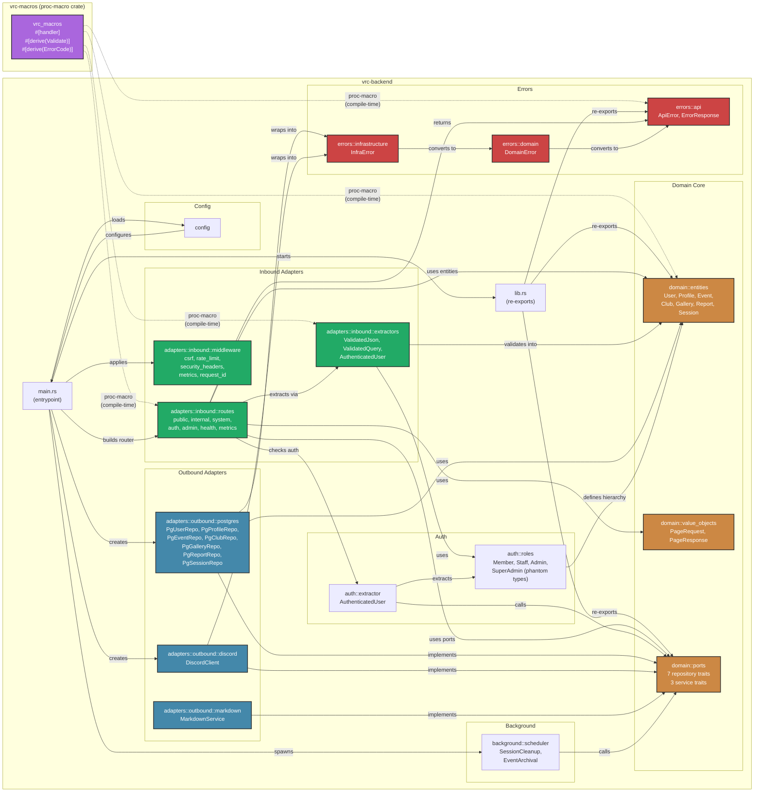

# Module Dependency Graph

> **Navigation**: [Docs Home](../README.md) > [Architecture](README.md) > Module Dependencies

## Overview

This document maps the dependency relationships between all Rust modules in the VRC Backend workspace. The project follows hexagonal architecture, where the domain core has zero outward dependencies and all adapters depend inward toward it.

## Workspace Crates

The project is a Cargo workspace with two crates:

| Crate | Path | Type | Description |
|-------|------|------|-------------|
| **`vrc-backend`** | `vrc-backend/` | `[[bin]]` + `[lib]` | Main application — all domain logic, adapters, and runtime |
| **`vrc-macros`** | `vrc-macros/` | `proc-macro` | Custom derive macros (`#[handler]`, `#[derive(Validate)]`, `#[derive(ErrorCode)]`) |

## Module Dependency Graph

## Dependency Rules

The hexagonal architecture enforces strict dependency rules:

### Allowed Dependencies

| From | To | Rationale |
|------|----|-----------|
| `main.rs` | Everything | Composition root — wires all components together |
| Inbound Adapters | Domain Core | Routes use entities, ports, and value objects |
| Outbound Adapters | Domain Core | Repositories implement port traits using entities |
| Background | Domain Core (Ports) | Scheduler calls repository methods |
| Auth | Domain Core (Entities) | Roles reference the `user_role` enum |
| Errors | (self-contained) | Error types convert between layers |

### Forbidden Dependencies

| From | To | Reason |
|------|----|--------|
| Domain Core | Any Adapter | Domain must be infrastructure-agnostic |
| Domain Core | Auth/Errors | Domain errors are defined in domain, not error module (domain errors are the exception — they live in errors but are conceptually domain) |
| Outbound Adapters | Inbound Adapters | Adapters do not depend on each other |
| Inbound Adapters | Outbound Adapters | Routes depend on port traits, never concrete implementations |

## `vrc-macros` Crate

The `vrc-macros` crate provides procedural macros that generate code at compile time:

| Macro | Target | Generated Code |
|-------|--------|----------------|
| `#[handler]` | Route handler functions | Wraps function with error handling boilerplate, injects `AppState` |
| `#[derive(Validate)]` | Request DTOs | Implements validation logic from field attributes (`#[validate(length(min=1, max=100))]`) |
| `#[derive(ErrorCode)]` | Error enums | Implements `Into<ApiError>` with HTTP status codes and error code strings |

Since `vrc-macros` is a proc-macro crate, it is a **compile-time only** dependency. It does not exist at runtime — its output is inlined into the consuming crate during compilation.

## Key Module Descriptions

| Module | File(s) | Responsibility |
|--------|---------|---------------|
| `main.rs` | `src/main.rs` | Application entrypoint. Loads config, creates connection pool, builds Axum router, spawns background tasks, starts server. |
| `lib.rs` | `src/lib.rs` | Library root. Re-exports public API for integration tests and benchmarks. |
| `config` | `src/config/` | Environment-based configuration. Parses and validates all settings at startup. |
| `domain::entities` | `src/domain/entities/` | Core business entities with their invariants. No framework dependencies. |
| `domain::value_objects` | `src/domain/value_objects/` | Pagination types and other reusable value types. |
| `domain::ports` | `src/domain/ports/` | Async trait definitions for repositories and services. The contracts that adapters implement. |
| `adapters::inbound::routes` | `src/adapters/inbound/routes/` | Axum route handlers organized by API layer (public, internal, system, auth, admin). |
| `adapters::inbound::middleware` | `src/adapters/inbound/middleware/` | Tower middleware for cross-cutting HTTP concerns. |
| `adapters::inbound::extractors` | `src/adapters/inbound/extractors/` | Custom Axum `FromRequest` / `FromRequestParts` implementations. |
| `adapters::outbound::postgres` | `src/adapters/outbound/postgres/` | SQLx-based PostgreSQL repository implementations. |
| `adapters::outbound::discord` | `src/adapters/outbound/discord/` | Discord REST API client for OAuth2 and guild operations. |
| `adapters::outbound::markdown` | `src/adapters/outbound/markdown/` | Markdown → sanitized HTML rendering pipeline. |
| `auth::roles` | `src/auth/roles/` | Role hierarchy types and phantom type definitions. |
| `auth::extractor` | `src/auth/` | `AuthenticatedUser<R>` extractor implementation. |
| `errors` | `src/errors/` | Three-layer error hierarchy: API, Domain, Infrastructure. |
| `background::scheduler` | `src/background/` | Tokio-based periodic task runner for session cleanup and event archival. |

---

## Related Documents

- [System Context](system-context.md) — How the backend fits in the broader system
- [Components](components.md) — Architectural component breakdown
- [Data Flow](data-flow.md) — How requests traverse these modules
- [Data Model](data-model.md) — Database schema used by outbound adapters
- [State Management](state-management.md) — State transitions implemented across modules
