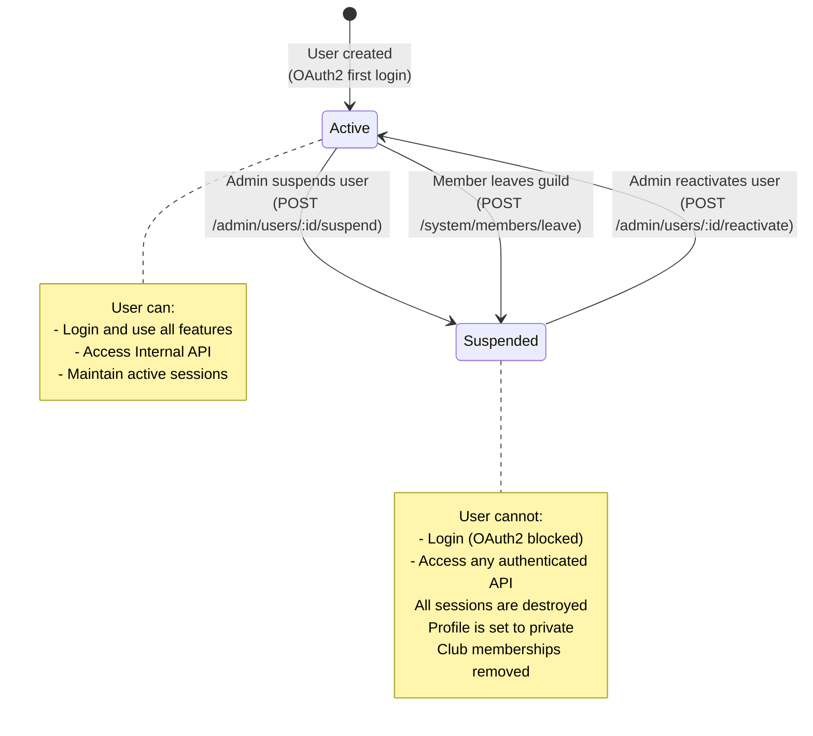
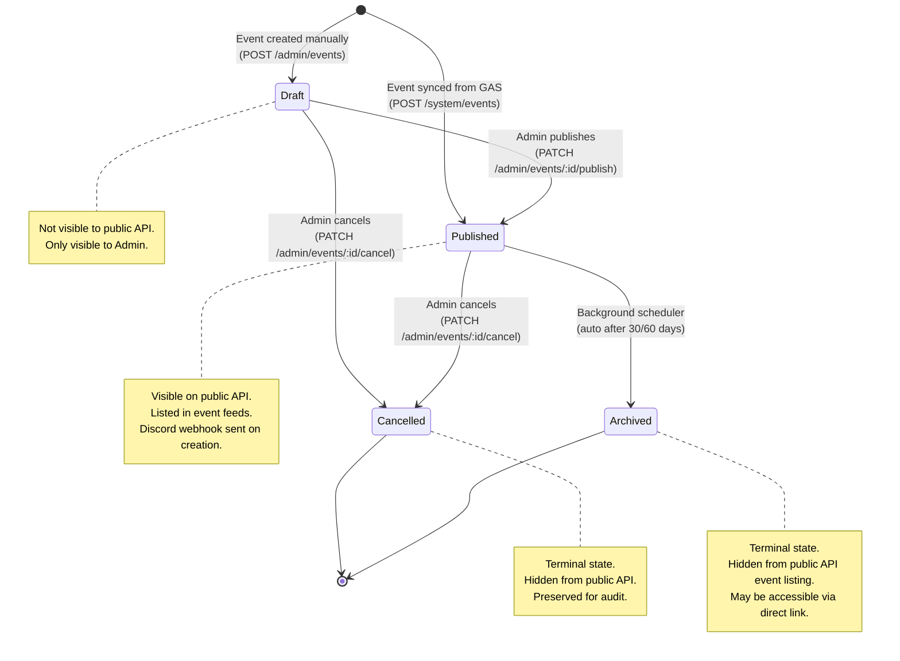
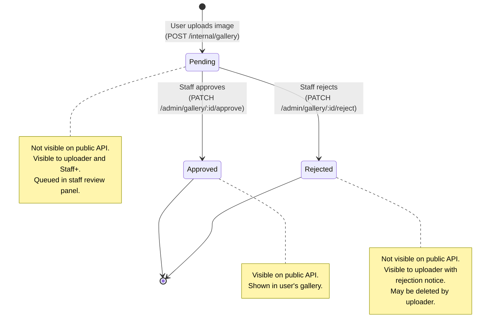
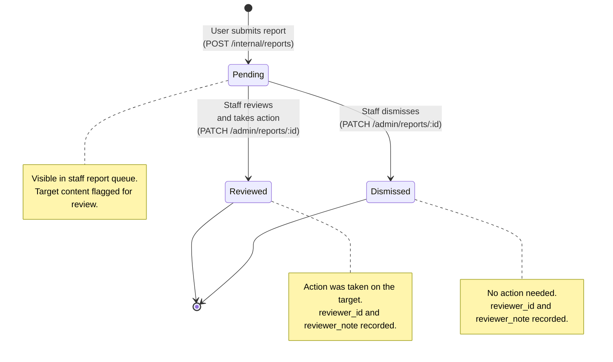
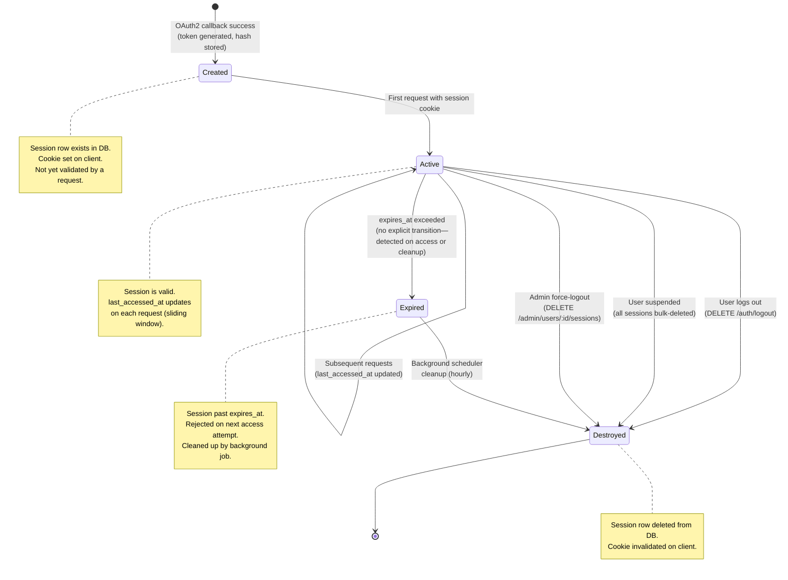
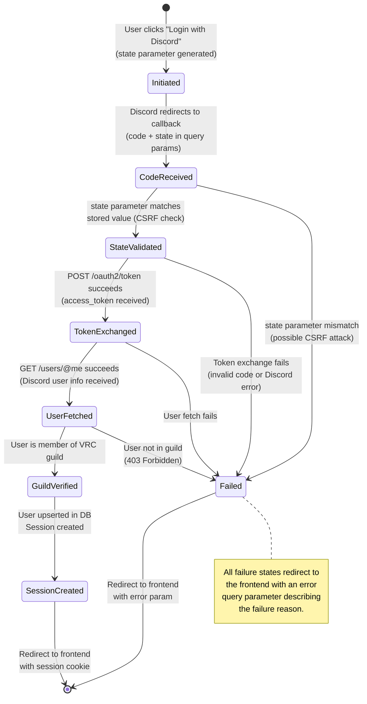

# State Management

> **Navigation**: [Docs Home](../README.md) > [Architecture](README.md) > State Management

## Overview

This document describes all state machines and entity lifecycles in the VRC Backend. Each stateful entity uses a PostgreSQL enum to represent its current state, with transitions enforced at the application layer. Invalid transitions result in domain errors.

---

## 1. User Status

Users have two possible states. Suspension can occur via admin action or automatically when a member leaves the Discord guild. Reactivation requires explicit admin intervention.

### Transition Table

| From | To | Trigger | Actor | Side Effects |
|------|----|---------|-------|-------------|
| — | `active` | First OAuth2 login | System | Create user + default profile |
| `active` | `suspended` | Admin action | Admin / Super Admin | Delete all sessions, set profile private |
| `active` | `suspended` | Member leave | Discord Bot (System API) | Delete all sessions, set profile private, remove club memberships |
| `suspended` | `active` | Admin reactivation | Admin / Super Admin | None (user must login again to create session) |

---

## 2. Event Status

Events follow a linear lifecycle with branching terminal states. Events created via GAS are published immediately. Draft events can be created manually via the admin API. Archival is automatic after events age past the configured threshold (30 days default, 60 days for large events).

### Transition Table

| From | To | Trigger | Actor | Side Effects |
|------|----|---------|-------|-------------|
| — | `draft` | Manual creation | Admin | None |
| — | `published` | GAS sync | GAS (System API) | Discord webhook notification |
| `draft` | `published` | Admin publishes | Admin | Discord webhook notification |
| `draft` | `cancelled` | Admin cancels | Admin | None |
| `published` | `cancelled` | Admin cancels | Admin | None |
| `published` | `archived` | Age threshold exceeded | Background Scheduler | None |

### Archival Rules

- Events are eligible for archival when `end_time` (or `start_time` if no `end_time`) is older than the configured threshold
- Default threshold: **30 days** past `end_time`
- The background scheduler checks every **24 hours**
- Archival is irreversible — archived events cannot be republished

---

## 3. Gallery Image Status

Gallery images require staff review before becoming publicly visible. The moderation workflow ensures all community-uploaded content meets guidelines.

### Transition Table

| From | To | Trigger | Actor | Side Effects |
|------|----|---------|-------|-------------|
| — | `pending` | Image upload | Any authenticated user | Image stored, added to review queue |
| `pending` | `approved` | Staff review | Staff / Admin / Super Admin | `reviewer_id` and `reviewed_at` set |
| `pending` | `rejected` | Staff review | Staff / Admin / Super Admin | `reviewer_id` and `reviewed_at` set |

---

## 4. Report Status

Reports follow a simple triage workflow. Staff members review reports and either take action (`reviewed`) or determine no action is needed (`dismissed`).

### Transition Table

| From | To | Trigger | Actor | Side Effects |
|------|----|---------|-------|-------------|
| — | `pending` | Report submitted | Any authenticated user | Added to staff review queue |
| `pending` | `reviewed` | Staff action | Staff / Admin / Super Admin | `reviewer_id`, `reviewer_note`, `resolved_at` set. Action taken on target (e.g., content removed, user warned). |
| `pending` | `dismissed` | Staff dismissal | Staff / Admin / Super Admin | `reviewer_id`, `reviewer_note`, `resolved_at` set. No action on target. |

---

## 5. Session Lifecycle

Sessions are created during OAuth2 login and destroyed via explicit logout, user suspension, or automatic cleanup of expired sessions.

### Session Properties

| Property | Value |
|----------|-------|
| Token generation | 32 bytes, `rand::OsRng`, base64url-encoded |
| Storage | SHA-256 hash in `sessions.token_hash` |
| Default TTL | 7 days |
| Sliding window | `last_accessed_at` updated on each authenticated request |
| Cleanup interval | Every 1 hour (background scheduler) |
| Max sessions per user | Unlimited (multi-device support) |

---

## 6. OAuth2 Flow States

The Discord OAuth2 authorization code flow has its own transient state machine. These states exist in memory during the login process and are not persisted to the database.

### Error Handling

| Failure Point | HTTP Response | User-Facing Error |
|--------------|---------------|-------------------|
| State mismatch | 302 → `/login?error=csrf` | "Login failed. Please try again." |
| Token exchange failure | 302 → `/login?error=discord` | "Discord authentication failed." |
| User fetch failure | 302 → `/login?error=discord` | "Could not retrieve your Discord account." |
| Not in guild | 302 → `/login?error=not_member` | "You must be a member of the VRC Discord server." |
| User suspended | 302 → `/login?error=suspended` | "Your account has been suspended." |

---

## Related Documents

- [Data Model](data-model.md) — Enum types and table definitions for each state
- [Data Flow](data-flow.md) — Sequence diagrams showing state transitions in context
- [Components](components.md) — Components responsible for enforcing transitions
- [System Context](system-context.md) — External actors that trigger state changes
- [Module Dependencies](module-dependency.md) — Code modules implementing state logic
