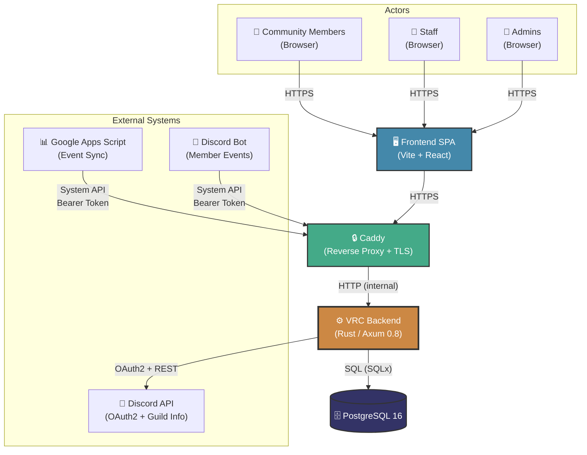

# System Context (C4 Level 1)

> **Navigation**: [Docs Home](../README.md) > [Architecture](README.md) > System Context

## Overview

This document describes the system context for the VRC Web-Backend — the outermost view of the system showing how it interacts with users and external systems. The VRC Backend is a Rust/Axum REST API that serves as the central hub for a VRChat community platform.

## System Context Diagram



## External Actors

| Actor | Type | Authentication | Description |
|-------|------|----------------|-------------|
| **Community Members** | Human (Browser) | Discord OAuth2 → Session Cookie | Regular VRChat community members who browse events, manage their profiles, join clubs, and upload gallery images. |
| **Staff** | Human (Browser) | Discord OAuth2 → Session Cookie | Community moderators with elevated privileges. Can review reports, approve gallery images, and moderate content. |
| **Admins / Super Admins** | Human (Browser) | Discord OAuth2 → Session Cookie | Community administrators who manage users, roles, system configuration, and have full CRUD access. |
| **Google Apps Script (GAS)** | Automated System | Bearer Token (System API) | Synchronizes event data from Google Sheets/Calendar into the backend. Pushes event creates and updates via the System API. |
| **Discord Bot** | Automated System | Bearer Token (System API) | Notifies the backend of Discord guild events such as member leave/ban. Triggers cascading state changes (user suspension, session cleanup, etc.). |
| **Discord API** | External Service | OAuth2 Client Credentials | Used for OAuth2 authentication (code exchange, token refresh) and fetching user/guild information during login. |
| **PostgreSQL 16** | Database | Connection String (internal) | Primary data store for all domain entities. Accessed via SQLx with compile-time–verified queries. |

## Trust Boundaries

```
┌─────────────────────────────────────────────────────┐
│  INTERNET (Untrusted)                               │
│  ┌───────────┐  ┌─────┐  ┌────────────┐            │
│  │ Browsers  │  │ GAS │  │ Discord Bot│            │
│  └─────┬─────┘  └──┬──┘  └─────┬──────┘            │
│        │           │            │                    │
├────────┼───────────┼────────────┼────────────────────┤
│  DMZ   │           │            │                    │
│  ┌─────▼───────────▼────────────▼──────┐             │
│  │          Caddy (TLS Termination)    │             │
│  │   • Rate limiting (per-IP)          │             │
│  │   • Security headers                │             │
│  │   • HTTPS enforcement               │             │
│  └─────────────────┬──────────────────┘             │
│                    │                                 │
├────────────────────┼─────────────────────────────────┤
│  INTERNAL NETWORK  │                                 │
│  ┌─────────────────▼──────────────────┐              │
│  │       VRC Backend (Axum)           │              │
│  │   • CSRF validation                │              │
│  │   • Session authentication         │              │
│  │   • Bearer token verification      │              │
│  │   • Input validation               │              │
│  │   • Role-based authorization       │              │
│  └─────────────────┬──────────────────┘              │
│                    │                                 │
│  ┌─────────────────▼──────────────────┐              │
│  │       PostgreSQL 16                │              │
│  │   • Connection via Unix socket     │              │
│  │   • Parameterized queries (SQLx)   │              │
│  └────────────────────────────────────┘              │
└─────────────────────────────────────────────────────┘
```

### Boundary Descriptions

| Boundary | Enforced By | Controls |
|----------|-------------|----------|
| **Internet → DMZ** | Caddy reverse proxy | TLS termination, rate limiting, security headers, HTTPS redirect |
| **DMZ → Internal** | Caddy + Axum middleware | Request routing, CORS policy, request size limits |
| **Backend → Database** | SQLx connection pool | Compile-time SQL verification, parameterized queries, connection encryption |
| **Backend → Discord API** | HTTPS + OAuth2 | Client credentials, token management, response validation |

## Communication Protocols

| From | To | Protocol | Auth Mechanism |
|------|----|----------|----------------|
| Browser | Caddy | HTTPS (TLS 1.3) | — |
| Caddy | Backend | HTTP (loopback) | Forwarded headers |
| GAS / Bot | Caddy | HTTPS (TLS 1.3) | `Authorization: Bearer <token>` |
| Backend | Discord API | HTTPS | OAuth2 access token |
| Backend | PostgreSQL | TCP / Unix socket | Connection string credentials |

---

## Related Documents

- [Container Diagram (C4 Level 2)](components.md) — Zooms into the backend's internal components
- [Data Flow](data-flow.md) — Request/response sequences for key use cases
- [Module Dependencies](module-dependency.md) — Code-level module graph
- [State Management](state-management.md) — Entity lifecycle state machines
- [Data Model](data-model.md) — Entity-relationship diagram and schema details
