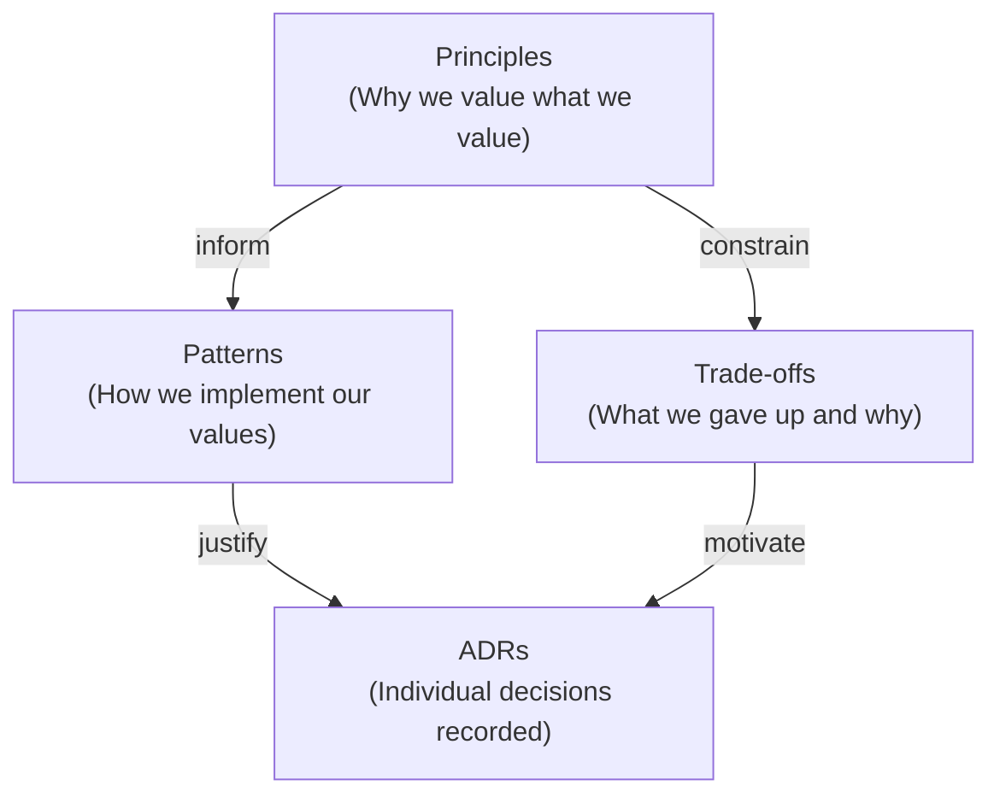

# Design

> **Audience**: All
>
> **Navigation**: [Docs Home](../README.md) > Design

## Overview

The VRC Web-Backend is built on a philosophy we call **"Romance Through Rigor"** — choosing the hardest viable path when it maximizes learning and correctness. This isn't complexity for its own sake; every design choice traces back to either compile-time safety, defense in depth, or educational value.

The design prioritizes:

1. **Catching errors at compile time** rather than runtime
2. **Making invalid states unrepresentable** through the type system
3. **Layered security** where no single mechanism is trusted alone
4. **Explicit error handling** with no catch-all escape hatches
5. **Mathematical correctness** verified by formal tools

## Design Documents

| Document | Description |
|----------|-------------|
| [Principles](principles.md) | Core design philosophy and guiding principles |
| [Patterns](patterns.md) | Design patterns used and their rationale |
| [Trade-offs](trade-offs.md) | Key trade-offs with analysis |
| [ADRs](adr/README.md) | Architecture Decision Records log |

## How These Documents Relate

**Principles** define what we value. **Patterns** are how those values manifest in code. **Trade-offs** document what we consciously sacrificed. **ADRs** record individual decisions with full context.

## Related Documents

- [Architecture Overview](../architecture/README.md)
- [System Specification](../../../specs/README.md)
- [Contributing Guide](../../../CONTRIBUTING.md)
