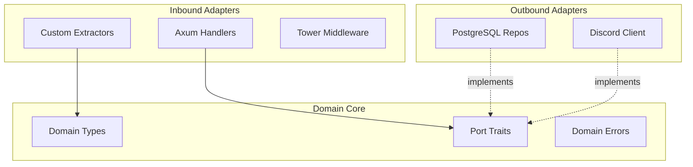

# ADR-0001: Hexagonal Architecture

> **Navigation**: [Docs Home](../../README.md) > [Design](../README.md) > [ADRs](README.md) > ADR-0001

## Status

**Accepted**

## Date

2025-01-15

## Context

The VRC Web-Backend needs a clear architectural pattern that:

1. **Isolates domain logic** from infrastructure concerns (database, HTTP framework, third-party APIs)
2. **Enables testing** of business logic without spinning up PostgreSQL or a web server
3. **Supports future changes** — if we need to swap PostgreSQL for another database or Axum for another framework, the domain logic shouldn't change
4. **Teaches architectural thinking** — contributors should learn about clean architecture and dependency inversion

The application handles user management, event synchronization, authentication, and content rendering for a ~50-300 member VRChat community. While the domain logic isn't deeply complex, the project's educational goals prioritize architectural rigor.

### Forces

- The project values compile-time safety and clean separation (see [Principles](../principles.md))
- Contributors range from beginners to experienced developers — the architecture should be self-documenting
- Simple layered architecture (handler → service → repository) doesn't enforce dependency direction
- The team is willing to accept more boilerplate in exchange for cleaner boundaries

## Decision

We will use **hexagonal architecture** (ports and adapters) with the following structure:

### Domain Core

- Contains domain types (`User`, `Event`, `Session`, `Role`), domain errors (`DomainError`), and port traits (`UserRepository`, `EventRepository`)
- Has **zero external dependencies** — depends only on Rust's standard library and `async-trait`
- Defines the contracts that adapters must fulfill

### Inbound Adapters

- Axum HTTP handlers that accept HTTP requests, extract validated data, call domain services, and return HTTP responses
- Custom extractors (`AuthenticatedUser<R>`, `ValidatedJson<T>`) that bridge HTTP and domain types

### Outbound Adapters

- PostgreSQL repository implementations that fulfill port traits using SQLx
- Discord API client that fulfills Discord-related port traits

### Dependency Rule

All dependencies point **inward** toward the domain core. The domain never imports from adapters.

## Consequences

### Positive

- **Pure domain core**: Domain types and logic can be reasoned about without any framework knowledge
- **Testable**: Domain logic can be tested with in-memory mock implementations — no database, no HTTP server
- **Swappable**: Replacing PostgreSQL with another database requires only a new adapter implementing the port traits
- **Self-documenting**: Port traits serve as living documentation of what the domain needs from the outside world
- **Educational**: Contributors learn dependency inversion, interface segregation, and clean architecture

### Negative

- **More boilerplate**: Every data access method requires a trait definition and an implementation
- **More files**: The codebase has more files than a simple layered architecture
- **Indirection**: Following a request from handler to repository requires jumping through trait definitions
- **Overkill for CRUD**: Simple create-read-update-delete operations don't benefit much from the abstraction

### Neutral

- Rust's trait system makes hexagonal architecture feel natural — port traits are just Rust traits
- The async-trait crate is needed because Rust doesn't natively support async trait methods in all contexts

## Alternatives Considered

### Alternative 1: Simple 3-Layer Architecture

**Description**: Traditional handler → service → repository layers without port traits.

**Pros**:
- Less boilerplate
- Easier to follow for beginners
- Faster to implement

**Cons**:
- No enforced dependency direction — services can accidentally depend on HTTP types
- Harder to test without infrastructure
- Doesn't teach architectural thinking

**Why Rejected**: Doesn't enforce the clean separation we want, and misses the educational opportunity.

### Alternative 2: Vertical Slices

**Description**: Organize by feature (user/, event/, auth/) with each slice containing its own handler, service, and repository.

**Pros**:
- Easy to find all code related to a feature
- Reduces cross-feature coupling

**Cons**:
- Doesn't enforce domain purity
- Shared domain concepts (like Role) become awkward
- Less natural in Rust's module system

**Why Rejected**: Feature-based organization can be layered on top of hexagonal architecture. The two aren't mutually exclusive, but hexagonal provides stronger guarantees.

## Related

- [Design Principles](../principles.md) — Principle 5: Hexagonal Purity
- [Design Patterns](../patterns.md) — Pattern 1: Hexagonal Architecture
- [Trade-offs](../trade-offs.md) — Trade-off 2: Hexagonal over Layered
