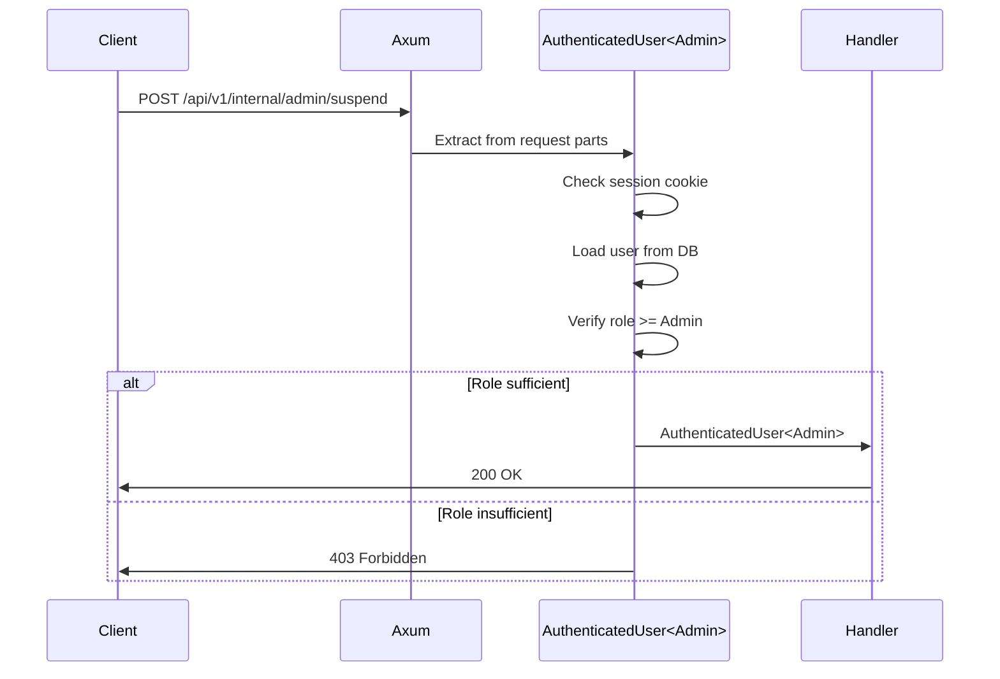

# ADR-0002: Type-State Authorization

> **Navigation**: [Docs Home](../../README.md) > [Design](../README.md) > [ADRs](README.md) > ADR-0002

## Status

**Accepted**

## Date

2025-01-15

## Context

The VRC Web-Backend has a role-based access control (RBAC) system with four roles:

| Role | Permissions |
|------|-------------|
| **Member** | View public content, edit own profile |
| **Staff** | Member permissions + manage events |
| **Admin** | Staff permissions + manage users, suspend accounts |
| **SuperAdmin** | Admin permissions + manage system configuration |

We need a mechanism to enforce that only users with the correct role can access protected endpoints. The mechanism must:

1. **Prevent forgotten checks** — a developer cannot accidentally expose an admin endpoint without a role check
2. **Be self-documenting** — reading a handler signature should reveal the required role
3. **Catch errors at compile time** — unauthorized access should be a compiler error, not a runtime bug

### Forces

- The project values compile-time safety above all else (see [Principles](../principles.md))
- Rust's type system supports phantom types and zero-cost abstractions
- Runtime role checks can be forgotten — a single missing `if` causes a security vulnerability
- The role hierarchy is simple (4 levels) and unlikely to change frequently

## Decision

We will use the **type-state pattern** with phantom type parameters to encode user roles at the type level.

### Implementation

```rust
use std::marker::PhantomData;

// Role markers — zero-sized types, exist only at compile time
pub struct Member;
pub struct Staff;
pub struct Admin;
pub struct SuperAdmin;

// Role trait — sealed, implemented only for role markers
pub trait Role: Send + Sync + 'static {
    fn minimum_role() -> RoleLevel;
}

// Authenticated user with role encoded in the type
pub struct AuthenticatedUser<R: Role> {
    pub user_id: UserId,
    pub discord_id: DiscordId,
    pub display_name: String,
    _role: PhantomData<R>,
}
```

### How It Works

1. A request arrives at an endpoint that requires `AuthenticatedUser<Admin>`
2. Axum's extractor system invokes the `FromRequestParts` implementation for `AuthenticatedUser<Admin>`
3. The extractor checks the session cookie, loads the user from the database, and verifies `user.role >= Admin`
4. If the role is insufficient, the extractor returns a 403 Forbidden **before the handler runs**
5. If the role is sufficient, the handler receives `AuthenticatedUser<Admin>` — the type proves authorization



### Compile-Time Enforcement

```rust
// This compiles — handler requires Admin, signature matches
async fn suspend_user(admin: AuthenticatedUser<Admin>) -> Result<...> { ... }

// This is a compile error — you can't pass AuthenticatedUser<Member> to a function
// expecting AuthenticatedUser<Admin>
async fn broken(member: AuthenticatedUser<Member>) -> Result<...> {
    suspend_user(member) // ERROR: expected Admin, found Member
}
```

## Consequences

### Positive

- **Unauthorized access is a compile error**: You cannot call an admin function with a member user
- **Self-documenting**: `fn suspend_user(admin: AuthenticatedUser<Admin>)` clearly declares the required role
- **Zero runtime overhead**: Phantom types are erased at compile time — no runtime cost
- **No forgotten checks**: The type system enforces authorization; developers can't skip it
- **Composable**: Functions can be generic over roles with trait bounds like `R: Role + AtLeast<Staff>`

### Negative

- **Steeper learning curve**: Phantom types and generics are advanced Rust concepts
- **More complex signatures**: Handler signatures include generic bounds
- **Inflexible for dynamic permissions**: Per-resource permissions (e.g., "can edit this specific event") still need runtime checks
- **One extractor per role level**: Each distinct role requirement triggers a separate extractor invocation

### Neutral

- The pattern is well-documented in the Rust community (type-state pattern)
- PhantomData has no runtime representation — `size_of::<PhantomData<Admin>>() == 0`
- Dynamic permissions (if ever needed) can coexist with type-state for static role requirements

## Alternatives Considered

### Alternative 1: Runtime Role Checks in Handlers

**Description**: Check `user.role >= RequiredRole` at the start of each handler function.

```rust
async fn suspend_user(user: AuthenticatedUser) -> Result<...> {
    if user.role < Role::Admin {
        return Err(ApiError::Forbidden);
    }
    // ...
}
```

**Pros**:
- Simple to understand
- Flexible — can check any condition

**Cons**:
- Easy to forget the check
- Not self-documenting — you have to read the function body
- A missing check is a security vulnerability, caught only by code review

**Why Rejected**: Forgetting a runtime check is too dangerous. Compile-time enforcement eliminates this entire class of bugs.

### Alternative 2: Middleware-Based RBAC

**Description**: Apply role-checking middleware to route groups.

```rust
Router::new()
    .route("/admin/*", admin_routes())
    .layer(RequireRole::admin())
```

**Pros**:
- Centralized role configuration
- Easy to apply to route groups

**Cons**:
- Individual handlers don't declare their requirements
- Middleware errors are runtime, not compile-time
- Route grouping doesn't always align with role requirements

**Why Rejected**: Loses the compile-time guarantee and self-documenting benefits. Route grouping is a weaker contract than type-level enforcement.

### Alternative 3: Attribute-Based Guards

**Description**: Use procedural macro attributes to declare role requirements.

```rust
#[require_role(Admin)]
async fn suspend_user(user: AuthenticatedUser) -> Result<...> { ... }
```

**Pros**:
- Clean syntax
- Declarative

**Cons**:
- Macro-generated code is harder to debug
- The role requirement isn't visible in the function signature
- Doesn't provide compile-time enforcement across function boundaries

**Why Rejected**: Doesn't propagate role information through the type system — only checks at the handler boundary, not across function calls.

## Related

- [Design Principles](../principles.md) — Principle 2: Type Safety Over Runtime Checks
- [Design Patterns](../patterns.md) — Pattern 2: Type-State Pattern
- [Trade-offs](../trade-offs.md) — Trade-off 3: Type-State over Runtime
