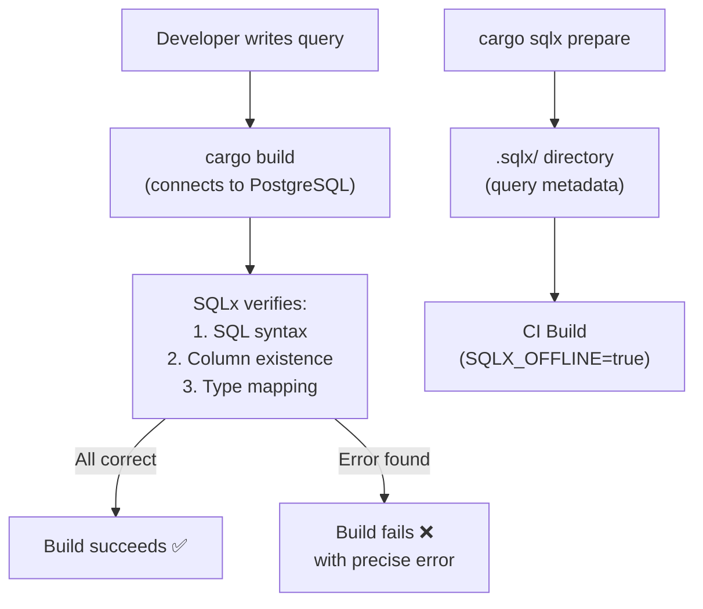

# ADR-0003: Compile-Time SQL Verification

> **Navigation**: [Docs Home](../../README.md) > [Design](../README.md) > [ADRs](README.md) > ADR-0003

## Status

**Accepted**

## Date

2025-01-20

## Context

The VRC Web-Backend uses PostgreSQL for persistence. SQL queries need to be correct in three dimensions:

1. **Syntax**: The SQL must parse correctly
2. **Schema**: Referenced tables and columns must exist
3. **Types**: Rust types must match PostgreSQL column types

Traditional approaches (raw SQL strings, ORMs) defer one or more of these checks to runtime. A query that references a dropped column compiles fine but fails in production.

### Forces

- The project prioritizes compile-time error detection (see [Principles](../principles.md))
- The database schema evolves through migrations — queries can become stale
- Runtime SQL errors in production are high-severity incidents
- SQLx provides compile-time verification against a real PostgreSQL database
- CI/CD pipeline needs to build without a running database

## Decision

We will use **SQLx with compile-time query verification** and the offline mode (`sqlx-data.json` / `.sqlx/` directory) for CI builds.

### How It Works

**During development** (with running PostgreSQL):

```rust
// sqlx::query_as! connects to the database at compile time
// and verifies: SQL syntax, column existence, type mapping
let user = sqlx::query_as!(
    User,
    "SELECT id, discord_id, display_name, role, created_at FROM users WHERE id = $1",
    user_id
)
.fetch_optional(&pool)
.await?;
```

If the `users` table doesn't have a `display_name` column, or if `role` is a `text` column but the Rust struct expects an `i32`, compilation fails immediately.

**During CI** (without running PostgreSQL):

```bash
# Generate offline query data from a running database
cargo sqlx prepare

# This creates .sqlx/ directory with JSON files per query
# CI can then build with SQLX_OFFLINE=true
```



### Offline Mode Workflow

1. Developer adds or modifies a `sqlx::query!` or `sqlx::query_as!` call
2. Developer runs `cargo sqlx prepare` with a running PostgreSQL instance
3. SQLx generates JSON metadata files in the `.sqlx/` directory
4. The `.sqlx/` directory is committed to version control
5. CI builds with `SQLX_OFFLINE=true`, using the committed metadata

## Consequences

### Positive

- **SQL errors caught at build time**: Syntax errors, missing columns, and type mismatches are compiler errors
- **Precise error messages**: SQLx reports exactly which query has which problem
- **Type-safe result mapping**: Query results are automatically mapped to Rust structs with correct types
- **No runtime surprises**: If it compiles, the queries work against the schema
- **Offline builds**: CI doesn't need a running database (via `.sqlx/` metadata)

### Negative

- **Requires running PostgreSQL during development**: The compile-time check connects to a real database
- **`.sqlx/` directory maintenance**: Developers must remember to run `cargo sqlx prepare` after query changes
- **Build breaks on schema changes**: Changing a migration requires updating queries and regenerating metadata
- **No query composition**: Unlike ORMs, SQLx queries are static strings — no programmatic query building

### Neutral

- The `.sqlx/` directory in version control adds some noise to diffs
- SQLx's compile-time checking adds a small amount of build time
- Migrations are managed separately via `sqlx migrate run`

## Alternatives Considered

### Alternative 1: Diesel ORM

**Description**: Use Diesel's type-safe query builder with schema inference from `diesel.toml`.

**Pros**:
- Type-safe query building in Rust
- Schema generated from migrations
- No running database needed for compilation

**Cons**:
- Thick abstraction layer over SQL
- Hard to write complex queries (joins, CTEs, window functions)
- Generated schema.rs file can become unwieldy
- Different query syntax from actual SQL

**Why Rejected**: Diesel's abstraction hides the actual SQL, making it harder to reason about query performance. SQLx gives full SQL control with compile-time verification.

### Alternative 2: SeaORM

**Description**: Use SeaORM's ActiveRecord-style approach with async support.

**Pros**:
- Async-native
- Good Rust API
- Migration support

**Cons**:
- ActiveRecord pattern conflicts with hexagonal architecture
- Less mature than Diesel or SQLx
- Abstraction layer adds overhead

**Why Rejected**: ActiveRecord pattern couples models to database operations, conflicting with our hexagonal architecture principle.

### Alternative 3: Raw SQL Strings Without Verification

**Description**: Use `sqlx::query()` (without the `!` macro) for runtime-only verification.

**Pros**:
- No database needed at compile time
- Simpler build setup

**Cons**:
- SQL errors only found at runtime
- No compile-time type checking
- Violates Principle 3 (compile-time verification)

**Why Rejected**: Directly contradicts our core principle of catching errors at compile time.

## Related

- [Design Principles](../principles.md) — Principle 3: Compile-Time Verification Wherever Possible
- [Design Patterns](../patterns.md) — Pattern 3: Repository Pattern (where queries live)
- [Trade-offs](../trade-offs.md) — Trade-off 4: SQLx over ORM
