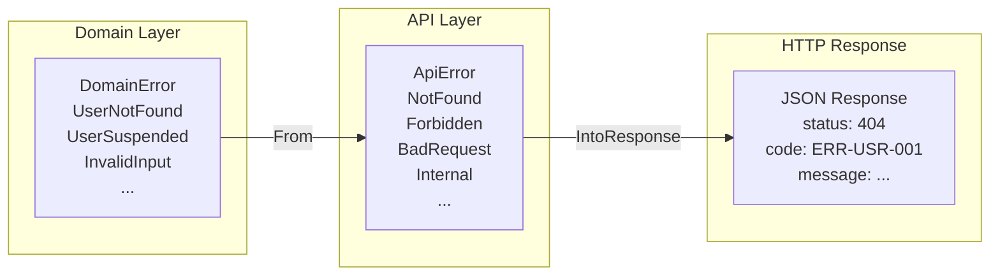

# ADR-0004: Algebraic Error Types

> **Navigation**: [Docs Home](../../README.md) > [Design](../README.md) > [ADRs](README.md) > ADR-0004

## Status

**Accepted**

## Date

2025-01-20

## Context

Error handling in a web backend involves multiple layers:

1. **Domain layer**: Business logic errors (user not found, user suspended, invalid input)
2. **API layer**: HTTP-meaningful errors (404, 403, 400, 500)
3. **HTTP response**: JSON error body with status code and error code

Each layer has different error semantics. A `DomainError::UserNotFound` means something different at the domain level (an entity doesn't exist) than at the API level (a 404 response with a specific error code).

### Forces

- The project values explicit error handling with no catch-all conversions (see [Principles](../principles.md))
- Rust's enum + `match` exhaustiveness checking is a powerful tool for total error handling
- Using `anyhow::Error` or `Box<dyn Error>` loses type information and prevents compile-time exhaustiveness
- Every error must map to a specific HTTP status code and machine-readable error code
- Adding a new error variant should force the developer to handle it everywhere

## Decision

We will use **per-layer algebraic error types** (Rust enums) with explicit, total `From` conversions between layers. No wildcard match arms in error conversions.

### Error Flow



### Implementation Pattern

```rust
// Domain layer — business logic errors
pub enum DomainError {
    UserNotFound,
    UserSuspended,
    InvalidInput(String),
    EventNotFound,
    Unauthorized,
    Infrastructure(String),
}

// API layer — HTTP-meaningful errors
pub enum ApiError {
    NotFound { code: &'static str, message: String },
    Forbidden { code: &'static str, message: String },
    BadRequest { code: &'static str, message: String },
    Unauthorized { code: &'static str, message: String },
    Internal { code: &'static str, message: String },
    TooManyRequests { code: &'static str, message: String },
}

// Total conversion — every variant is explicitly mapped
impl From<DomainError> for ApiError {
    fn from(err: DomainError) -> Self {
        match err {
            DomainError::UserNotFound => ApiError::NotFound {
                code: "ERR-USR-001",
                message: "ユーザーが見つかりません".into(),
            },
            DomainError::UserSuspended => ApiError::Forbidden {
                code: "ERR-USR-002",
                message: "アカウントが停止されています".into(),
            },
            DomainError::InvalidInput(msg) => ApiError::BadRequest {
                code: "ERR-VAL-001",
                message: msg,
            },
            DomainError::EventNotFound => ApiError::NotFound {
                code: "ERR-EVT-001",
                message: "イベントが見つかりません".into(),
            },
            DomainError::Unauthorized => ApiError::Unauthorized {
                code: "ERR-AUTH-001",
                message: "認証が必要です".into(),
            },
            DomainError::Infrastructure(msg) => ApiError::Internal {
                code: "ERR-SYS-001",
                message: msg,
            },
            // NO wildcard arm — new variants cause compile errors
        }
    }
}
```

### Key Rule

**No wildcard (`_`) match arms in error conversions.** When a new `DomainError` variant is added (e.g., `DomainError::EventCancelled`), the compiler immediately produces an error in the `From<DomainError> for ApiError` implementation, forcing the developer to decide how it maps to an HTTP response.

## Consequences

### Positive

- **Exhaustive handling**: Adding a new error variant causes compile errors at every unmapped conversion point
- **No information loss**: Each domain error maps to a specific API error with a unique error code
- **Self-documenting**: The `From` implementation is a complete mapping table
- **Machine-readable codes**: Every error response includes a unique code (e.g., `ERR-USR-001`) for frontend handling
- **No silent failures**: `anyhow`-style catch-all errors are impossible

### Negative

- **More verbose**: Each new error variant requires updates in multiple places
- **More match arms**: The `From` implementation grows with every variant
- **Rigid structure**: Error enums can't easily accommodate one-off error conditions
- **Duplication potential**: Similar error mappings across different domain contexts

### Neutral

- The `#[derive(ErrorCode)]` custom macro reduces some of the boilerplate
- Error codes follow a consistent naming convention: `ERR-{DOMAIN}-{NUMBER}`
- Japanese error messages are embedded directly in the conversion (see [ADR-0008](0008-japanese-error-messages.md))

## Alternatives Considered

### Alternative 1: anyhow::Error

**Description**: Use `anyhow::Error` throughout the application with `.context()` for error messages.

**Pros**:
- Minimal boilerplate
- Easy to propagate errors with `?`
- Good for prototyping

**Cons**:
- No compile-time exhaustiveness checking
- Error types are erased — can't pattern match on specific variants
- HTTP status code determination becomes a runtime guess
- Violates Principle 6 (Error Exhaustiveness)

**Why Rejected**: Loses all compile-time error handling guarantees. Adding new error conditions doesn't force handling.

### Alternative 2: thiserror with a Single Error Enum

**Description**: One large error enum for all errors, using `thiserror` for `Display`/`Error` derivation.

**Pros**:
- Single enum to manage
- `thiserror` provides nice `Display` implementations

**Cons**:
- Mixes domain and API concerns in one type
- No layered error transformation
- Harder to maintain as the application grows

**Why Rejected**: A single flat enum doesn't capture the semantic difference between domain errors and API errors. Layered enums provide better separation of concerns.

### Alternative 3: Error Trait Objects (Box&lt;dyn Error&gt;)

**Description**: Use `Box<dyn Error>` with downcasting for specific handling.

**Pros**:
- Flexible — any error type works
- Easy to propagate

**Cons**:
- Runtime type checking via downcasting
- No compile-time exhaustiveness
- Easy to forget to handle specific error types

**Why Rejected**: Runtime downcasting is the opposite of compile-time safety.

## Related

- [Design Principles](../principles.md) — Principle 6: Error Exhaustiveness
- [Design Patterns](../patterns.md) — Pattern 4: Algebraic Error Types
- [Trade-offs](../trade-offs.md) — relates to Rust's type system expressiveness (Trade-off 1)
- [Error Reference](../../reference/errors.md) — complete error code listing
