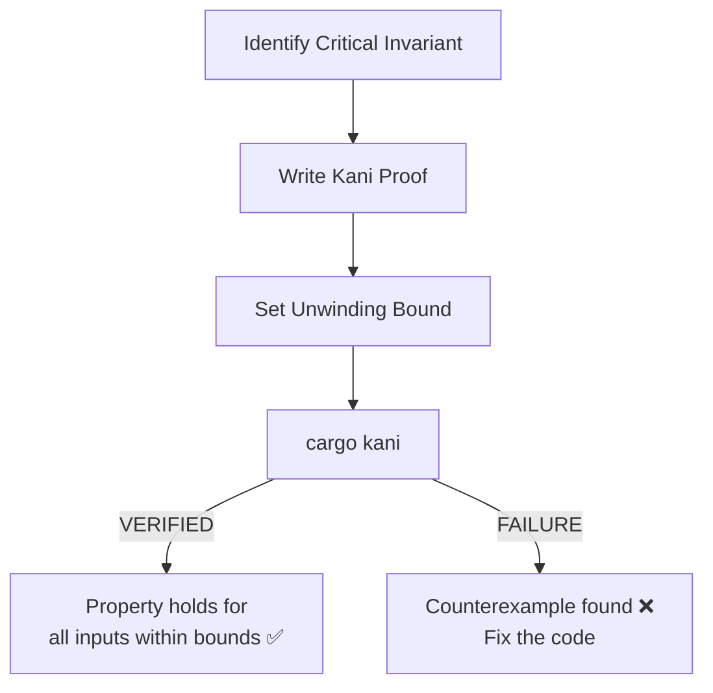

# ADR-0005: Formal Verification with Kani

> **Navigation**: [Docs Home](../../README.md) > [Design](../README.md) > [ADRs](README.md) > ADR-0005

## Status

**Accepted**

## Date

2025-02-01

## Context

The VRC Web-Backend has critical domain invariants that must hold under all conditions:

- Role hierarchy must be transitive (if Admin ≥ Staff and Staff ≥ Member, then Admin ≥ Member)
- Sanitized content must never contain script tags
- Rate limit counters must not overflow
- Token comparison must be constant-time

Example-based unit tests verify specific inputs produce expected outputs, but they can't prove properties hold for **all** inputs. Property-based testing (proptest) helps by generating random inputs, but it's probabilistic — it can miss edge cases.

### Forces

- The project values mathematical correctness (see [Principles](../principles.md))
- Critical security invariants must hold unconditionally, not just for tested inputs
- Kani is a bounded model checker for Rust that can prove properties about actual Rust code
- The learning value of formal verification aligns with "Romance Through Rigor"
- Kani proofs run on actual Rust code — no separate specification language

## Decision

We will use **Kani bounded model checking** to formally verify critical domain invariants. Kani proofs supplement (not replace) unit tests and property-based tests.

### What Kani Does

Kani translates Rust code to a mathematical model and exhaustively checks all possible execution paths within bounded inputs. If a proof passes, the property holds for **all** inputs within the specified bounds — not just random samples.

### Where We Apply Kani

| Invariant | Why It's Critical |
|-----------|-------------------|
| Role hierarchy transitivity | Authorization correctness |
| Sanitization completeness | XSS prevention |
| Counter overflow safety | Rate limiting correctness |
| Token comparison constant-time | Timing attack prevention |

### Implementation

```rust
#[cfg(kani)]
mod proofs {
    use super::*;

    #[kani::proof]
    #[kani::unwind(5)]
    fn verify_role_hierarchy_is_transitive() {
        let a: Role = kani::any();
        let b: Role = kani::any();
        let c: Role = kani::any();

        // If a >= b and b >= c, then a >= c must hold
        if a.has_permission_of(b) && b.has_permission_of(c) {
            assert!(a.has_permission_of(c));
        }
    }

    #[kani::proof]
    #[kani::unwind(5)]
    fn verify_role_hierarchy_is_reflexive() {
        let role: Role = kani::any();
        // Every role has its own permissions
        assert!(role.has_permission_of(role));
    }

    #[kani::proof]
    #[kani::unwind(5)]
    fn verify_role_hierarchy_is_antisymmetric() {
        let a: Role = kani::any();
        let b: Role = kani::any();

        // If a >= b and b >= a, then a == b
        if a.has_permission_of(b) && b.has_permission_of(a) {
            assert!(a == b);
        }
    }
}
```

### Proof Strategy



### Testing Pyramid

```
    ┌─────────────┐
    │  Kani Proofs │  Mathematical guarantees (bounded)
    ├─────────────┤
    │   proptest   │  Random inputs, statistical confidence
    ├─────────────┤
    │  Unit Tests  │  Specific examples, fast feedback
    └─────────────┘
```

Kani proofs provide the strongest guarantees but are limited to bounded inputs and specific properties. They sit at the top of the testing pyramid for critical invariants.

## Consequences

### Positive

- **Mathematical correctness**: Properties are proven, not just tested — no edge case can be missed within bounds
- **Runs on actual code**: Kani verifies the real Rust implementation, not a separate model
- **Counterexample generation**: When a proof fails, Kani provides a concrete counterexample
- **Educational value**: Contributors learn formal methods and mathematical reasoning about code
- **Complements existing tests**: Works alongside unit tests and proptest

### Negative

- **Bounded verification**: Proofs only hold for inputs within the unwinding bound — not truly universal
- **Slow execution**: Kani proofs can take minutes to run (not suitable for every build)
- **Limited scope**: Not all properties can be verified with Kani (e.g., async behavior, I/O)
- **Learning curve**: Formal verification concepts are unfamiliar to most developers
- **Tooling maturity**: Kani is actively developed — occasional breaking changes or limitations

### Neutral

- Kani proofs are `#[cfg(kani)]` gated — they don't affect normal compilation
- Proofs are colocated with the code they verify (in the same module)
- Kani is maintained by AWS and is open source

## Alternatives Considered

### Alternative 1: Property-Based Testing Only (proptest)

**Description**: Rely solely on proptest for invariant checking with random inputs.

**Pros**:
- Easier to write than Kani proofs
- Faster execution
- Well-established in the Rust ecosystem

**Cons**:
- Probabilistic — can miss edge cases
- Number of iterations is finite and configurable
- Cannot provide mathematical guarantees

**Why Rejected**: proptest is excellent but cannot prove that a property holds for all inputs. We use proptest for general properties and Kani for critical invariants.

### Alternative 2: TLA+ / Alloy Specification

**Description**: Write formal specifications in TLA+ or Alloy, separate from the Rust code.

**Pros**:
- Powerful specification languages
- Can model distributed system properties
- Well-established in formal methods community

**Cons**:
- Separate specification — must be kept in sync with code
- Different language to learn, maintain, and review
- Doesn't verify the actual implementation

**Why Rejected**: The gap between specification and implementation is a major risk. Kani verifies the actual Rust code.

### Alternative 3: No Formal Verification

**Description**: Rely on unit tests and property-based tests only.

**Pros**:
- Simpler tooling
- Faster CI pipeline
- Lower learning barrier

**Cons**:
- No mathematical guarantees
- Critical invariants are only probabilistically tested
- Misses the educational opportunity

**Why Rejected**: For critical security invariants (role hierarchy, sanitization), probabilistic testing isn't sufficient. The educational value also supports including formal verification.

## Related

- [Design Principles](../principles.md) — Principle 7: Property-Based Correctness
- [Formal Verification Specification](../../../../specs/12-formal-verification/README.md) — detailed proof specifications
- [Kani Proofs Specification](../../../../specs/12-formal-verification/kani-proofs.md) — individual proof details
- [Testing Strategy](../../development/testing.md) — how Kani fits into the overall testing strategy
