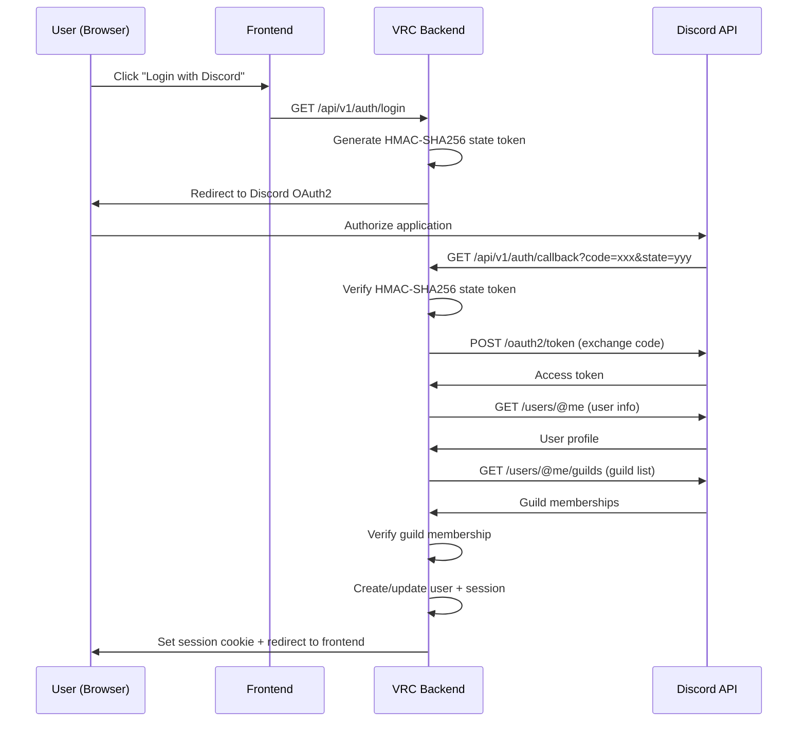

# ADR-0006: Discord-Only Authentication

> **Navigation**: [Docs Home](../../README.md) > [Design](../README.md) > [ADRs](README.md) > ADR-0006

## Status

**Accepted**

## Date

2025-01-10

## Context

The VRC Web-Backend serves the VRChat October Class Reunion community — a Japanese-speaking VRChat community organized on Discord. Every member of the community has a Discord account and is part of the community Discord server.

We need to decide on an authentication strategy. The options range from traditional email/password to social OAuth2 providers.

### Forces

- Every community member already has a Discord account
- Guild membership verification is essential — only community members should access the platform
- Password management (hashing, reset flows, credential stuffing prevention) is a significant security surface
- The community has ~50-300 members — no need for universal access
- Discord's OAuth2 API provides identity, guild membership, and avatar information

## Decision

We will use **Discord OAuth2 as the sole authentication method**. No email/password, no alternative OAuth2 providers.

### Authentication Flow

### Guild Verification

After obtaining the user's identity, the backend checks that the user is a member of the community Discord server. Users who are not in the server cannot log in. Users who leave the server have their accounts suspended automatically (via the System API leave sync endpoint).

## Consequences

### Positive

- **Zero password management**: No password hashing, no reset flows, no credential stuffing
- **Natural community verification**: Guild membership check ensures only community members access the platform
- **Rich profile data**: Discord provides display name, avatar, and discriminator
- **Simplified implementation**: Single OAuth2 provider — one auth flow to implement and maintain
- **Reduced attack surface**: No password database to protect, no brute-force login attacks

### Negative

- **Discord dependency**: If Discord has an outage, no one can log in
- **Vendor lock-in**: Tightly coupled to Discord's OAuth2 API and guild system
- **Exclusion**: Anyone without a Discord account cannot use the platform
- **API rate limits**: Discord imposes rate limits on OAuth2 and API endpoints
- **TOS risk**: Changes to Discord's Terms of Service or API could impact the platform

### Neutral

- Discord OAuth2 is well-documented and stable
- The community already uses Discord as its primary communication platform

## Alternatives Considered

### Alternative 1: Email/Password with Optional Discord Linking

**Description**: Traditional email/password authentication with optional Discord account linking for community verification.

**Pros**:
- Universal — anyone can sign up
- No external dependency for basic authentication
- Industry standard

**Cons**:
- Must implement password hashing, reset flows, and brute-force protection
- Community verification becomes a separate step
- Larger attack surface (credential stuffing, password spraying)

**Why Rejected**: The password management overhead and security surface are unjustified when every user already has a Discord account.

### Alternative 2: Multiple OAuth2 Providers

**Description**: Support Discord, Google, and GitHub OAuth2.

**Pros**:
- More flexible
- Users can choose their preferred provider

**Cons**:
- Only Discord provides guild membership verification
- Account linking across providers adds complexity
- Other providers don't add value for this specific community

**Why Rejected**: Additional providers don't serve the community's needs and add implementation complexity without benefit.

## Related

- [Trade-offs](../trade-offs.md) — Trade-off 6: Discord-Only Auth
- [Auth API Reference](../../reference/api/auth.md) — OAuth2 flow details
- [Security Guide](../../guides/security.md) — authentication security model
