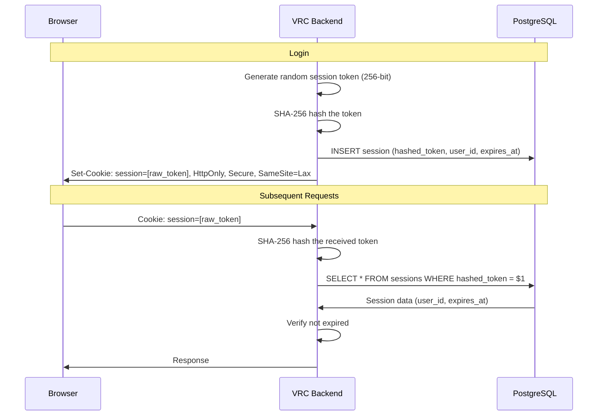

# ADR-0007: Server-Side Sessions over JWT

> **Navigation**: [Docs Home](../../README.md) > [Design](../README.md) > [ADRs](README.md) > ADR-0007

## Status

**Accepted**

## Date

2025-01-10

## Context

After authenticating via Discord OAuth2, we need a mechanism to maintain user sessions. The two primary approaches are:

1. **Server-side sessions**: Generate a random token, store session data in the database, send the token as a cookie
2. **JWT (JSON Web Tokens)**: Encode session data in a signed token, send it to the client, verify the signature on each request

### Forces

- The application is single-node — no need for stateless scaling across multiple servers
- Session revocation (logout, account suspension) must be immediate — not dependent on token expiry
- The project values security simplicity over performance optimization
- PostgreSQL is already used for all persistent data
- The community size (~50-300) means session table size is negligible

## Decision

We will use **server-side sessions** stored in PostgreSQL with SHA-256 hashed tokens in cookies.

### Implementation

### Token Handling

- **Generation**: Cryptographically random 256-bit token via `rand::OsRng`
- **Storage**: Only the SHA-256 hash is stored in the database — raw tokens are never persisted
- **Comparison**: Received tokens are hashed, then compared to stored hashes using `subtle::ConstantTimeEq`
- **Cookie attributes**: `HttpOnly`, `Secure`, `SameSite=Lax`, `Path=/`

### Why Hash Stored Tokens?

If the sessions table is compromised (SQL injection in another application sharing the DB, backup leak, etc.), the attacker gets hashed tokens — not usable for session hijacking. The raw token only exists in the client's cookie and briefly in server memory.

## Consequences

### Positive

- **Instant revocation**: `DELETE FROM sessions WHERE user_id = $1` immediately invalidates all sessions
- **Small token size**: A session cookie is ~64 characters (hex-encoded SHA-256), not a large JWT
- **Full server-side control**: Can enumerate sessions, force logout, audit last activity
- **No JWT vulnerabilities**: No algorithm confusion, no signature key rotation, no `none` algorithm attacks
- **Simple security model**: Token → hash → database lookup — straightforward to reason about

### Negative

- **Database lookup per request**: Every authenticated request requires a `SELECT` on the sessions table
- **Doesn't scale horizontally**: Multiple backend instances need a shared database (which we already have)
- **Session cleanup needed**: Expired sessions accumulate and need periodic cleanup
- **Slightly more latency**: Database query adds ~1-2ms per request compared to local JWT verification

### Neutral

- Session table sits in the same PostgreSQL instance as all other data — no additional infrastructure
- The sessions table is indexed on `hashed_token` for fast lookup
- Expired session cleanup can be handled by a periodic SQL `DELETE WHERE expires_at < NOW()`

## Alternatives Considered

### Alternative 1: JWT (Stateless)

**Description**: Encode user ID, role, and expiry in a signed JWT. Verify the signature locally without database access.

**Pros**:
- No database lookup per request
- Scales horizontally without shared state
- Self-contained — all data in the token

**Cons**:
- **Cannot revoke immediately**: Must wait for token expiry or maintain a blocklist (negating statelessness)
- **Token bloat**: JWTs are larger than simple session tokens
- **Key rotation complexity**: Signing keys must be rotated, old keys kept for verification
- **Algorithm confusion attacks**: `alg=none` and key confusion are well-known JWT vulnerabilities
- **Information leakage**: JWT payload is base64-encoded (not encrypted) — user data visible to client

**Why Rejected**: Immediate revocation is a hard requirement. The single-node deployment doesn't benefit from statelessness. JWT's additional attack surface is unjustified.

### Alternative 2: JWT with Refresh Tokens

**Description**: Short-lived JWT (15 min) with long-lived refresh token stored server-side.

**Pros**:
- Reduces database lookups (only on refresh)
- Revocation via refresh token deletion

**Cons**:
- Combines worst of both: server-side storage for refresh tokens AND JWT complexity
- Revocation has a 15-minute delay
- More complex auth flow

**Why Rejected**: More complex than pure server-side sessions with no clear benefit for our use case.

### Alternative 3: Redis-Backed Sessions

**Description**: Store sessions in Redis instead of PostgreSQL for faster lookups.

**Pros**:
- Sub-millisecond session lookups
- Built-in TTL for automatic expiry

**Cons**:
- Additional infrastructure component
- Redis persistence configuration needed
- Another thing to monitor and back up

**Why Rejected**: PostgreSQL session lookups are fast enough (~1-2ms) for ~50-300 users. Adding Redis is unjustified infrastructure complexity.

## Related

- [Trade-offs](../trade-offs.md) — Trade-off 7: Sessions over JWT
- [Security Guide](../../guides/security.md) — session security details
- [ADR-0006: Discord-Only Authentication](0006-discord-only-authentication.md) — the auth flow that creates sessions
