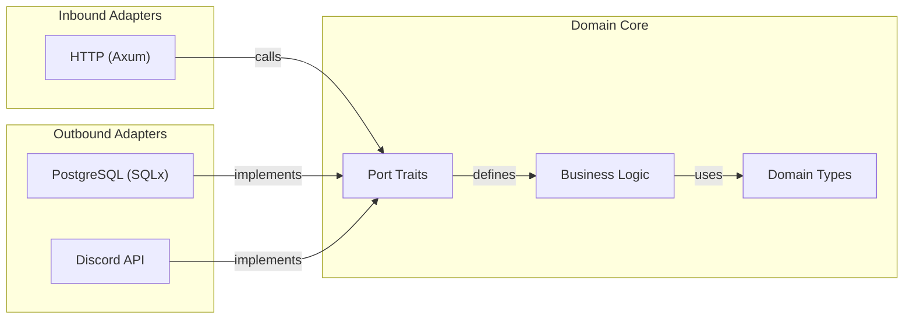
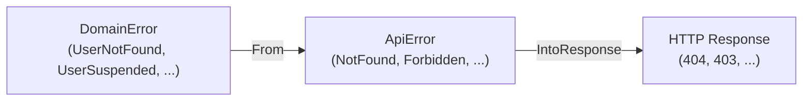
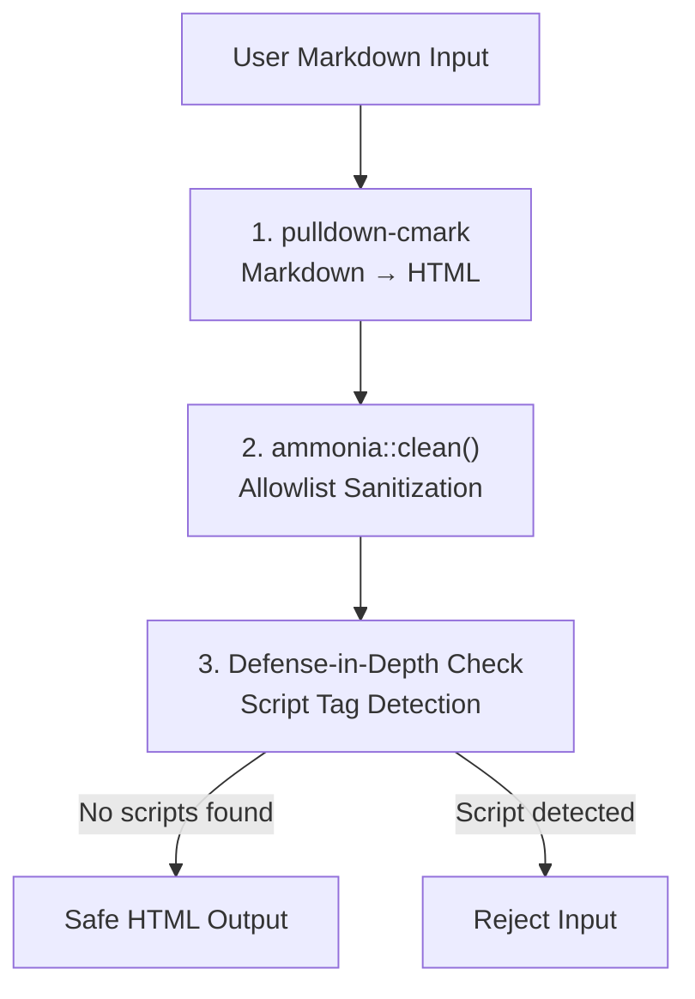

# Design Patterns

> **Audience**: Developers
>
> **Navigation**: [Docs Home](../README.md) > [Design](README.md) > Patterns

## Overview

This document catalogs the design patterns used in the VRC Web-Backend, why each was chosen, and where it appears in the codebase.

---

## 1. Hexagonal Architecture (Ports and Adapters)

### What It Is

The application is organized into a pure domain core surrounded by adapter layers. The domain defines port traits (interfaces) for all external dependencies. Adapters implement these traits for specific technologies (PostgreSQL, HTTP, Discord).

### Why It Was Chosen

- Domain logic is testable without any infrastructure
- Swapping PostgreSQL for another database requires only a new adapter
- Forces clean separation of concerns
- Aligns with [Principle 5: Hexagonal Purity](principles.md#5-hexagonal-purity)

### Where It's Used

```
vrc-backend/src/
├── domain/              # Pure core — no external dependencies
│   ├── types/           # Domain entities (User, Event, Session, Role)
│   ├── ports/           # Port traits (UserRepository, EventRepository)
│   └── errors/          # DomainError enum
├── adapters/
│   ├── postgres/        # PostgreSQL repository implementations
│   ├── http/            # Axum route handlers and extractors
│   └── discord/         # Discord API client
└── config/              # Application configuration
```



### Related ADR

- [ADR-0001: Hexagonal Architecture](adr/0001-hexagonal-architecture.md)

---

## 2. Type-State Pattern (Phantom Types for Role Enforcement)

### What It Is

`AuthenticatedUser<R: Role>` uses a phantom type parameter `R` to encode the user's role at the type level. The extractor verifies the role at the HTTP boundary, and from that point on, the compiler enforces that only users with the correct role can call a function.

### Why It Was Chosen

- Makes unauthorized access a **compile error**, not a runtime bug
- Self-documenting — function signatures declare required roles
- Aligns with [Principle 2: Type Safety Over Runtime Checks](principles.md#2-type-safety-over-runtime-checks)

### Where It's Used

```rust
// Role markers — zero-sized types used only as phantom type parameters
pub struct Member;
pub struct Staff;
pub struct Admin;
pub struct SuperAdmin;

// The extractor that verifies the role from the session
pub struct AuthenticatedUser<R: Role> {
    pub user_id: UserId,
    pub discord_id: DiscordId,
    _role: PhantomData<R>,
}

// Handler that requires Admin role — won't compile with Member
async fn suspend_user(
    admin: AuthenticatedUser<Admin>,
    Path(user_id): Path<UserId>,
) -> Result<Json<ApiResponse>, ApiError> {
    // admin is guaranteed to be an Admin at compile time
}
```

### Related ADR

- [ADR-0002: Type-State Authorization](adr/0002-type-state-authorization.md)

---

## 3. Repository Pattern (Trait-Based Data Access)

### What It Is

Data access is abstracted behind traits defined in the domain layer. Each entity has a corresponding repository trait that defines CRUD operations. The PostgreSQL adapter provides the concrete implementation.

### Why It Was Chosen

- Domain logic doesn't depend on database technology
- Enables testing with in-memory mock repositories
- Natural fit for hexagonal architecture
- Clean separation of query logic from business logic

### Where It's Used

```rust
// Port trait — defined in domain, no external deps
#[async_trait]
pub trait UserRepository: Send + Sync {
    async fn find_by_id(&self, id: UserId) -> Result<Option<User>, DomainError>;
    async fn find_by_discord_id(&self, id: DiscordId) -> Result<Option<User>, DomainError>;
    async fn save(&self, user: &User) -> Result<(), DomainError>;
    async fn update_role(&self, id: UserId, role: Role) -> Result<(), DomainError>;
}

// Adapter — implements the trait with actual SQL
pub struct PostgresUserRepository {
    pool: PgPool,
}

#[async_trait]
impl UserRepository for PostgresUserRepository {
    async fn find_by_id(&self, id: UserId) -> Result<Option<User>, DomainError> {
        sqlx::query_as!(User, "SELECT * FROM users WHERE id = $1", id.as_ref())
            .fetch_optional(&self.pool)
            .await
            .map_err(|e| DomainError::Infrastructure(e.to_string()))
    }
    // ...
}
```

---

## 4. Algebraic Error Types (Per-Layer Enums with Total Conversions)

### What It Is

Each architectural layer has its own error enum. Errors flow outward through explicit, total `From` conversions — every variant is mapped, with no wildcard arms.

### Why It Was Chosen

- Adding a new error variant causes compile errors at every unmapped conversion point
- Each layer's errors are self-contained and meaningful at that level
- No `anyhow`, no `Box<dyn Error>`, no information loss
- Aligns with [Principle 6: Error Exhaustiveness](principles.md#6-error-exhaustiveness)

### Where It's Used



```rust
// Domain layer errors
pub enum DomainError {
    UserNotFound,
    UserSuspended,
    InvalidInput(String),
    Infrastructure(String),
}

// API layer errors — maps domain errors to HTTP-meaningful errors
pub enum ApiError {
    NotFound { code: &'static str, message: String },
    Forbidden { code: &'static str, message: String },
    BadRequest { code: &'static str, message: String },
    Internal { code: &'static str, message: String },
}
```

### Related ADR

- [ADR-0004: Algebraic Error Types](adr/0004-algebraic-error-types.md)

---

## 5. Tower Middleware Composition (Typed Service Layers)

### What It Is

Middleware is composed using Tower's typed layer system. Each middleware is a standalone layer that wraps the next service. Layers are composed declaratively in the router definition with explicit ordering.

### Why It Was Chosen

- Type-safe middleware composition — incompatible layers cause compile errors
- Each middleware is independently testable
- Explicit ordering prevents subtle middleware interaction bugs
- Tower is Axum's native middleware system

### Where It's Used

```rust
// Middleware stack composed as typed layers
let app = Router::new()
    .merge(public_routes())
    .merge(internal_routes())
    .merge(system_routes())
    .merge(auth_routes())
    .layer(SecurityHeadersLayer::new())
    .layer(CsrfLayer::new(config.frontend_origin.clone()))
    .layer(RateLimitLayer::new(rate_limit_config))
    .layer(CorsLayer::new(config.frontend_origin.clone()))
    .layer(TraceLayer::new_for_http());
```

Middleware ordering (outermost → innermost):
1. **Tracing** — logs every request
2. **CORS** — rejects disallowed origins
3. **Rate Limiting** — throttles excessive requests
4. **CSRF** — validates Origin on mutating requests
5. **Security Headers** — adds HSTS, CSP, etc.

---

## 6. Builder Pattern (Configuration from Environment)

### What It Is

Application configuration is built from environment variables using a builder-style pattern. Required variables cause startup failure if missing. Optional variables have sensible defaults.

### Why It Was Chosen

- Fail-fast on missing required configuration
- Clear separation of required vs. optional settings
- Single place to validate all configuration

### Where It's Used

Configuration is loaded at startup from `.env` files and environment variables, validated, and then passed as immutable shared state to all handlers via Axum's `State` extractor.

```rust
// Configuration struct with validation
pub struct AppConfig {
    pub database_url: String,
    pub session_secret: String,        // Required, min 64 chars
    pub discord_client_id: String,     // Required
    pub discord_client_secret: String, // Required
    pub frontend_origin: String,       // Required
    pub system_api_token: String,      // Required, min 64 chars
    pub cookie_secure: bool,           // Default: true
    pub trust_x_forwarded_for: bool,   // Default: false
    pub rust_log: String,              // Default: "info"
}
```

---

## 7. Derive Macro Pattern (Custom Procedural Macros)

### What It Is

Custom procedural macros in the `vrc-macros` crate provide compile-time code generation for cross-cutting concerns: validation, error codes, and route metadata.

### Why It Was Chosen

- Eliminates boilerplate while preserving type safety
- Validation rules live next to field definitions
- Error codes are derived from enum structure — can't forget one
- Aligns with [Principle 3: Compile-Time Verification](principles.md#3-compile-time-verification-wherever-possible)

### Where It's Used

```rust
// #[derive(Validate)] — generates validation logic from attributes
#[derive(Validate)]
pub struct UpdateBioRequest {
    #[validate(length(max = 2000))]
    pub bio: String,

    #[validate(url, length(max = 512))]
    pub avatar_url: Option<String>,
}

// #[derive(ErrorCode)] — generates error code constants from enum variants
#[derive(ErrorCode)]
pub enum AuthError {
    #[error_code("ERR-AUTH-001")]
    InvalidToken,
    #[error_code("ERR-AUTH-002")]
    SessionExpired,
}
```

Macro source code is in the `vrc-macros/` crate.

---

## 8. Token Bucket Rate Limiting (Governor with DashMap)

### What It Is

Rate limiting uses the `governor` crate with `DashMap` for lock-free, per-key rate limiting. Four tiers are defined with different limits, applied based on route prefix.

### Why It Was Chosen

- Lock-free — uses atomic operations, no mutex contention
- Per-key limiting — each client gets their own bucket
- Configurable per tier — different limits for different security contexts
- `governor` is well-tested and production-ready

### Where It's Used

| Tier | Routes | Limit | Key |
|------|--------|-------|-----|
| Public | `/api/v1/public/*` | 60/min | IP address |
| Internal | `/api/v1/internal/*` | 120/min | Session user ID |
| System | `/api/v1/system/*` | 30/min | Bearer token |
| Auth | `/api/v1/auth/*` | 10/min | IP address |

```rust
// Rate limit configuration per tier
pub struct RateLimitConfig {
    pub public: RateLimit,   // 60 req/min
    pub internal: RateLimit, // 120 req/min
    pub system: RateLimit,   // 30 req/min
    pub auth: RateLimit,     // 10 req/min
}
```

---

## 9. Defense-in-Depth (Multi-Layer XSS Prevention)

### What It Is

User-generated content (bios, event descriptions) passes through multiple sanitization layers. Each layer assumes the previous one might have failed.

### Why It Was Chosen

- Sanitizer bypass vulnerabilities are discovered regularly
- Multiple independent layers make exploitation exponentially harder
- Aligns with [Principle 4: Defense in Depth](principles.md#4-defense-in-depth)

### Where It's Used



```rust
pub fn sanitize_markdown(input: &str) -> Result<String, DomainError> {
    // Layer 1: Controlled HTML generation
    let html = markdown_to_html(input);

    // Layer 2: Allowlist-based sanitization
    let clean = ammonia::Builder::new()
        .tags(hashset!["p", "br", "strong", "em", "a", "ul", "ol", "li"])
        .url_protocols(hashset!["https"])
        .clean(&html)
        .to_string();

    // Layer 3: Defense-in-depth — reject if scripts survive
    if contains_script_pattern(&clean) {
        return Err(DomainError::XssDetected);
    }

    Ok(clean)
}
```

---

## Pattern Summary

| Pattern | Primary Principle | Complexity Cost | Safety Gain |
|---------|-------------------|-----------------|-------------|
| Hexagonal Architecture | Hexagonal Purity | High (more traits/files) | High (testable, swappable) |
| Type-State Pattern | Type Safety | Medium (phantom types) | Very High (compile-time roles) |
| Repository Pattern | Hexagonal Purity | Medium (trait + impl) | High (testable data access) |
| Algebraic Error Types | Error Exhaustiveness | Medium (many match arms) | Very High (total error handling) |
| Tower Middleware | Compile-Time Verification | Low (declarative) | High (typed composition) |
| Builder Pattern | Compile-Time Verification | Low | Medium (fail-fast config) |
| Derive Macros | Compile-Time Verification | High (macro code) | High (generated correctness) |
| Token Bucket | Defense in Depth | Low (library-based) | Medium (DOS prevention) |
| Defense-in-Depth XSS | Defense in Depth | Low (3 function calls) | Very High (layered sanitization) |

## Related Documents

- [Design Principles](principles.md) — the principles these patterns implement
- [Trade-offs](trade-offs.md) — what these patterns cost us
- [ADRs](adr/README.md) — individual decision records
- [Architecture Overview](../architecture/README.md) — system structure
