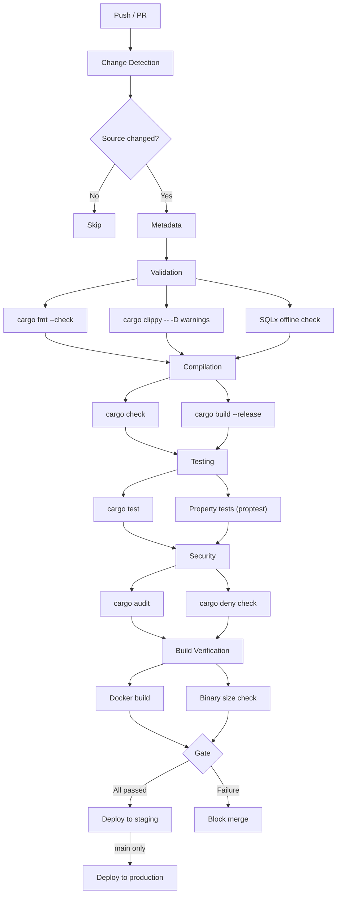
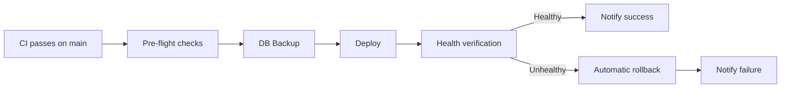

# CI/CD Pipeline

> **Navigation**: [Docs Home](../README.md) > [Development](README.md) > CI/CD

This document describes the GitHub Actions workflows that automate code quality checks, testing, security scanning, and deployment.

## Workflow Overview

| Workflow | Trigger | Purpose |
|---|---|---|
| **CI** | Push to `main`/`develop`/`release/**`/`hotfix/**`, PRs, merge queue | Full validation pipeline |
| **Security** | Weekly schedule, PRs touching dependencies/Dockerfile | Dependency audits, container scanning, SAST |
| **Nightly** | Daily at 04:00 JST, on-demand | Extended tests: Miri, Kani, property fuzzing, benchmarks |
| **CD** | Called by CI after merge to `main` | Docker build, push, deploy |
| **Release** | Release events | Versioned release artifacts |

## CI Pipeline

The CI pipeline is a multi-phase DAG with conditional execution. It runs **22 jobs** in approximately 8–15 minutes (cache hit) or 20–30 minutes (cold).

### Pipeline Stages



### Phase Details

#### Phase 0: Change Detection

Uses `dorny/paths-filter` to detect which parts of the codebase changed:

- **rust** — `vrc-backend/src/**`, `Cargo.toml`, `Cargo.lock`
- **macros** — `vrc-macros/src/**`, `vrc-macros/Cargo.toml`
- **migrations** — `vrc-backend/migrations/**`
- **docker** — `Dockerfile`, `docker-compose*.yml`, `Caddyfile`
- **ci** — `.github/**`

Jobs in later phases are skipped if no relevant files changed.

#### Phase 1: Validation

| Job | Command | Purpose |
|---|---|---|
| Format check | `cargo fmt --check` | Enforce consistent code style |
| Clippy | `cargo clippy -- -D warnings` | Lint with pedantic level, deny all warnings |
| SQLx check | SQLx offline verification | Ensure query metadata is up to date |

#### Phase 2: Compilation

| Job | Command | Purpose |
|---|---|---|
| Check | `cargo check` | Fast type-check without producing binaries |
| Build | `cargo build --release` | Full release build to catch optimization-time issues |

#### Phase 3: Testing

| Job | Command | Purpose |
|---|---|---|
| Unit + Integration | `cargo test` | All tests in the workspace |
| Property tests | `cargo test -- proptest` | proptest-based property checks |

#### Phase 4: Security

| Job | Tool | Purpose |
|---|---|---|
| Advisory audit | `cargo audit` | Check for known vulnerabilities in dependencies |
| Policy check | `cargo deny check` | Enforce license, advisory, and ban policies |

#### Phase 5: Build Verification

| Job | Purpose |
|---|---|
| Docker build | Verify Docker image builds successfully |
| Binary size check | Ensure stripped binary stays under size budget |

#### Gate

All phases must pass before a PR can be merged. The pipeline uses GitHub's merge queue for atomicity on `main`.

### Environment Configuration

Key CI environment variables:

```yaml
CARGO_TERM_COLOR: always
CARGO_INCREMENTAL: "0"        # Disable incremental (better caching)
SQLX_OFFLINE: "true"          # No database in CI
RUST_BACKTRACE: short
MSRV: "1.85.0"
```

### Caching

The CI pipeline caches:

- **Cargo registry** — downloaded crate sources
- **Cargo build** — compiled dependencies (`target/`)
- **cargo-chef layers** — Docker layer caching for dependency builds

Cache keys are based on `Cargo.lock` hash, so caches invalidate when dependencies change.

## Security Pipeline

Runs weekly and on PRs that touch dependency files.

| Check | Tool | Description |
|---|---|---|
| Dependency audit | `cargo audit` | Known CVE/advisory checking against RustSec database |
| License & policy | `cargo deny` | License compliance, advisory redundancy, crate bans |
| Container scan | Trivy / Grype | Vulnerability scanning of Docker image layers |
| Secret detection | — | Scan for leaked credentials in source |

## Nightly Pipeline

Extended testing that is too slow for per-commit CI. Runs daily at **04:00 JST**.

| Job | Tool | Duration | Description |
|---|---|---|---|
| Extended property tests | proptest | ~45 min | 10,000 cases per property test |
| Full integration suite | cargo test | ~30 min | All tests including `--include-ignored` |
| Undefined behavior | Miri | ~60 min | Detect UB in unsafe code |
| Formal verification | Kani | ~30 min | Bounded model checking proofs |
| Benchmarks | criterion | ~15 min | Performance regression detection |

Results are reported via GitHub Issues if failures are detected.

## CD Pipeline

Triggered after successful CI on `main`:



### Deployment Flow

1. **Pre-flight** — verify image exists in GHCR, environment is reachable
2. **DB Backup** — snapshot database before deployment (skippable)
3. **Deploy** — pull new image, `docker compose up -d`
4. **Health verification** — poll `/health` endpoint until healthy or timeout
5. **Rollback** — automatic if health check fails
6. **Notification** — Discord webhook on success or failure

### Docker Image

- **Registry**: GitHub Container Registry (`ghcr.io`)
- **Tags**: `sha-<short>`, `latest` (for `main`), semantic version tags
- **Signing**: Images are signed for supply chain security

## Running CI Locally

You can replicate most CI checks locally:

```bash
# Full pre-commit check (same as CI gate)
make check

# Individual checks
make fmt           # Auto-format
make lint          # clippy + fmt --check
make test          # All tests
make audit         # Security audit
make deny          # License/advisory check

# Docker build verification
make docker-build
```

## Workflow Dispatch

Several workflows support manual triggering via `workflow_dispatch`:

- **CI** — `extended_tests` (property tests), `force_docker_build`, `rust_toolchain_override`
- **Nightly** — toggle individual test suites (Miri, Kani, benchmarks, fuzz)
- **Security** — `scan_scope` (full, dependencies-only, container-only)
- **CD** — `environment` (staging/production), `image-tag`, `skip-backup`, `dry-run`

## Related Documents

- [Testing Guide](testing.md) — understanding what CI tests
- [Build System](build.md) — build configurations used in CI
- [Setup Guide](setup.md) — replicating CI locally
- [Project Structure](project-structure.md) — where workflow files live
