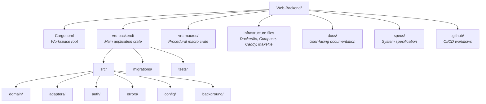
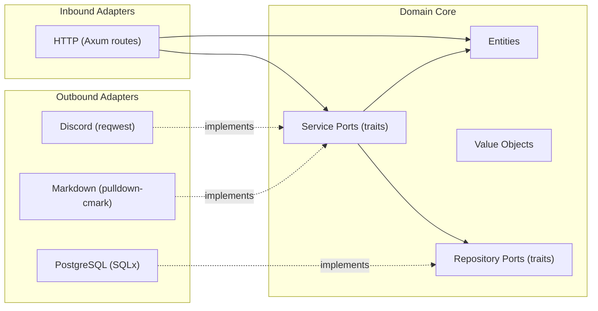

# Project Structure

> **Navigation**: [Docs Home](../README.md) > [Development](README.md) > Project Structure

Full annotated directory tree and architecture explanation for the VRC Web-Backend codebase.

## Directory Overview



## Complete Directory Tree

```
Web-Backend/
├── Cargo.toml                    # Workspace manifest (members, release profile)
├── Cargo.lock                    # Pinned dependency versions
├── Caddyfile                     # Caddy reverse proxy configuration
├── docker-compose.yml            # Dev environment (PostgreSQL)
├── docker-compose.prod.yml       # Production stack (app + postgres + caddy)
├── Dockerfile                    # Multi-stage build (cargo-chef + bookworm-slim)
├── Makefile                      # Task runner (build, test, lint, db, docker)
├── .env.example                  # Environment variable template
├── LICENSE                       # Project license
├── README.md                     # Project overview and quickstart
├── CONTRIBUTING.md               # Contribution guidelines
├── SECURITY.md                   # Security policy and reporting
├── CHANGELOG.md                  # Version history
├── CODE_OF_CONDUCT.md            # Community guidelines
│
├── .github/
│   └── workflows/
│       ├── ci.yml                # Main CI pipeline (22 jobs)
│       ├── cd.yml                # Deployment pipeline (reusable)
│       ├── nightly.yml           # Extended tests (Miri, Kani, fuzzing)
│       ├── security.yml          # Security scanning (audit, deny, container)
│       ├── release.yml           # Release artifact pipeline
│       ├── stale.yml             # Stale issue/PR management
│       ├── labeler.yml           # Auto-labeling for PRs
│       ├── reusable-rust-check.yml     # Shared Rust check job
│       ├── reusable-docker-publish.yml # Shared Docker build+push job
│       ├── reusable-deploy-ssh.yml     # Shared SSH deployment job
│       └── reusable-notify.yml         # Shared notification job
│
├── vrc-backend/                  # ─── Main Application Crate ───
│   ├── Cargo.toml                # Dependencies: axum, sqlx, tower, tokio, etc.
│   │
│   ├── migrations/               # SQLx database migrations (auto-run on start)
│   │   ├── 20250101000000_initial_schema.sql        # Core tables
│   │   ├── 20250102000000_add_updated_at_columns.sql # Audit timestamps
│   │   ├── 20250103000000_performance_indexes.sql    # Query optimization
│   │   └── 20250104000000_spec_compliance.sql        # Specification alignment
│   │
│   ├── src/
│   │   ├── main.rs               # Entry point: config → DI → server start
│   │   ├── lib.rs                # AppState definition, module re-exports
│   │   │
│   │   ├── config/               # Application configuration
│   │   │   └── mod.rs            # AppConfig: reads env vars, validates settings
│   │   │
│   │   ├── domain/               # ── Business Logic (no external deps) ──
│   │   │   ├── entities/         # Core data structures
│   │   │   │   ├── user.rs       # User entity
│   │   │   │   ├── profile.rs    # User profile
│   │   │   │   ├── event.rs      # Event entity
│   │   │   │   ├── club.rs       # Club entity
│   │   │   │   ├── gallery.rs    # Gallery entity
│   │   │   │   ├── report.rs     # Report entity
│   │   │   │   └── session.rs    # Session entity
│   │   │   ├── value_objects/    # Domain value types
│   │   │   │   ├── page_request.rs   # Pagination request
│   │   │   │   └── page_response.rs  # Pagination response
│   │   │   └── ports/            # Interfaces (trait definitions)
│   │   │       ├── repositories/ # Data access traits
│   │   │       │   ├── user_repository.rs
│   │   │       │   ├── profile_repository.rs
│   │   │       │   ├── event_repository.rs
│   │   │       │   ├── club_repository.rs
│   │   │       │   ├── gallery_repository.rs
│   │   │       │   ├── report_repository.rs
│   │   │       │   └── session_repository.rs
│   │   │       └── services/     # Business logic service traits
│   │   │
│   │   ├── adapters/             # ── Interface Adapters ──
│   │   │   ├── inbound/          # Driving adapters (HTTP)
│   │   │   │   ├── routes/       # Route handlers grouped by API surface
│   │   │   │   │   ├── public.rs     # Public API (unauthenticated)
│   │   │   │   │   ├── internal.rs   # Internal API (authenticated)
│   │   │   │   │   ├── system.rs     # System API (admin)
│   │   │   │   │   ├── auth.rs       # Auth API (Discord OAuth2)
│   │   │   │   │   ├── admin.rs      # Admin endpoints
│   │   │   │   │   ├── health.rs     # Health check
│   │   │   │   │   └── metrics.rs    # Prometheus metrics
│   │   │   │   ├── middleware/   # Tower middleware
│   │   │   │   │   ├── csrf.rs           # CSRF protection
│   │   │   │   │   ├── rate_limit.rs     # Rate limiting (governor)
│   │   │   │   │   ├── metrics.rs        # Request metrics collection
│   │   │   │   │   ├── security_headers.rs # Security headers
│   │   │   │   │   └── request_id.rs     # Request ID propagation
│   │   │   │   └── extractors/  # Axum extractors
│   │   │   │       ├── validated_json.rs  # JSON body with validation
│   │   │   │       └── validated_query.rs # Query params with validation
│   │   │   └── outbound/         # Driven adapters (external services)
│   │   │       ├── postgres/     # SQLx repository implementations
│   │   │       │   ├── user_repo.rs
│   │   │       │   ├── profile_repo.rs
│   │   │       │   ├── event_repo.rs
│   │   │       │   ├── club_repo.rs
│   │   │       │   ├── gallery_repo.rs
│   │   │       │   ├── report_repo.rs
│   │   │       │   └── session_repo.rs
│   │   │       ├── discord/      # Discord integration
│   │   │       │   ├── oauth2.rs     # OAuth2 client
│   │   │       │   └── webhook.rs    # Webhook sender
│   │   │       └── markdown/     # Markdown processing
│   │   │           └── mod.rs    # pulldown-cmark rendering + ammonia sanitization
│   │   │
│   │   ├── auth/                 # Authentication & authorization
│   │   │   └── mod.rs            # Type-state roles, AuthenticatedUser extractor
│   │   │
│   │   ├── errors/               # Error types
│   │   │   └── mod.rs            # DomainError, ApiError, InfraError
│   │   │
│   │   └── background/           # Background tasks
│   │       └── mod.rs            # Session cleanup, event archival scheduler
│   │
│   └── tests/                    # Integration tests
│       └── ...
│
├── vrc-macros/                   # ─── Procedural Macro Crate ───
│   ├── Cargo.toml                # proc-macro = true
│   └── src/
│       └── lib.rs                # #[handler], #[derive(Validate)], #[derive(ErrorCode)]
│
├── docs/                         # ─── User-Facing Documentation ───
│   ├── README.md                 # Documentation hub
│   └── en/                       # English documentation
│       ├── README.md             # Navigation index
│       ├── getting-started/      # Installation, quickstart, examples
│       ├── architecture/         # System design, C4 diagrams
│       ├── reference/            # API reference, configuration
│       ├── guides/               # How-to guides
│       ├── development/          # (this section) Dev setup, build, test, CI
│       └── design/               # Design decisions, ADRs
│
├── specs/                        # ─── System Specification ───
│   ├── 01-requirements/          # Functional, non-functional, constraints
│   ├── 02-architecture/          # C4 diagrams, ADRs
│   ├── 03-technology/            # Tech stack decisions
│   ├── 04-database/              # Schema, migrations, queries
│   ├── 05-api/                   # API design (REST endpoints)
│   ├── 06-security/              # Threat model, auth design
│   ├── 07-infrastructure/        # Docker, CI/CD, observability
│   ├── 12-formal-verification/   # Kani proofs, correctness patterns
│   ├── 13-testing/               # Test strategy
│   └── 15-project-management/    # Milestones, risks, workflow
│
└── target/                       # ─── Build Output (git-ignored) ───
    ├── debug/                    # Debug build artifacts
    ├── release/                  # Release build artifacts
    └── sqlx-prepare-check/       # SQLx offline query metadata
```

## Architecture Layers

The project follows a **hexagonal architecture** (ports and adapters) pattern. This separates business logic from infrastructure concerns.



### Layer Rules

| Layer | Directory | May depend on | Must NOT depend on |
|---|---|---|---|
| **Domain** | `domain/` | Nothing (pure Rust, std only) | `adapters/`, `config/`, external crates |
| **Ports** | `domain/ports/` | Domain entities, value objects | Any adapter implementation |
| **Inbound adapters** | `adapters/inbound/` | Domain, ports | Outbound adapters directly |
| **Outbound adapters** | `adapters/outbound/` | Domain, ports | Inbound adapters |
| **Auth** | `auth/` | Domain entities | Adapter internals |
| **Errors** | `errors/` | Domain entities | Adapter internals |
| **Config** | `config/` | Nothing | Domain, adapters |

The **domain layer** has zero external dependencies — it uses only Rust's standard library. All external interactions (database, HTTP client, etc.) are abstracted behind **port traits** in `domain/ports/`. Adapters in `adapters/outbound/` implement these traits.

### Dependency Injection

`main.rs` wires everything together:

1. Reads configuration (`AppConfig`)
2. Creates database pool (`PgPool`)
3. Constructs concrete adapter implementations
4. Builds `AppState` containing all dependencies
5. Constructs the Axum router with routes, middleware, and state
6. Starts the Tokio runtime and Axum server

## vrc-macros Crate

The `vrc-macros` crate is a separate workspace member because Rust requires procedural macros to be in their own crate (`proc-macro = true`).

### Provided Macros

| Macro | Type | Purpose |
|---|---|---|
| `#[handler]` | Attribute | Wraps an Axum handler with standard error handling and logging |
| `#[derive(Validate)]` | Derive | Generates input validation logic from field attributes |
| `#[derive(ErrorCode)]` | Derive | Generates structured API error codes for error enum variants |

These macros reduce boilerplate in route handlers and error definitions. The `vrc-backend` crate depends on `vrc-macros` as a workspace dependency.

## Key Files

| File | Purpose |
|---|---|
| `vrc-backend/src/main.rs` | Server entry point, configuration loading, DI setup |
| `vrc-backend/src/lib.rs` | `AppState` struct, module tree re-exports |
| `vrc-backend/src/config/mod.rs` | `AppConfig` — reads all settings from environment variables |
| `vrc-backend/src/auth/mod.rs` | Type-state role system, `AuthenticatedUser` Axum extractor |
| `vrc-backend/src/errors/mod.rs` | Unified error hierarchy: `DomainError` → `ApiError` → HTTP response |
| `Cargo.toml` | Workspace definition, release profile optimizations |
| `Dockerfile` | Production image build (4 stages, cargo-chef) |
| `Makefile` | Developer task runner (all common commands) |

## Related Documents

- [Setup Guide](setup.md) — getting the codebase running
- [Build System](build.md) — compilation and Docker builds
- [Testing Guide](testing.md) — where tests live and how to run them
- [CI/CD](ci-cd.md) — automated pipeline
- [Architecture Overview](../architecture/README.md) — high-level system design
