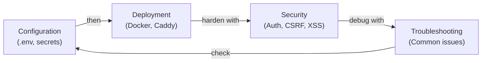

# Guides

> **Audience**: Users, Operators, Contributors
>
> **Navigation**: [Docs Home](../README.md) > Guides

## Overview

These guides provide practical, task-oriented instructions for configuring, deploying, securing, and troubleshooting the VRC Web-Backend.

## Guide Index

| Guide | Audience | Description |
|-------|----------|-------------|
| [Configuration](configuration.md) | Users/Ops | Environment variables, secrets, and startup validation |
| [Deployment](deployment.md) | Ops | Production deployment on Proxmox VM with Docker |
| [Security](security.md) | Ops/Security | Security model, hardening, and OWASP mitigation |
| [Troubleshooting](troubleshooting.md) | All | Common problems with symptoms, causes, and solutions |

## Quick Reference

### I want to...

| Task | Guide | Section |
|------|-------|---------|
| Set up environment variables | [Configuration](configuration.md) | Required Variables |
| Generate secrets | [Configuration](configuration.md) | Secret Generation |
| Deploy to production | [Deployment](deployment.md) | Deployment Procedure |
| Set up SSL/TLS | [Deployment](deployment.md) | Caddy Configuration |
| Understand the security model | [Security](security.md) | Overview |
| Fix a login error | [Troubleshooting](troubleshooting.md) | Login Issues |
| Fix a build error | [Troubleshooting](troubleshooting.md) | Build Issues |

## Related Documents

- [Architecture Overview](../architecture/README.md) — system structure
- [Design Principles](../design/principles.md) — why things work this way
- [API Reference](../reference/api/README.md) — endpoint documentation
