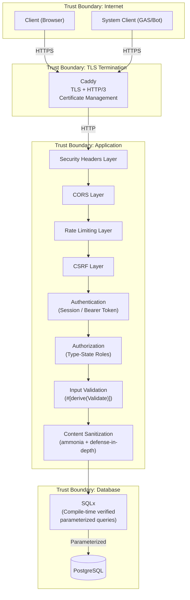
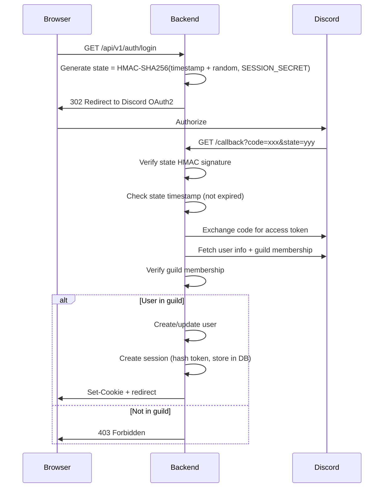
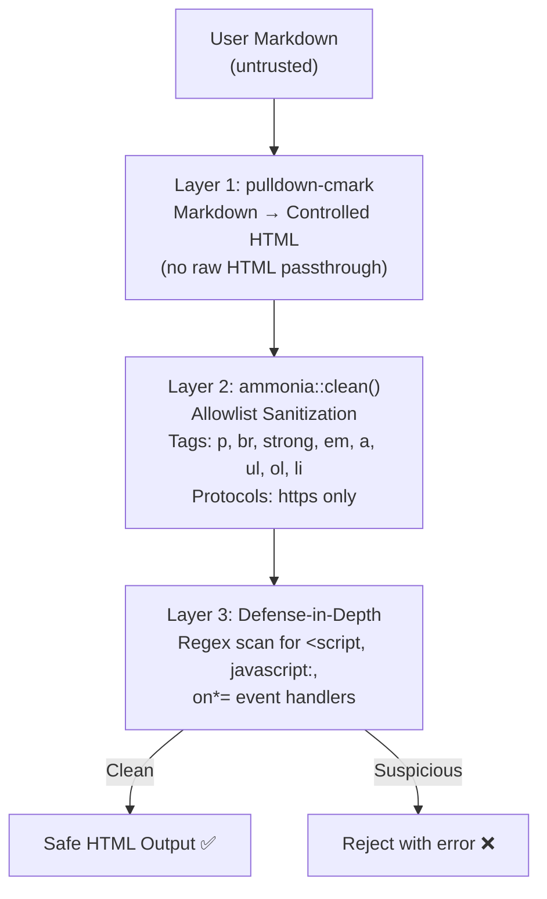

# Security Guide

> **Audience**: Operators, Security Reviewers
>
> **Navigation**: [Docs Home](../README.md) > [Guides](README.md) > Security

## Overview

The VRC Web-Backend implements a defense-in-depth security model with multiple overlapping layers. No single mechanism is trusted alone — each layer assumes the previous one might have failed.

## Security Model



## Authentication

### Discord OAuth2 Flow

Authentication uses Discord OAuth2 with HMAC-SHA256 signed state tokens for CSRF protection during the OAuth2 flow.



**State token security:**
- HMAC-SHA256 signed with `SESSION_SECRET` — cannot be forged
- Contains timestamp — rejects expired states (prevents replay attacks)
- Contains random nonce — ensures uniqueness

### Session Management

| Property | Implementation |
|----------|---------------|
| Token generation | 256-bit cryptographically random via `rand::OsRng` |
| Token storage | SHA-256 hashed in `sessions` table — raw token never persisted |
| Token comparison | SHA-256 hash + `subtle::ConstantTimeEq` (timing-safe) |
| Cookie attributes | `HttpOnly`, `Secure`, `SameSite=Lax`, `Path=/` |
| Session lifetime | Configurable via `SESSION_MAX_AGE_HOURS` (default: 168h / 7 days) |
| Revocation | Immediate — delete row from `sessions` table |

**Why SHA-256 hashed storage?** If the sessions table is compromised (database backup leak, shared DB vulnerability), attackers get hashed tokens — unusable for session hijacking.

**Why constant-time comparison?** Prevents timing side-channel attacks where an attacker measures response time differences to guess token bytes incrementally.

## Authorization

### RBAC with Type-State Enforcement

Roles are enforced at compile time using phantom type parameters:

| Role | Level | Permissions |
|------|-------|-------------|
| **Member** | 1 | View public content, edit own profile |
| **Staff** | 2 | Member + manage events |
| **Admin** | 3 | Staff + manage users, suspend accounts |
| **SuperAdmin** | 4 | Admin + system configuration |

```rust
// Compile-time enforcement — no runtime check needed
async fn admin_only(user: AuthenticatedUser<Admin>) -> Result<...> { ... }
```

### Permission Matrix

| Action | Member | Staff | Admin | SuperAdmin |
|--------|--------|-------|-------|------------|
| View public content | ✅ | ✅ | ✅ | ✅ |
| Edit own profile | ✅ | ✅ | ✅ | ✅ |
| View member directory | ✅ | ✅ | ✅ | ✅ |
| Create/edit events | ❌ | ✅ | ✅ | ✅ |
| Delete events | ❌ | ❌ | ✅ | ✅ |
| Manage users | ❌ | ❌ | ✅ | ✅ |
| Suspend accounts | ❌ | ❌ | ✅ | ✅ |
| Change user roles | ❌ | ❌ | ❌ | ✅ |
| System configuration | ❌ | ❌ | ❌ | ✅ |

## Input Validation

### #[derive(Validate)]

All user input is validated using the custom `#[derive(Validate)]` macro before reaching domain logic:

```rust
#[derive(Validate)]
pub struct UpdateBioRequest {
    #[validate(length(max = 2000))]
    pub bio: String,

    #[validate(url, length(max = 512))]
    pub avatar_url: Option<String>,
}
```

The `ValidatedJson<T>` extractor runs validation before the handler executes — invalid input never reaches business logic.

### Validation Rules

| Field Type | Rules |
|-----------|-------|
| Display names | 1-100 chars, trimmed |
| Bio/description | Max 2000 chars, sanitized |
| URLs | HTTPS only, max 512 chars, valid URL format |
| IDs | UUID format |
| Pagination | Page ≥ 1, per_page 1-100 |

## XSS Prevention

### Multi-Layer Sanitization

User-generated content passes through three independent layers:



**Why three layers?**
- Layer 1 prevents raw HTML injection from Markdown
- Layer 2 catches any HTML that slips through (ammonia allowlist)
- Layer 3 catches theoretical ammonia bypasses (defense-in-depth)

## CSRF Protection

### Origin Header Validation

CSRF protection validates the `Origin` header on all mutating requests (POST, PUT, PATCH, DELETE):

```
Request: POST /api/v1/internal/users/me/bio
Origin: https://your-domain.com     ← Must match FRONTEND_ORIGIN
```

| Condition | Result |
|-----------|--------|
| Origin matches `FRONTEND_ORIGIN` | Request proceeds |
| Origin doesn't match | `403 Forbidden` (ERR-CSRF-001) |
| Origin header missing (mutating request) | `403 Forbidden` (ERR-CSRF-001) |
| GET/HEAD/OPTIONS requests | CSRF check skipped |

**Combined with:**
- `SameSite=Lax` cookies — browser won't send cookies on cross-site POST
- CORS policy — only `FRONTEND_ORIGIN` is allowed

## Rate Limiting

### Per-Tier Configuration

Rate limiting uses the `governor` crate with lock-free atomic operations:

| Tier | Routes | Limit | Key | Purpose |
|------|--------|-------|-----|---------|
| Public | `/api/v1/public/*` | 60/min | IP address | Prevent scraping |
| Internal | `/api/v1/internal/*` | 120/min | User ID | Prevent abuse |
| System | `/api/v1/system/*` | 30/min | Bearer token | Prevent runaway sync |
| Auth | `/api/v1/auth/*` | 10/min | IP address | Prevent brute force |

When a rate limit is exceeded, the response includes:
- `429 Too Many Requests` status code
- `Retry-After` header with seconds until the limit resets

## Security Headers

The backend adds six security headers to every response:

| Header | Value | Purpose |
|--------|-------|---------|
| `Strict-Transport-Security` | `max-age=63072000; includeSubDomains; preload` | Force HTTPS for 2 years |
| `X-Content-Type-Options` | `nosniff` | Prevent MIME type sniffing |
| `X-Frame-Options` | `DENY` | Prevent clickjacking |
| `Referrer-Policy` | `strict-origin-when-cross-origin` | Control referrer leakage |
| `Permissions-Policy` | `camera=(), microphone=(), geolocation=()` | Disable unnecessary browser features |
| `Content-Security-Policy` | `default-src 'self'; script-src 'self'; ...` | Prevent inline scripts, restrict resource loading |

## Secret Management

| Secret | Location | Purpose | Minimum Length |
|--------|----------|---------|---------------|
| `SESSION_SECRET` | `.env` or Docker secret | HMAC key for session signing and state tokens | 64 characters |
| `SYSTEM_API_TOKEN` | `.env` or Docker secret | Bearer token for system API authentication | 64 characters |
| `DISCORD_CLIENT_SECRET` | `.env` | Discord OAuth2 application secret | Set by Discord |
| Database password | Docker secret (`secrets/db_password.txt`) | PostgreSQL authentication | 32+ characters recommended |

**Secret rotation procedure:**
1. Generate new secret: `openssl rand -hex 64`
2. Update the secret file or environment variable
3. Restart the application: `docker compose restart app`
4. Active sessions will be invalidated (for `SESSION_SECRET` rotation)

## SQL Injection Prevention

SQL injection is **impossible** in this codebase. All queries use SQLx's compile-time verified parameterized queries:

```rust
// Parameters ($1, $2) are never interpolated into the SQL string
// SQLx sends them as separate protocol-level parameters
sqlx::query_as!(
    User,
    "SELECT * FROM users WHERE id = $1 AND role >= $2",
    user_id,    // $1 — sent as parameter, never interpolated
    min_role    // $2 — sent as parameter, never interpolated
)
```

SQLx uses PostgreSQL's extended query protocol, which separates SQL text from parameters at the protocol level. There is no string interpolation — no SQL injection vector exists.

## SSRF Prevention

User-submitted URLs (profile links, avatar URLs) are validated:

1. **Protocol**: Only `https://` URLs are accepted
2. **Length**: Maximum 512 characters
3. **Format**: Must be a valid URL per the `url` crate's parser
4. **No internal access**: URLs are stored and rendered client-side — the backend never fetches user-submitted URLs

## Timing Attack Prevention

Token comparison uses a two-layer approach:

```rust
// 1. Hash both tokens with SHA-256 (equalizes length, prevents length-based timing leaks)
let received_hash = Sha256::digest(received_token.as_bytes());
let stored_hash = Sha256::digest(stored_token.as_bytes());

// 2. Compare hashes with constant-time algorithm (prevents byte-by-byte timing leaks)
use subtle::ConstantTimeEq;
received_hash.ct_eq(&stored_hash).into()
```

**Why both layers?**
- SHA-256 equalizes token length (prevents timing differences from different-length tokens)
- `ConstantTimeEq` prevents timing differences from byte-by-byte comparison

## Dependency Scanning

Use `cargo-audit` to scan for known vulnerabilities in dependencies:

```bash
# Install
cargo install cargo-audit

# Scan
cargo audit

# Scan with fix suggestions
cargo audit fix
```

Run `cargo audit` regularly and as part of CI.

## OWASP Top 10 Mitigation Mapping

| # | OWASP Category | Mitigation |
|---|---------------|------------|
| A01 | Broken Access Control | Type-state authorization with compile-time role enforcement |
| A02 | Cryptographic Failures | SHA-256 token hashing, TLS via Caddy, secure cookie attributes |
| A03 | Injection | Compile-time verified parameterized SQL queries (SQLx) |
| A04 | Insecure Design | Hexagonal architecture, defense-in-depth, formal verification |
| A05 | Security Misconfiguration | Startup validation, security headers, minimal Docker image |
| A06 | Vulnerable Components | `cargo audit` for dependency scanning |
| A07 | Auth Failures | Discord OAuth2, HMAC state tokens, rate-limited auth endpoints |
| A08 | Data Integrity Failures | HMAC-SHA256 state tokens, session token hashing, CSP headers |
| A09 | Logging & Monitoring | Structured logging (tracing), Prometheus metrics endpoint |
| A10 | SSRF | HTTPS-only URL validation, backend never fetches user URLs |

## Security Incident Response

If a security vulnerability is discovered:

1. **Do not** disclose publicly
2. Report via the process described in [SECURITY.md](../../../SECURITY.md)
3. Assess impact and affected versions
4. Develop and test a fix
5. Deploy the fix
6. Rotate any potentially compromised secrets
7. Notify affected users if necessary

## Related Documents

- [Design Principles](../design/principles.md) — Principle 4: Defense in Depth
- [ADR-0006: Discord-Only Authentication](../design/adr/0006-discord-only-authentication.md)
- [ADR-0007: Server-Side Sessions](../design/adr/0007-server-side-sessions.md)
- [Configuration Guide](configuration.md) — secret management
- [Deployment Guide](deployment.md) — production security setup
- [Threat Model](../../../specs/06-security/threat-model.md) — detailed threat analysis
