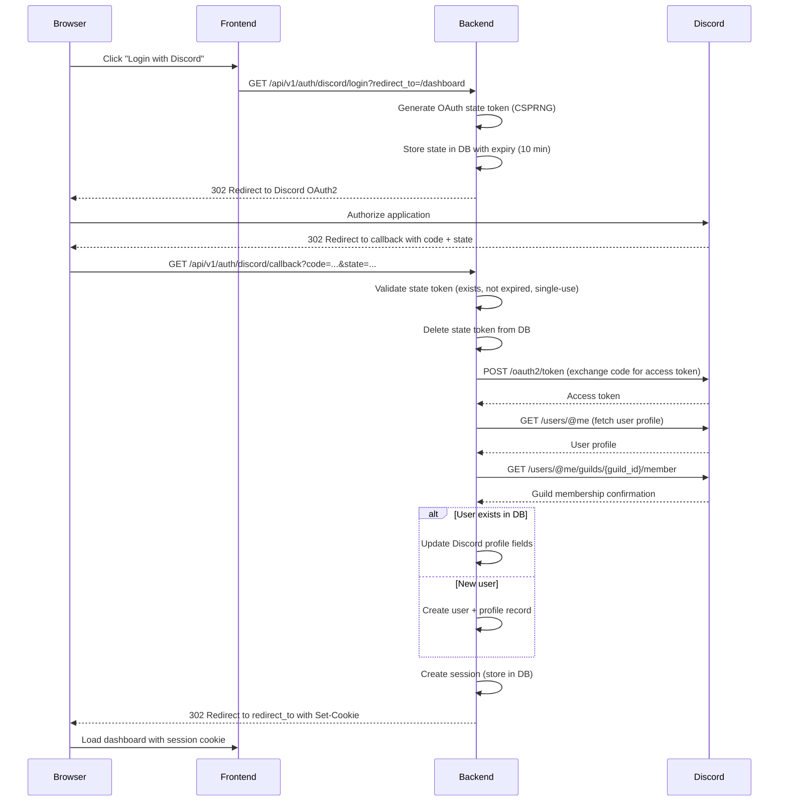

# Auth API Reference

> **Navigation**: [Docs Home](../../README.md) > [Reference](../README.md) > [API](README.md) > Auth API

The Auth API handles Discord OAuth2 authentication. These endpoints are unauthenticated and rate-limited to **10 requests/min per IP** to prevent abuse.

---

## OAuth2 Flow



---

## Endpoints

### Initiate Login

```
GET /api/v1/auth/discord/login
```

Starts the Discord OAuth2 authorization flow. Generates a cryptographically secure state token and redirects the user to Discord's authorization page.

**Query Parameters**

| Parameter | Type | Default | Description |
|-----------|------|---------|-------------|
| `redirect_to` | string | `/` | URL path to redirect to after successful login. Must be a relative path starting with `/`. |

**Redirect Validation**

The `redirect_to` parameter is validated to prevent open redirect attacks:
- Must start with `/`
- Must not contain `//` (no protocol-relative URLs)
- Must not contain `@` (no credentials in URL)
- Only paths on the same origin are accepted

**Response** `302 Found`

Redirects to Discord's OAuth2 authorization URL:

```
https://discord.com/oauth2/authorize?
  client_id={DISCORD_CLIENT_ID}&
  redirect_uri={BACKEND_BASE_URL}/api/v1/auth/discord/callback&
  response_type=code&
  scope=identify+guilds.members.read&
  state={generated_state_token}
```

**Error Codes**

| Code | Status | Cause |
|------|--------|-------|
| `ERR-AUTH-001` | 302 (redirect) | Login initiation failed; redirects to frontend with error |
| `ERR-RATELIMIT-001` | 429 | Rate limit exceeded |

---

### OAuth2 Callback

```
GET /api/v1/auth/discord/callback
```

Handles the Discord OAuth2 callback. Validates the state token, exchanges the authorization code for an access token, fetches the user profile, and creates/updates the session.

**Query Parameters**

| Parameter | Type | Description |
|-----------|------|-------------|
| `code` | string | Authorization code from Discord |
| `state` | string | State token for CSRF validation |

**State Token Security**

The state token provides protection against CSRF and replay attacks:

1. **Generated with CSPRNG** — Cryptographically secure random bytes
2. **Stored in database** — Not in cookies or URL (prevents client-side tampering)
3. **Time-limited** — Expires after 10 minutes
4. **Single-use** — Deleted immediately after validation
5. **Bound to session** — Cannot be reused across different login attempts

**Response** `302 Found`

On success, redirects to the frontend URL (from the original `redirect_to` parameter) with the session cookie set:

```
Set-Cookie: session_id=<opaque_token>; HttpOnly; Secure; SameSite=Lax; Path=/; Max-Age=604800
```

On failure, redirects to the frontend with an error query parameter:

```
{FRONTEND_ORIGIN}/auth/error?code=ERR-AUTH-002
```

**Cookie Behavior**

| Attribute | Value | Description |
|-----------|-------|-------------|
| `HttpOnly` | `true` | Not accessible via JavaScript |
| `Secure` | Configured via `COOKIE_SECURE` | `true` in production (HTTPS only) |
| `SameSite` | `Lax` | Sent on top-level navigations and same-site requests |
| `Path` | `/` | Available on all paths |
| `Max-Age` | `SESSION_MAX_AGE_SECS` | Default: 604800 (7 days) |

**Error Codes**

| Code | Status | Cause |
|------|--------|-------|
| `ERR-AUTH-001` | 302 (redirect) | OAuth code exchange or user fetch failed |
| `ERR-AUTH-002` | 302 (redirect) | State token missing, expired, or already used |
| `ERR-RATELIMIT-001` | 429 | Rate limit exceeded |

---

## Session Lifecycle

1. **Creation** — Session is created in the database after successful OAuth2 callback
2. **Usage** — Session ID in cookie is validated on each Internal API request
3. **Expiry** — Sessions expire after `SESSION_MAX_AGE_SECS` (default: 7 days)
4. **Cleanup** — Background task purges expired sessions every `SESSION_CLEANUP_INTERVAL_SECS` (default: 1 hour)
5. **Logout** — `POST /api/v1/internal/auth/logout` destroys the session immediately

---

## Related Documents

- [API Overview](README.md) — Authentication methods overview
- [Internal API](internal.md) — Endpoints that use session authentication
- [Configuration Reference](../configuration.md) — Session and cookie configuration
- [Error Catalog](../errors.md) — Complete error code reference
