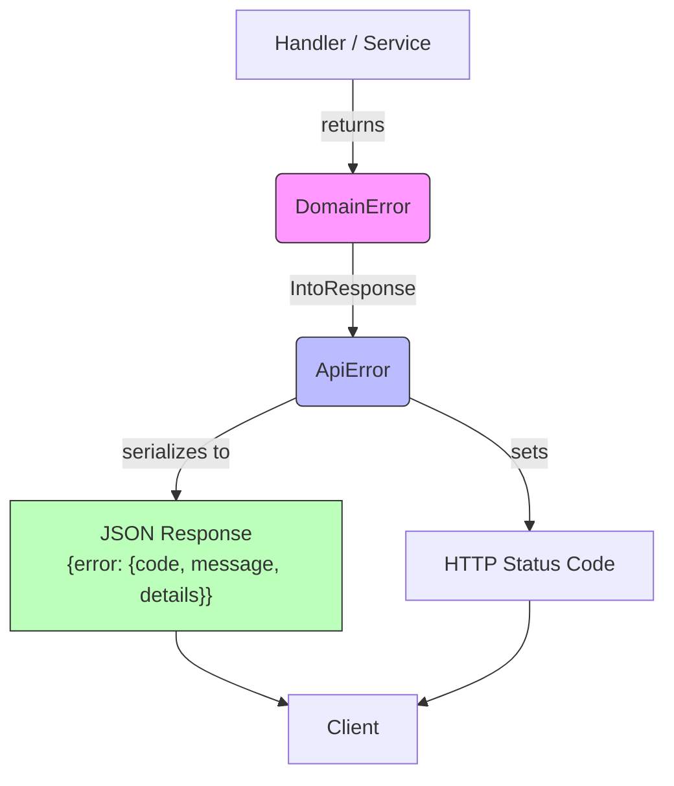

# Error Catalog

> **Navigation**: [Docs Home](../README.md) > [Reference](README.md) > Errors

Complete catalog of all error codes returned by the VRC Web-Backend. All errors follow the standard envelope format:

```json
{
  "error": {
    "code": "ERR-XXX-NNN",
    "message": "Human-readable message in Japanese",
    "details": {}
  }
}
```

---

## Error Flow



Domain errors raised in the service layer are converted into `ApiError` via the `IntoResponse` trait. Each `ApiError` maps to a specific HTTP status code and error code string. The error message is returned in Japanese.

---

## Profile Errors

| Code | HTTP Status | Message | Cause | Resolution |
|------|-------------|---------|-------|------------|
| `ERR-PROF-001` | 400 Bad Request | プロフィールのバリデーションに失敗しました | One or more profile fields failed validation | Check `error.details` for field-level errors and fix the invalid fields |
| `ERR-PROF-002` | 400 Bad Request | 危険なコンテンツが検出されました | `bio_markdown` contains scripts, data URIs, or other dangerous content | Remove prohibited content from the bio |
| `ERR-PROF-003` | 404 Not Found | プロフィールが見つかりません | Profile does not exist or is not publicly visible | Verify the Discord ID or check that the profile is set to public |

## Authentication Errors

| Code | HTTP Status | Message | Cause | Resolution |
|------|-------------|---------|-------|------------|
| `ERR-AUTH-001` | 302 (redirect) | ログインに失敗しました | Discord OAuth2 code exchange or user fetch failed | Retry login; check Discord API status |
| `ERR-AUTH-002` | 302 (redirect) | OAuth認証の状態検証に失敗しました | State token missing, expired (>10 min), or already used | Restart the login flow from the beginning |
| `ERR-AUTH-003` | 401 Unauthorized | セッションが無効または期限切れです | Session cookie missing, invalid, or expired | Login again to obtain a new session |
| `ERR-AUTH-004` | 403 Forbidden | アカウントが停止されています | User account has been suspended by an admin | Contact a community administrator |

## CSRF Errors

| Code | HTTP Status | Message | Cause | Resolution |
|------|-------------|---------|-------|------------|
| `ERR-CSRF-001` | 403 Forbidden | CSRF検証に失敗しました | `Origin` header missing or does not match `FRONTEND_ORIGIN` | Ensure requests are sent from the correct frontend origin |

## Permission Errors

| Code | HTTP Status | Message | Cause | Resolution |
|------|-------------|---------|-------|------------|
| `ERR-PERM-001` | 403 Forbidden | 権限が不足しています | User's role level is insufficient for the requested action | Request elevation from an admin, or use an account with appropriate permissions |
| `ERR-PERM-002` | 403 Forbidden | 管理者は自身の権限を降格できません | Admin attempted to change their own role | Another admin or super_admin must change the role |

## Role Errors

| Code | HTTP Status | Message | Cause | Resolution |
|------|-------------|---------|-------|------------|
| `ERR-ROLE-001` | 403 Forbidden | 管理者への昇格はスーパー管理者のみ可能です | Non-super_admin attempted to promote a user to admin | Only `super_admin` can promote to `admin` |
| `ERR-ROLE-002` | 403 Forbidden | スーパー管理者への昇格はAPIからできません | Attempted to promote a user to super_admin | `super_admin` is configured via `SUPER_ADMIN_DISCORD_ID` env var only |
| `ERR-ROLE-003` | 403 Forbidden | スーパー管理者は保護されています | Attempted to demote or modify the super_admin | The `super_admin` role cannot be changed via API |
| `ERR-ROLE-004` | 403 Forbidden | 操作者の権限レベルが不足しています | Actor's role level is not higher than the target's current level | A higher-level admin must perform this action |

## Moderation Errors

| Code | HTTP Status | Message | Cause | Resolution |
|------|-------------|---------|-------|------------|
| `ERR-MOD-001` | 404 Not Found | 通報対象が見つかりません | The reported target (user, event, club, etc.) does not exist | Verify the `target_type` and `target_id` |
| `ERR-MOD-002` | 409 Conflict | 同一対象への重複通報です | User already submitted a report for this target | A duplicate report is not needed |
| `ERR-MOD-003` | 400 Bad Request | 通報理由の長さが不正です | `reason` field is shorter than 10 or longer than 1000 characters | Adjust the reason length to 10–1000 characters |

## Event Errors

| Code | HTTP Status | Message | Cause | Resolution |
|------|-------------|---------|-------|------------|
| `ERR-EVT-001` | 404 Not Found | イベントが見つかりません | Event with the given ID does not exist | Verify the event ID |

## Club Errors

| Code | HTTP Status | Message | Cause | Resolution |
|------|-------------|---------|-------|------------|
| `ERR-CLUB-001` | 404 Not Found | クラブが見つかりません | Club with the given ID does not exist | Verify the club ID |

## Gallery Errors

| Code | HTTP Status | Message | Cause | Resolution |
|------|-------------|---------|-------|------------|
| `ERR-GAL-001` | 404 Not Found | ギャラリー画像が見つかりません | Gallery image with the given ID does not exist | Verify the image ID |
| `ERR-GAL-002` | 400 Bad Request | 無効なギャラリーステータス遷移です | Attempted an invalid status transition (e.g., `approved` → `pending`) | Check valid status transitions: `pending` → `approved`/`rejected`/`removed` |

## User Errors

| Code | HTTP Status | Message | Cause | Resolution |
|------|-------------|---------|-------|------------|
| `ERR-USER-001` | 404 Not Found | ユーザーが見つかりません | User with the given ID does not exist | Verify the user ID |

## System/Sync Errors

| Code | HTTP Status | Message | Cause | Resolution |
|------|-------------|---------|-------|------------|
| `ERR-SYNC-001` | 401 Unauthorized | システムAPIトークンが無効です | Bearer token missing or does not match `SYSTEM_API_TOKEN` | Check the `Authorization: Bearer <token>` header value |
| `ERR-SYNC-002` | 400 Bad Request | システムAPIのバリデーションに失敗しました | Request body failed validation | Check `error.details` for field-level errors |

## Rate Limiting

| Code | HTTP Status | Message | Cause | Resolution |
|------|-------------|---------|-------|------------|
| `ERR-RATELIMIT-001` | 429 Too Many Requests | レート制限を超過しました | Too many requests within the rate limit window | Wait for the `Retry-After` header duration and retry |

## General Errors

| Code | HTTP Status | Message | Cause | Resolution |
|------|-------------|---------|-------|------------|
| `ERR-VALIDATION` | 400 Bad Request | バリデーションエラー | General request validation failure (malformed JSON, missing fields, invalid types) | Check request body and query parameters |
| `ERR-INTERNAL` | 500 Internal Server Error | 内部サーバーエラー | Unexpected server error (database failure, panic, etc.) | Retry later; report if persistent. Check server logs for details |

---

## Related Documents

- [API Overview](api/README.md) — Error response format and conventions
- [Public API](api/public.md) — Public endpoint error codes
- [Internal API](api/internal.md) — Internal endpoint error codes
- [Admin API](api/admin.md) — Admin endpoint error codes and role authorization matrix
- [System API](api/system.md) — System endpoint error codes
