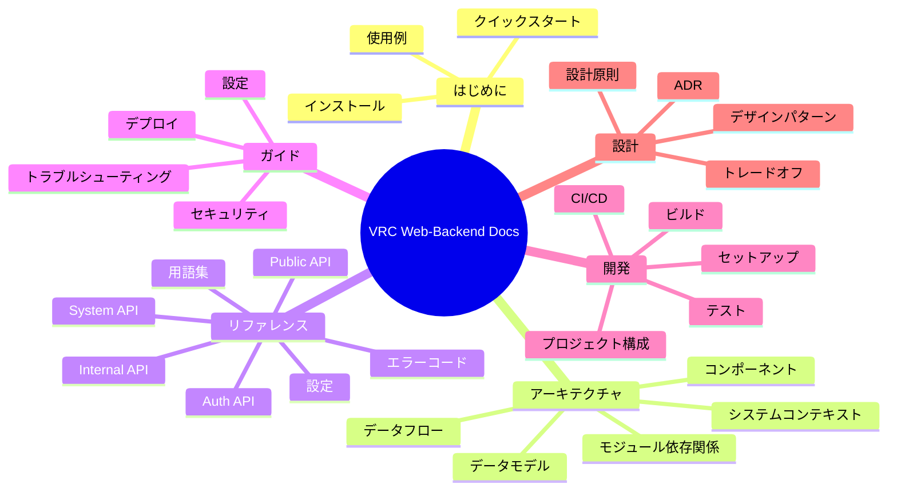

# VRC Web-Backend ドキュメント

VRC Web-Backend ドキュメントへようこそ。このページは全プロジェクトドキュメントのナビゲーションハブです。

> **言語 / Language**: [English](../en/README.md) | [日本語](../ja/README.md)

## クイックリンク

| やりたいこと | 参照先 |
|---|---|
| すぐに始めたい | [クイックスタート](getting-started/quickstart.md) |
| アーキテクチャを理解したい | [アーキテクチャ概要](architecture/README.md) |
| API エンドポイントを調べたい | [API リファレンス](reference/api/README.md) |
| 設定方法を知りたい | [設定ガイド](guides/configuration.md) |
| 開発環境を構築したい | [開発セットアップ](development/setup.md) |
| 設計判断を理解したい | [ADR](design/adr/README.md) |
| 問題を解決したい | [トラブルシューティング](guides/troubleshooting.md) |

## ドキュメントマップ

## 全ドキュメント一覧

### はじめに

| ドキュメント | 対象者 | 説明 |
|------------|--------|------|
| [インストール](getting-started/installation.md) | ユーザー/運用 | 全インストール方法（Docker、手動） |
| [クイックスタート](getting-started/quickstart.md) | ユーザー | 5分以内で起動 |
| [使用例](getting-started/examples.md) | ユーザー/開発者 | API 使用例集 |

### アーキテクチャ

| ドキュメント | 対象者 | 説明 |
|------------|--------|------|
| [概要](architecture/README.md) | 全員 | ハイレベルシステム設計と図 |
| [システムコンテキスト](architecture/system-context.md) | アーキテクト | C4 Level 1: システムの外部環境 |
| [コンポーネント](architecture/components.md) | 開発者 | 内部コンポーネント詳細 |
| [データモデル](architecture/data-model.md) | 開発者 | ER 図付きデータベーススキーマ |
| [データフロー](architecture/data-flow.md) | 開発者 | データの流れ |
| [モジュール依存関係](architecture/module-dependency.md) | 開発者 | モジュール関係グラフ |
| [ステート管理](architecture/state-management.md) | 開発者 | 状態遷移とライフサイクル |

### リファレンス

| ドキュメント | 対象者 | 説明 |
|------------|--------|------|
| [API 概要](reference/api/README.md) | 開発者 | API 規約と概要 |
| [Public API](reference/api/public.md) | 開発者 | 認証不要の公開エンドポイント |
| [Internal API](reference/api/internal.md) | 開発者 | セッション認証付きエンドポイント |
| [System API](reference/api/system.md) | 開発者 | M2M エンドポイント |
| [Auth API](reference/api/auth.md) | 開発者 | Discord OAuth2 フロー |
| [Admin API](reference/api/admin.md) | 開発者 | 管理者エンドポイント |
| [設定リファレンス](reference/configuration.md) | 運用 | 全設定オプション |
| [環境変数](reference/environment.md) | 運用 | 全環境変数 |
| [エラーコード](reference/errors.md) | 全員 | エラーコードと対処法 |
| [用語集](reference/glossary.md) | 全員 | ドメイン用語 |

### ガイド

| ドキュメント | 対象者 | 説明 |
|------------|--------|------|
| [設定ガイド](guides/configuration.md) | ユーザー/運用 | システム設定方法 |
| [デプロイガイド](guides/deployment.md) | 運用 | 本番デプロイ手順 |
| [トラブルシューティング](guides/troubleshooting.md) | 全員 | よくある問題と解決策 |
| [セキュリティ](guides/security.md) | 運用/セキュリティ | セキュリティモデルと強化策 |

### 開発

| ドキュメント | 対象者 | 説明 |
|------------|--------|------|
| [開発セットアップ](development/setup.md) | コントリビューター | 開発環境構築 |
| [ビルド](development/build.md) | コントリビューター | ビルドシステムガイド |
| [テスト](development/testing.md) | コントリビューター | テスト戦略と実行方法 |
| [CI/CD](development/ci-cd.md) | コントリビューター | パイプラインドキュメント |
| [プロジェクト構成](development/project-structure.md) | コントリビューター | コードベースガイド |

### 設計

| ドキュメント | 対象者 | 説明 |
|------------|--------|------|
| [設計原則](design/principles.md) | 全員 | 設計哲学 |
| [デザインパターン](design/patterns.md) | 開発者 | 使用パターンと理由 |
| [トレードオフ](design/trade-offs.md) | アーキテクト | 主要なトレードオフ |
| [ADR](design/adr/README.md) | 全員 | アーキテクチャ決定記録 |

## 関連ドキュメント

- [ルート README](../../README.md)
- [コントリビューティングガイド](../../CONTRIBUTING.md)
- [システム仕様書](../../specs/README.md)
- [セキュリティポリシー](../../SECURITY.md)
