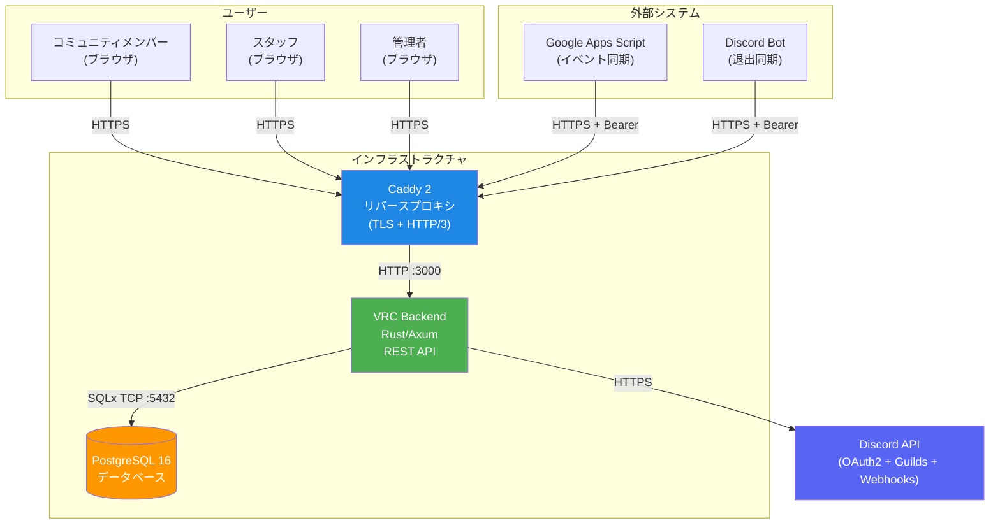
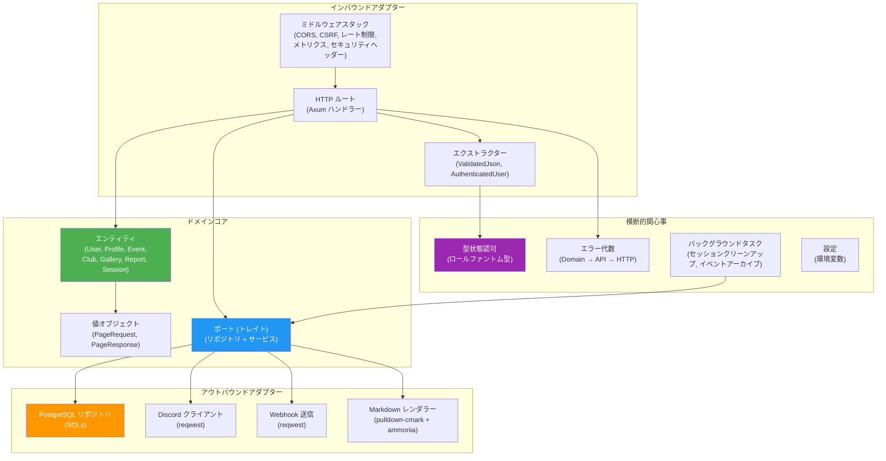

# アーキテクチャ概要

> **対象者**: 開発者、アーキテクト、コントリビューター
>
> **ナビゲーション**: [ドキュメントホーム](../README.md) > アーキテクチャ

## システムコンテキスト

VRC Web-Backend は、VRChat 10月クラス会コミュニティサイトを支えるモノリシックな Rust/Axum REST API です。Caddy リバースプロキシの背後に配置され、認証には Discord、永続化には PostgreSQL、データ同期には外部システム（GAS、Discord Bot）と通信します。

## ハイレベルアーキテクチャ

バックエンドは**ヘキサゴナルアーキテクチャ**（ポート＆アダプター）に従い、厳密なレイヤー分離を実現しています。

## API レイヤー

バックエンドは4つの独立した API レイヤーを公開しており、それぞれ固有の認証方式、レート制限、キャッシュ戦略を持ちます。

| レイヤー | パスプレフィックス | 認証方式 | レート制限 | キャッシュ |
|---------|-----------------|---------|----------|----------|
| **Public** | `/api/v1/public/*` | なし | IP あたり 60 リクエスト/分, バースト 10 | `public, max-age=30` |
| **Internal** | `/api/v1/internal/*` | セッション Cookie | ユーザー/IP あたり 120 リクエスト/分, バースト 20 | `private, no-store` |
| **System** | `/api/v1/system/*` | Bearer トークン | グローバル 30 リクエスト/分, バースト 5 | なし |
| **Auth** | `/api/v1/auth/*` | なし | IP あたり 10 リクエスト/分, バースト 3 | なし |

## 主要な設計判断

| 判断 | 概要 | ADR |
|-----|------|-----|
| ヘキサゴナルアーキテクチャ | ドメインコアは外部依存ゼロ。全 I/O はポートトレイトを経由する | [ADR-0001](../design/adr/0001-hexagonal-architecture.md) |
| 型状態認可 | ロール権限をファントム型でエンコード。不正アクセスはコンパイルエラーになる | [ADR-0002](../design/adr/0002-type-state-authorization.md) |
| コンパイル時 SQL 検証 | 全クエリを SQLx オフラインモードでライブスキーマに対して検証 | [ADR-0003](../design/adr/0003-compile-time-sql.md) |
| 代数的エラー型 | 各 API レイヤーが独自のエラー enum を持つ。変換は全射（catch-all なし） | [ADR-0004](../design/adr/0004-algebraic-error-types.md) |
| 形式検証 | 重要なドメインロジックを Kani 有界モデル検査で検証 | [ADR-0005](../design/adr/0005-formal-verification.md) |

## コンポーネント一覧

| コンポーネント | 場所 | 責務 |
|-------------|------|------|
| ドメインエンティティ | `vrc-backend/src/domain/entities/` | ビジネスオブジェクト（User, Profile, Event, Club, Gallery, Report, Session） |
| ドメインポート | `vrc-backend/src/domain/ports/` | リポジトリおよびサービスのトレイト定義 |
| 値オブジェクト | `vrc-backend/src/domain/value_objects/` | ページネーション、バリデーション済み型 |
| HTTP ルート | `vrc-backend/src/adapters/inbound/routes/` | 全 API レイヤーの Axum ハンドラー |
| ミドルウェア | `vrc-backend/src/adapters/inbound/middleware/` | CSRF、レート制限、メトリクス、セキュリティヘッダー、リクエスト ID |
| エクストラクター | `vrc-backend/src/adapters/inbound/extractors/` | ValidatedJson, ValidatedQuery |
| PostgreSQL リポジトリ | `vrc-backend/src/adapters/outbound/postgres/` | SQLx ベースのリポジトリ実装 |
| Discord クライアント | `vrc-backend/src/adapters/outbound/discord/` | OAuth2、ギルドチェック、Webhook 送信 |
| Markdown レンダラー | `vrc-backend/src/adapters/outbound/markdown/` | pulldown-cmark + ammonia サニタイズ |
| 認証システム | `vrc-backend/src/auth/` | ロールファントム型、AuthenticatedUser エクストラクター |
| エラーシステム | `vrc-backend/src/errors/` | DomainError, ApiError, InfraError |
| バックグラウンドタスク | `vrc-backend/src/background/` | セッションクリーンアップ、イベントアーカイブスケジューラ |
| 設定 | `vrc-backend/src/config/` | 環境変数からの AppConfig |
| プロシージャマクロ | `vrc-macros/src/` | `#[handler]`, `#[derive(Validate)]`, `#[derive(ErrorCode)]` |

## 関連ドキュメント

- [システムコンテキスト（C4 Level 1）](system-context.md)
- [コンポーネント詳細](components.md)
- [モジュール依存関係](module-dependency.md)
- [データモデル](data-model.md)
- [データフロー](data-flow.md)
- [ステート管理](state-management.md)
- [設計原則](../design/principles.md)
