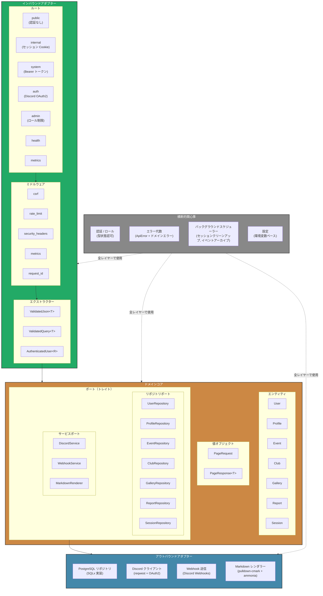

# コンポーネント詳細（C4 Level 2）

> **ナビゲーション**: [ドキュメントホーム](../README.md) > [アーキテクチャ](README.md) > コンポーネント

## 概要

このドキュメントは、VRC Backend の内部コンポーネントをヘキサゴナル（ポート＆アダプター）アーキテクチャに基づいて詳細に記述します。システムは4つのレイヤーで構成されています：インバウンドアダプター、ドメインコア、アウトバウンドアダプター、横断的関心事。

## コンポーネント図



## インバウンドアダプター

### ルート

API は認証・認可要件に基づく個別のルートグループに分割されています。

| ルートグループ | パスプレフィックス | 認証方式 | 目的 |
|-------------|-----------------|---------|------|
| **Public** | `/api/v1/public` | なし | 公開イベント、公開プロフィール、クラブ一覧への読み取り専用アクセス |
| **Internal** | `/api/v1/internal` | セッション Cookie | 認証済みユーザー操作 — プロフィール編集、クラブ管理、画像アップロード、レポート送信 |
| **System** | `/api/v1/system` | Bearer トークン | M2M 連携 — GAS イベント同期、Discord Bot メンバーイベント |
| **Auth** | `/api/v1/auth` | Discord OAuth2 | ログイン、ログアウト、コールバック、セッション更新 |
| **Admin** | `/api/v1/admin` | セッション Cookie + `admin`/`super_admin` ロール | ユーザー管理、ロール変更、システム管理 |
| **Health** | `/health` | なし | コンテナオーケストレーション用の Liveness / Readiness プローブ |
| **Metrics** | `/metrics` | 内部のみ | Prometheus 互換メトリクスエンドポイント |

### ミドルウェアスタック

ミドルウェアは全リクエストに対して特定の順序で適用されます。

| ミドルウェア | 順序 | 説明 |
|------------|------|------|
| **`request_id`** | 1番目 | 各リクエストに一意の `X-Request-Id` ヘッダーを生成する。ログとエラーレスポンスに伝播し、トレーサビリティを確保する。 |
| **`security_headers`** | 2番目 | `X-Content-Type-Options`、`X-Frame-Options`、`Strict-Transport-Security`、`X-XSS-Protection`、`Content-Security-Policy` ヘッダーを設定する。 |
| **`metrics`** | 3番目 | ルートごとのリクエスト数、レイテンシヒストグラム、レスポンスステータスコードを記録する。 |
| **`rate_limit`** | 4番目 | トークンバケットアルゴリズムによる IP 単位・ルート単位のレート制限。不正利用と DoS を防御する。 |
| **`csrf`** | 5番目 | 状態変更リクエスト（`POST`、`PUT`、`PATCH`、`DELETE`）に対するダブルサブミット Cookie CSRF 防御。System API（Bearer 認証）と Auth エンドポイントは除外。 |

### エクストラクター

デシリアライズとバリデーションを組み合わせたカスタム Axum エクストラクター。

| エクストラクター | 説明 |
|---------------|------|
| **`ValidatedJson<T>`** | JSON ボディをデシリアライズし、`#[derive(Validate)]` ルールを実行する。失敗時は構造化エラー詳細付きの `422 Unprocessable Entity` を返す。 |
| **`ValidatedQuery<T>`** | 上記と同様だがクエリ文字列パラメータ用。ページネーションとフィルタリングに使用する。 |
| **`AuthenticatedUser<R>`** | 最小ロール `R` でパラメータ化された型状態エクストラクター。Cookie からセッションを検索し、ユーザーステータスが `active` であることを確認し、ロール階層をチェックする。ファントム型 `R` は `Member`、`Staff`、`Admin`、`SuperAdmin` のいずれか。 |

## ドメインコア

### エンティティ

| エンティティ | 説明 | 主要フィールド |
|------------|------|-------------|
| **User** | Discord アカウントに紐付くコアアイデンティティ。ロールとステータスを保持する。 | `id`, `discord_id`, `username`, `role`, `status`, `created_at`, `updated_at` |
| **Profile** | ユーザーが編集可能なプロフィール情報。Markdown で書かれた自己紹介をサニタイズ済み HTML にレンダリングする。 | `user_id`, `display_name`, `bio_markdown`, `bio_html`, `avatar_url`, `is_public`, `updated_at` |
| **Event** | GAS から同期または管理者 API 経由で作成される VRChat コミュニティイベント。 | `id`, `title`, `description`, `start_time`, `end_time`, `world_link`, `status`, `created_at` |
| **Club** | メンバーシップ管理付きのコミュニティサブグループ。 | `id`, `name`, `description`, `owner_id`, `is_active`, `created_at` |
| **Gallery** | ユーザーがアップロードした画像。スタッフの承認が必要。 | `id`, `user_id`, `image_url`, `caption`, `status`, `uploaded_at`, `reviewed_at` |
| **Report** | プロフィール、イベント、クラブ、ギャラリー画像に対するユーザー送信レポート。 | `id`, `reporter_id`, `target_type`, `target_id`, `reason`, `status`, `created_at`, `resolved_at` |
| **Session** | ユーザーに紐付く認証済みセッション。Cookie トークンと有効期限を保持する。 | `id`, `user_id`, `token_hash`, `expires_at`, `created_at`, `last_accessed_at` |

### 値オブジェクト

| 値オブジェクト | 説明 |
|-------------|------|
| **`PageRequest`** | バリデーション済み境界値付きのページネーションパラメータ（`page`、`per_page`）をカプセル化する。 |
| **`PageResponse<T>`** | `items: Vec<T>`、`total`、`page`、`per_page`、算出された `total_pages` を含むジェネリックなページネーションレスポンス。 |

### ポート（トレイト）

リポジトリポートは永続化の契約を定義します。サービスポートは外部サービスの契約を定義します。全ポートは `Result<T, DomainError>` を使用する `async` トレイトです。

**リポジトリポート:**

| ポート | 主要操作 |
|-------|---------|
| `UserRepository` | `find_by_id`, `find_by_discord_id`, `upsert`, `update_role`, `update_status`, `list_paginated` |
| `ProfileRepository` | `find_by_user_id`, `upsert`, `set_visibility`, `list_public_paginated` |
| `EventRepository` | `find_by_id`, `upsert`, `update_status`, `list_published_paginated`, `archive_stale` |
| `ClubRepository` | `find_by_id`, `create`, `update`, `add_member`, `remove_member`, `list_paginated` |
| `GalleryRepository` | `find_by_id`, `create`, `update_status`, `list_by_user`, `list_pending` |
| `ReportRepository` | `find_by_id`, `create`, `update_status`, `list_paginated` |
| `SessionRepository` | `find_by_token`, `create`, `delete`, `delete_all_for_user`, `cleanup_expired` |

**サービスポート:**

| ポート | 主要操作 |
|-------|---------|
| `DiscordService` | `exchange_code`, `fetch_user`, `check_guild_membership` |
| `WebhookService` | `send_event_notification`, `send_report_alert` |
| `MarkdownRenderer` | `render_to_html`（Markdown → サニタイズ済み HTML） |

## アウトバウンドアダプター

| アダプター | 実装対象 | 技術 | 詳細 |
|----------|---------|------|------|
| **PostgreSQL リポジトリ** | 全 7 `*Repository` トレイト | SQLx + PostgreSQL 16 | コンパイル時検証済み SQL クエリ。`PgPool` によるコネクションプーリング。複数ステップ操作のトランザクション。 |
| **Discord クライアント** | `DiscordService` | `reqwest` + OAuth2 | OAuth2 コード交換、ユーザー情報取得、Discord REST API に対するギルドメンバーシップ検証を処理する。 |
| **Webhook 送信** | `WebhookService` | `reqwest` | 設定済み Discord Webhook URL にイベントとレポートのリッチ埋め込み通知を送信する。 |
| **Markdown レンダラー** | `MarkdownRenderer` | `pulldown-cmark` + `ammonia` | `pulldown-cmark` で Markdown を HTML に変換し、`ammonia` でサニタイズして XSS を防止する。 |

## 横断的関心事

### 認証 / ロール（型状態認可）

認可システムは Rust の型システムを利用して、コンパイル時にロールチェックを強制します。

```
SuperAdmin > Admin > Staff > Member
```

`AuthenticatedUser<R>` エクストラクターはファントム型を使用して、必要な最小ロールを持つユーザーのみがハンドラーを呼び出せることを保証します。ロール階層はエクストラクション時にチェックされ、ユーザーのロールが `R` より低い場合、ハンドラー本体が実行される前に `403 Forbidden` でリクエストが拒否されます。

### エラー代数

エラーは3つのレイヤーで構造化されています。

| レイヤー | 型 | 説明 |
|---------|---|------|
| **API** | `ApiError` | ステータスコード、エラーコード、人間が読めるメッセージを含む HTTP 向けエラー。`#[derive(ErrorCode)]` で生成される。 |
| **ドメイン** | `DomainError` | ビジネスロジックエラー（例：`UserSuspended`、`EventAlreadyArchived`）。 |
| **インフラストラクチャ** | `InfraError` | データベース、ネットワーク、外部サービスの障害。境界で `ApiError` に変換される。 |

### バックグラウンドスケジューラー

設定可能な間隔で定期タスクを実行します。

| タスク | デフォルト間隔 | 説明 |
|-------|-------------|------|
| **セッションクリーンアップ** | 1時間ごと | データベースから期限切れセッションを削除する。 |
| **イベントアーカイブ** | 24時間ごと | 設定された閾値（30/60日）を超えたイベントを `published` から `archived` に遷移させる。 |

### 設定

起動時にロードされる環境変数ベースの設定。開発では `.env` ファイル、本番では環境変数をサポートする。即座にバリデーションを行い、必要な設定が欠落または不正な場合、サーバーは起動を拒否します。

---

## 関連ドキュメント

- [システムコンテキスト](system-context.md) — C4 Level 1: システム境界と外部アクター
- [データモデル](data-model.md) — ER 図と完全なスキーマ
- [データフロー](data-flow.md) — 主要インタラクションのシーケンス図
- [モジュール依存関係](module-dependency.md) — ソースコードのモジュールグラフ
- [ステート管理](state-management.md) — エンティティライフサイクルの状態マシン
