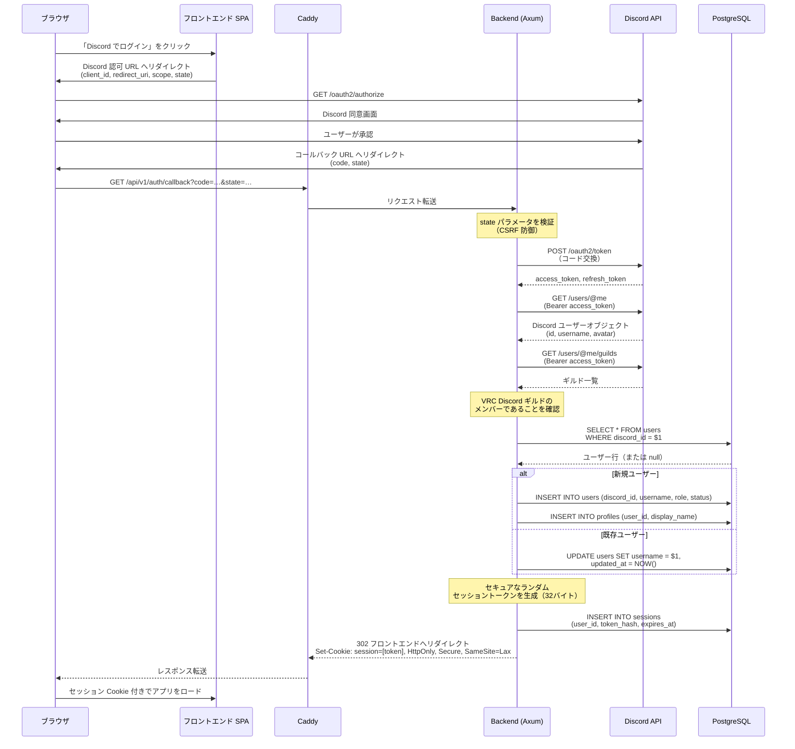
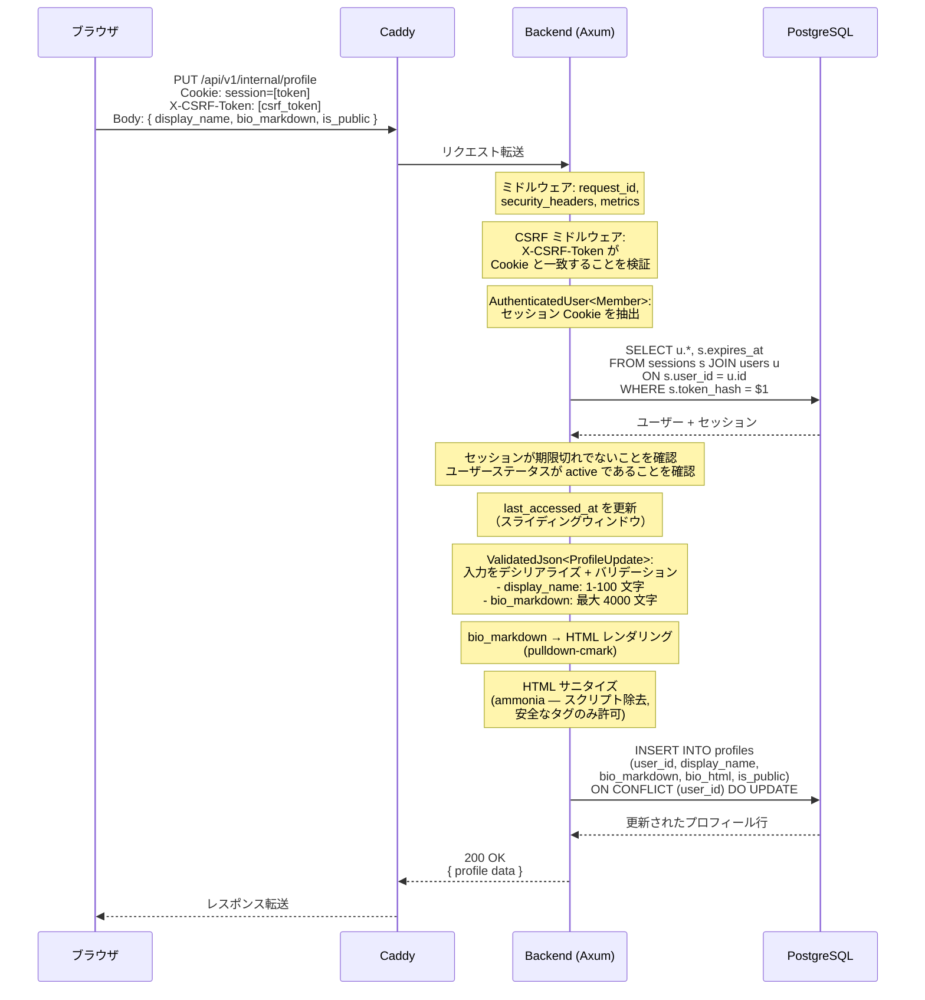
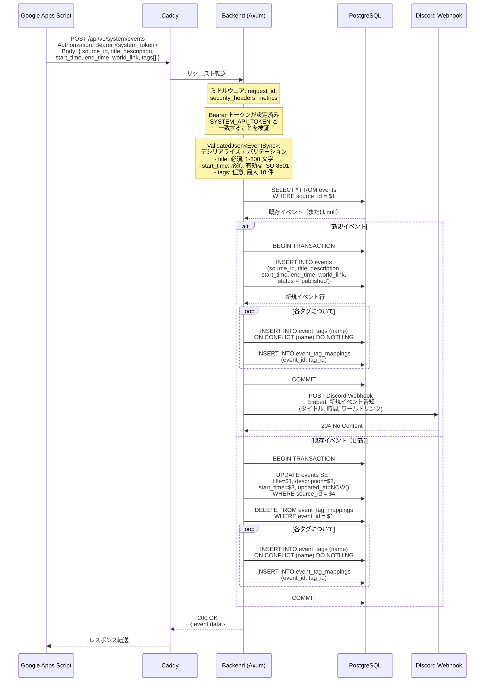
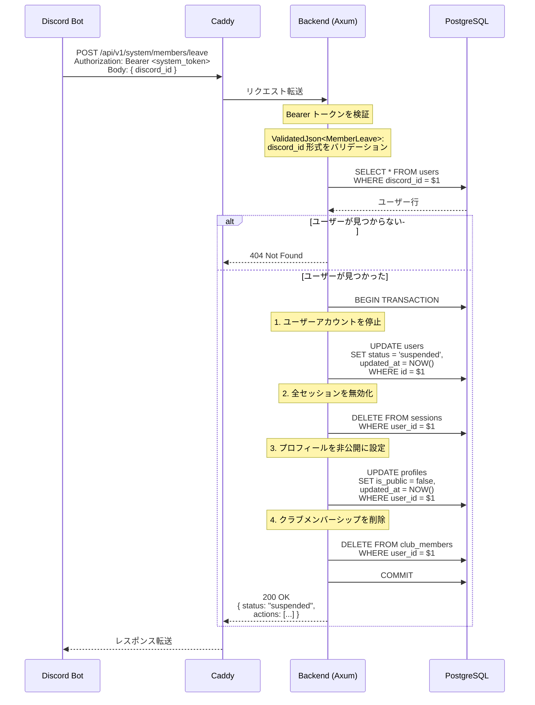

# データフロー

> **ナビゲーション**: [ドキュメントホーム](../README.md) > [アーキテクチャ](README.md) > データフロー

## 概要

このドキュメントは、VRC Backend における4つの主要なインタラクションのデータフローを記述します。各フローは Mermaid シーケンス図で図示され、認証、バリデーション、データベース操作、副作用を含む完全なリクエスト/レスポンスパスを示しています。

---

## 1. Discord OAuth2 ログイン

認証フローは Discord の OAuth2 認可コードグラントを使用します。バックエンドは認可コードをトークンに交換し、ユーザー情報を取得し、ギルドメンバーシップを検証してセッションを確立します。

### ポイント

- `state` パラメータは OAuth2 フロー中の CSRF 攻撃を防止する
- セッショントークンの SHA-256 ハッシュのみがデータベースに保存される
- セッション Cookie は `HttpOnly`、`Secure`、`SameSite=Lax`
- ギルドメンバーシップが必須 — 非メンバーは `403 Forbidden` を受け取る
- 新規ユーザーは `member` ロールとデフォルトプロフィールで自動プロビジョニングされる

---

## 2. プロフィール更新（Internal API）

認証済みユーザーがプロフィールを更新します。このフローには CSRF 検証、セッション認証、入力バリデーション、Markdown レンダリング、HTML サニタイズ、データベース永続化が含まれます。

### ポイント

- CSRF 防御はダブルサブミット Cookie パターンを使用する
- 入力バリデーションは `ValidatedJson` エクストラクター（`#[derive(Validate)]` 経由）で実行される
- Markdown はサーバーサイドでレンダリングされ、`ammonia` でサニタイズして XSS を防止する
- `bio_markdown`（ソース）と `bio_html`（レンダリング済み）の両方を保存し、読み取り時の再レンダリングを回避する
- `UPSERT` パターンにより、初回プロフィール作成と以降の更新の両方を処理する

---

## 3. Google Apps Script からのイベント同期

GAS が System API にイベントデータをプッシュします。バックエンドは Bearer トークンを検証し、ペイロードをバリデーションし、タグ付きでイベントを UPSERT し、新規イベントに対して Discord Webhook 通知を送信します。

### ポイント

- System API は静的 Bearer トークン（共有シークレット）を使用する — セッション管理なし
- `source_id` フィールドにより冪等な UPSERT が可能 — 繰り返しの同期で重複が作成されない
- タグ管理はタグ正規化に INSERT-or-IGNORE を、マッピングには全置換を使用する
- 同期内の全データベース操作はトランザクションで囲まれる
- Discord Webhook 通知は新規イベントのみに対して送信される（更新時は送信しない）
- Webhook が失敗してもイベントは作成される — Webhook 配信はベストエフォート

---

## 4. メンバー退出（Discord Bot → System API）

メンバーが Discord ギルドから退出または BAN された場合、Bot がバックエンドに通知します。バックエンドは単一トランザクション内で関連する全エンティティに退出処理をカスケードします。

### ポイント

- 全カスケード変更は原子性のため単一データベーストランザクション内で実行される
- ユーザーは**停止**されるが削除はされない — 将来の再有効化のためにデータは保持される
- 全アクティブセッションは即座に無効化され、全デバイスで強制ログアウトされる
- 退出メンバーの情報を非表示にするためプロフィールは非公開に設定される
- クラブメンバーシップは削除されるが、所有クラブは残る（必要に応じて別途無効化）
- ギャラリー画像とレポートは**削除されない** — 監査目的で保持される
- ユーザーがギルドに戻り再ログインした場合、管理者がステータスを再有効化できる

---

## 関連ドキュメント

- [システムコンテキスト](system-context.md) — これらのフローに関与するアクターと外部システム
- [コンポーネント](components.md) — 各ステップを処理する内部コンポーネント
- [データモデル](data-model.md) — 各フローで操作されるデータベーステーブルと関係
- [ステート管理](state-management.md) — これらのフローによってトリガーされる状態遷移
- [モジュール依存関係](module-dependency.md) — リクエスト処理に関与するコードモジュール
