# データモデル

> **ナビゲーション**: [ドキュメントホーム](../README.md) > [アーキテクチャ](README.md) > データモデル

## 概要

このドキュメントは、VRC Backend の完全なデータモデルを記述します。エンティティ間の関係、フィールド定義、PostgreSQL カスタム enum 型、インデックス戦略を含みます。全テーブルは `UUID` 主キー（v7、時間ソート可能）と `TIMESTAMPTZ` を時間フィールドに使用します。

## ER 図

```mermaid
erDiagram
    users {
        UUID id PK
        VARCHAR discord_id UK "NOT NULL, unique"
        VARCHAR username "NOT NULL"
        user_role role "NOT NULL, default member"
        user_status status "NOT NULL, default active"
        TIMESTAMPTZ created_at "NOT NULL"
        TIMESTAMPTZ updated_at "NOT NULL"
    }

    profiles {
        UUID user_id PK,FK "references users(id)"
        VARCHAR display_name "NOT NULL"
        TEXT bio_markdown "nullable"
        TEXT bio_html "nullable"
        VARCHAR avatar_url "nullable"
        BOOLEAN is_public "NOT NULL, default true"
        TIMESTAMPTZ updated_at "NOT NULL"
    }

    sessions {
        UUID id PK
        UUID user_id FK "references users(id)"
        VARCHAR token_hash "NOT NULL, unique"
        TIMESTAMPTZ expires_at "NOT NULL"
        TIMESTAMPTZ created_at "NOT NULL"
        TIMESTAMPTZ last_accessed_at "NOT NULL"
    }

    events {
        UUID id PK
        VARCHAR title "NOT NULL"
        TEXT description "nullable"
        TIMESTAMPTZ start_time "NOT NULL"
        TIMESTAMPTZ end_time "nullable"
        VARCHAR world_link "nullable"
        event_status status "NOT NULL, default draft"
        VARCHAR source_id "nullable, unique (GAS ID)"
        TIMESTAMPTZ created_at "NOT NULL"
        TIMESTAMPTZ updated_at "NOT NULL"
    }

    event_tags {
        UUID id PK
        VARCHAR name "NOT NULL, unique"
        TIMESTAMPTZ created_at "NOT NULL"
    }

    event_tag_mappings {
        UUID event_id PK,FK "references events(id)"
        UUID tag_id PK,FK "references event_tags(id)"
    }

    reports {
        UUID id PK
        UUID reporter_id FK "references users(id)"
        report_target_type target_type "NOT NULL"
        UUID target_id "NOT NULL"
        TEXT reason "NOT NULL"
        report_status status "NOT NULL, default pending"
        UUID reviewer_id FK "nullable, references users(id)"
        TEXT reviewer_note "nullable"
        TIMESTAMPTZ created_at "NOT NULL"
        TIMESTAMPTZ resolved_at "nullable"
    }

    clubs {
        UUID id PK
        VARCHAR name "NOT NULL"
        TEXT description "nullable"
        UUID owner_id FK "references users(id)"
        BOOLEAN is_active "NOT NULL, default true"
        TIMESTAMPTZ created_at "NOT NULL"
        TIMESTAMPTZ updated_at "NOT NULL"
    }

    club_members {
        UUID club_id PK,FK "references clubs(id)"
        UUID user_id PK,FK "references users(id)"
        TIMESTAMPTZ joined_at "NOT NULL"
    }

    gallery_images {
        UUID id PK
        UUID user_id FK "references users(id)"
        VARCHAR image_url "NOT NULL"
        VARCHAR caption "nullable"
        gallery_image_status status "NOT NULL, default pending"
        UUID reviewer_id FK "nullable, references users(id)"
        TIMESTAMPTZ uploaded_at "NOT NULL"
        TIMESTAMPTZ reviewed_at "nullable"
    }

    users ||--o| profiles : "1対1"
    users ||--o{ sessions : "1対多"
    users ||--o{ reports : "送信"
    users ||--o{ clubs : "所有"
    users ||--o{ club_members : "参加"
    users ||--o{ gallery_images : "アップロード"

    events ||--o{ event_tag_mappings : "タグ付け"
    event_tags ||--o{ event_tag_mappings : "適用"

    clubs ||--o{ club_members : "メンバー所属"

    reports }o--|| users : "レビュー担当"
    gallery_images }o--o| users : "レビュー担当"
```



## PostgreSQL カスタム enum 型

```sql
CREATE TYPE user_role AS ENUM ('member', 'staff', 'admin', 'super_admin');

CREATE TYPE user_status AS ENUM ('active', 'suspended');

CREATE TYPE event_status AS ENUM ('draft', 'published', 'cancelled', 'archived');

CREATE TYPE report_status AS ENUM ('pending', 'reviewed', 'dismissed');

CREATE TYPE report_target_type AS ENUM ('profile', 'event', 'club', 'gallery_image');

CREATE TYPE gallery_image_status AS ENUM ('pending', 'approved', 'rejected');
```

## エンティティの説明

### `users`

コアアイデンティティテーブル。各行は `discord_id` を介して Discord アカウントに紐付くコミュニティメンバーを表します。`role` フィールドはプラットフォーム全体の認可レベルを決定します。`status` フィールドはユーザーがシステムとインタラクションできるかどうかを制御します。

- **1対1**: `profiles`（ユーザーの公開情報）
- **1対多**: `sessions`（ユーザーは複数デバイスで複数のアクティブセッションを持てる）
- **1対多**: `reports`（レポーター として）、`clubs`（オーナーとして）、`gallery_images`（アップローダーとして）

### `profiles`

各ユーザーの編集可能なプロフィール情報。`user_id` を主キーと外部キーの両方として使用する（1対1関係）。`bio_markdown` フィールドにはユーザーの元の Markdown 入力を、`bio_html` にはレンダリングおよびサニタイズ済み HTML 出力を保存します。`is_public` によりプロフィールの公開/非公開を切り替えることができます。

### `sessions`

認証済みセッションを保存します。`token_hash` はセッション Cookie 値の SHA-256 ハッシュであり、平文トークンは決して保存されません。セッションには `expires_at` で強制される設定可能な TTL があります。`last_accessed_at` フィールドはスライディング有効期限ウィンドウをサポートします。期限切れセッションはバックグラウンドスケジューラーによってクリーンアップされます。

### `events`

コミュニティイベント。主に Google Apps Script から同期されます。`source_id` フィールドには GAS 側の識別子が保存され、冪等な UPSERT を可能にします。イベントは次のライフサイクルに従います：`draft` → `published` → `cancelled` または `archived`。バックグラウンドスケジューラーは、設定された経過日数の閾値を超えたイベントを自動的にアーカイブします。

### `event_tags` / `event_tag_mappings`

イベント用の多対多タグシステム。タグは `event_tags` テーブルに正規化され、`event_tag_mappings` 結合テーブルで関連付けられます。これにより Public API でタグによるイベントフィルタリングが可能になります。

### `reports`

各種コンテンツに対するユーザー送信レポート。`target_type` enum はレポート対象のコンテンツ種別を識別し、`target_id` は特定のエンティティを参照します。レポートはスタッフまたは管理者によってレビューされ、`reviewed`（アクション実施）または `dismissed`（アクション不要）にステータスを設定し、`reviewer_note` を残すことができます。

### `clubs`

オーナーとメンバー名簿を持つコミュニティサブグループ。`owner_id` はクラブを作成したユーザーを参照します。関連データを削除せずに `is_active` でクラブを無効化できます。

### `club_members`

クラブメンバーシップの結合テーブル。`(club_id, user_id)` の複合主キーにより重複メンバーシップを防止します。`joined_at` はユーザーの参加日時を追跡します。

### `gallery_images`

公開される前にスタッフの承認が必要なユーザーアップロード画像。モデレーションワークフローは `gallery_image_status` を使用してレビュー状態を追跡します。`reviewer_id` と `reviewed_at` は誰がいつ承認/却下したかを記録します。

## インデックス戦略

### 主キーインデックス

全ての `id` カラムは `PRIMARY KEY` 制約による暗黙の B-tree インデックスを持ちます。

### ユニークインデックス

| テーブル | カラム | 目的 |
|---------|-------|------|
| `users` | `discord_id` | OAuth2 ログイン時の高速ルックアップ |
| `sessions` | `token_hash` | 認証リクエストごとの高速セッションルックアップ |
| `events` | `source_id` | GAS からの冪等 UPSERT（部分インデックス、`WHERE source_id IS NOT NULL`） |
| `event_tags` | `name` | 重複タグ名の防止 |

### 外部キーインデックス

全外部キーカラムは、効率的な JOIN 操作とカスケード削除をサポートするための明示的な B-tree インデックスを持ちます。

| テーブル | カラム | 参照先 |
|---------|-------|-------|
| `sessions` | `user_id` | `users(id)` |
| `reports` | `reporter_id` | `users(id)` |
| `reports` | `reviewer_id` | `users(id)` |
| `clubs` | `owner_id` | `users(id)` |
| `club_members` | `club_id` | `clubs(id)` |
| `club_members` | `user_id` | `users(id)` |
| `gallery_images` | `user_id` | `users(id)` |
| `gallery_images` | `reviewer_id` | `users(id)` |
| `event_tag_mappings` | `event_id` | `events(id)` |
| `event_tag_mappings` | `tag_id` | `event_tags(id)` |

### クエリ最適化インデックス

| テーブル | カラム | 種別 | 目的 |
|---------|-------|------|------|
| `events` | `status, start_time` | B-tree 複合 | 公開イベント一覧 — `published` ステータスでフィルタ、`start_time` で並び替え |
| `events` | `status, updated_at` | B-tree 複合 | バックグラウンドアーカイブ — 閾値を超えた `published` イベントの検索 |
| `gallery_images` | `status` | B-tree（部分: `WHERE status = 'pending'`） | スタッフレビューキュー — 保留中の画像一覧 |
| `reports` | `status` | B-tree（部分: `WHERE status = 'pending'`） | スタッフレポートキュー — 保留中のレポート一覧 |
| `sessions` | `expires_at` | B-tree | バックグラウンドクリーンアップ — 期限切れセッションの検索 |
| `profiles` | `is_public` | B-tree（部分: `WHERE is_public = true`） | 公開プロフィール一覧 |

---

## 関連ドキュメント

- [コンポーネント](components.md) — エンティティのドメインレイヤーおよびリポジトリポートへのマッピング
- [データフロー](data-flow.md) — 主要ユースケースにおけるデータの流れ
- [ステート管理](state-management.md) — 各エンティティのライフサイクル状態マシン
- [システムコンテキスト](system-context.md) — アーキテクチャ全体におけるデータベースの役割
- [モジュール依存関係](module-dependency.md) — リポジトリ実装の配線方法
