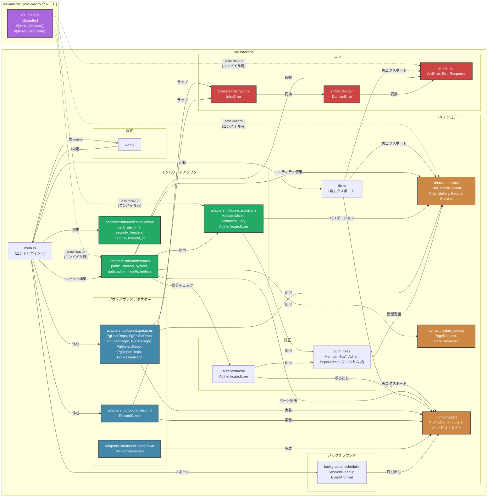

# モジュール依存関係グラフ

> **ナビゲーション**: [ドキュメントホーム](../README.md) > [アーキテクチャ](README.md) > モジュール依存関係

## 概要

このドキュメントは、VRC Backend ワークスペース内の全 Rust モジュール間の依存関係を図示します。プロジェクトはヘキサゴナルアーキテクチャに従っており、ドメインコアは外向きの依存関係を一切持たず、全アダプターはドメインコアに向かって内向きに依存します。

## ワークスペースクレート

プロジェクトは2つのクレートで構成される Cargo ワークスペースです。

| クレート | パス | 種別 | 説明 |
|---------|------|------|------|
| **`vrc-backend`** | `vrc-backend/` | `[[bin]]` + `[lib]` | メインアプリケーション — 全ドメインロジック、アダプター、ランタイム |
| **`vrc-macros`** | `vrc-macros/` | `proc-macro` | カスタム derive マクロ（`#[handler]`、`#[derive(Validate)]`、`#[derive(ErrorCode)]`） |

## モジュール依存関係グラフ

## 依存関係ルール

ヘキサゴナルアーキテクチャは厳密な依存関係ルールを強制します。

### 許可される依存関係

| 依存元 | 依存先 | 理由 |
|-------|-------|------|
| `main.rs` | すべて | コンポジションルート — 全コンポーネントを結合する |
| インバウンドアダプター | ドメインコア | ルートはエンティティ、ポート、値オブジェクトを使用する |
| アウトバウンドアダプター | ドメインコア | リポジトリはエンティティを使用してポートトレイトを実装する |
| バックグラウンド | ドメインコア（ポート） | スケジューラーはリポジトリメソッドを呼び出す |
| 認証 | ドメインコア（エンティティ） | ロールは `user_role` enum を参照する |
| エラー | （自己完結） | エラー型はレイヤー間で変換される |

### 禁止される依存関係

| 依存元 | 依存先 | 理由 |
|-------|-------|------|
| ドメインコア | いかなるアダプター | ドメインはインフラストラクチャに依存してはならない |
| ドメインコア | 認証/エラー | ドメインエラーはドメイン内で定義される（ドメインエラーは例外 — errors 内に存在するが概念的にはドメインのもの） |
| アウトバウンドアダプター | インバウンドアダプター | アダプター同士は依存しない |
| インバウンドアダプター | アウトバウンドアダプター | ルートはポートトレイトに依存し、具象実装には依存しない |

## `vrc-macros` クレート

`vrc-macros` クレートはコンパイル時にコードを生成するプロシージャマクロを提供します。

| マクロ | 対象 | 生成コード |
|-------|------|----------|
| `#[handler]` | ルートハンドラー関数 | エラーハンドリングのボイラープレートで関数をラップし、`AppState` をインジェクトする |
| `#[derive(Validate)]` | リクエスト DTO | フィールド属性（`#[validate(length(min=1, max=100))]`）からバリデーションロジックを実装する |
| `#[derive(ErrorCode)]` | エラー enum | HTTP ステータスコードとエラーコード文字列付きの `Into<ApiError>` を実装する |

`vrc-macros` は proc-macro クレートであるため、**コンパイル時のみ**の依存関係です。ランタイムには存在せず、出力はコンパイル時に消費クレートにインライン化されます。

## 主要モジュールの説明

| モジュール | ファイル | 責務 |
|----------|---------|------|
| `main.rs` | `src/main.rs` | アプリケーションエントリポイント。設定読み込み、コネクションプール作成、Axum ルーター構築、バックグラウンドタスクスポーン、サーバー起動。 |
| `lib.rs` | `src/lib.rs` | ライブラリルート。結合テストとベンチマーク用のパブリック API を再エクスポートする。 |
| `config` | `src/config/` | 環境変数ベースの設定。起動時に全設定をパースおよびバリデーションする。 |
| `domain::entities` | `src/domain/entities/` | 不変条件を持つコアビジネスエンティティ。フレームワーク依存なし。 |
| `domain::value_objects` | `src/domain/value_objects/` | ページネーション型およびその他の再利用可能な値型。 |
| `domain::ports` | `src/domain/ports/` | リポジトリとサービスの async トレイト定義。アダプターが実装する契約。 |
| `adapters::inbound::routes` | `src/adapters/inbound/routes/` | API レイヤー（public, internal, system, auth, admin）ごとに整理された Axum ルートハンドラー。 |
| `adapters::inbound::middleware` | `src/adapters/inbound/middleware/` | HTTP の横断的関心事のための Tower ミドルウェア。 |
| `adapters::inbound::extractors` | `src/adapters/inbound/extractors/` | カスタム Axum `FromRequest` / `FromRequestParts` 実装。 |
| `adapters::outbound::postgres` | `src/adapters/outbound/postgres/` | SQLx ベースの PostgreSQL リポジトリ実装。 |
| `adapters::outbound::discord` | `src/adapters/outbound/discord/` | OAuth2 およびギルド操作用の Discord REST API クライアント。 |
| `adapters::outbound::markdown` | `src/adapters/outbound/markdown/` | Markdown → サニタイズ済み HTML レンダリングパイプライン。 |
| `auth::roles` | `src/auth/roles/` | ロール階層型とファントム型定義。 |
| `auth::extractor` | `src/auth/` | `AuthenticatedUser<R>` エクストラクター実装。 |
| `errors` | `src/errors/` | 3レイヤーエラー階層: API、Domain、Infrastructure。 |
| `background::scheduler` | `src/background/` | Tokio ベースの定期タスクランナー。セッションクリーンアップとイベントアーカイブ。 |

---

## 関連ドキュメント

- [システムコンテキスト](system-context.md) — バックエンドが全体システムにどう位置づけられるか
- [コンポーネント](components.md) — コンポーネント図と責務の詳細
- [データモデル](data-model.md) — ER 図とスキーマ詳細
- [データフロー](data-flow.md) — 主要インタラクションのシーケンス図
- [ステート管理](state-management.md) — エンティティライフサイクルの状態マシン
