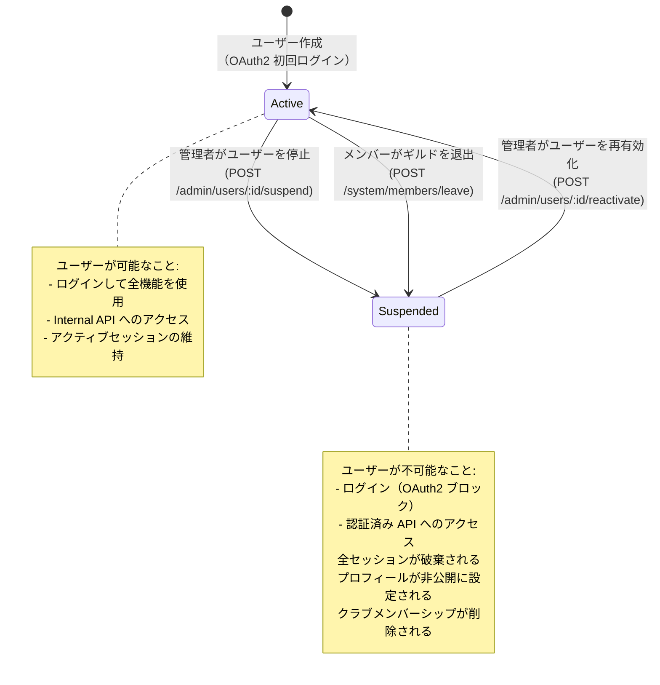
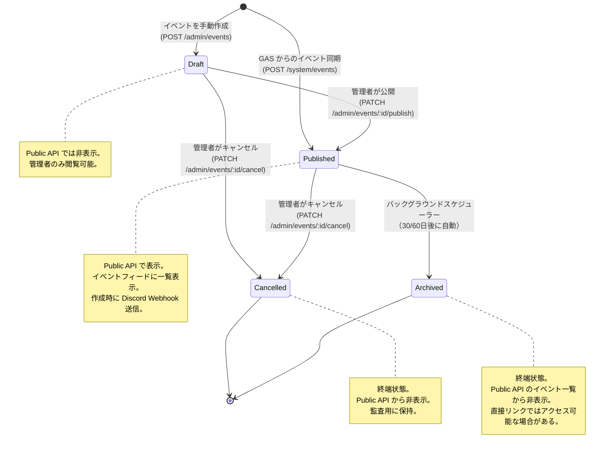
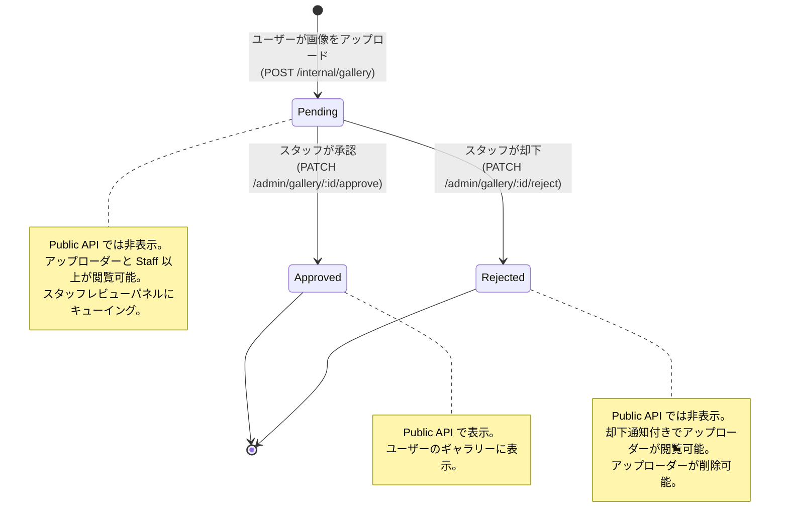
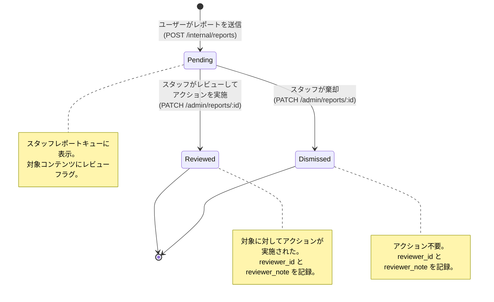
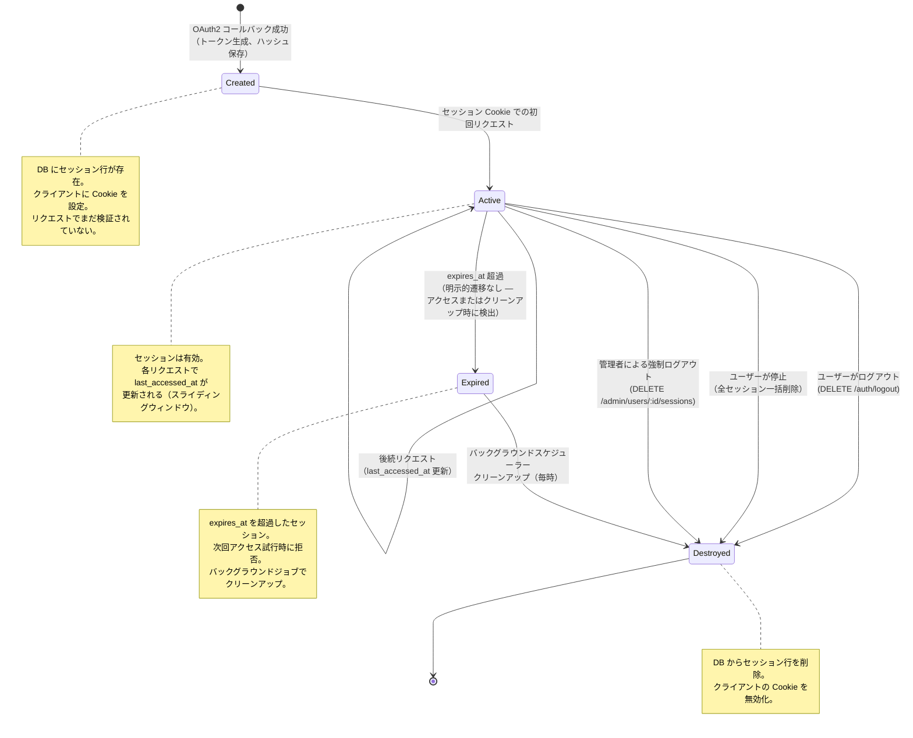
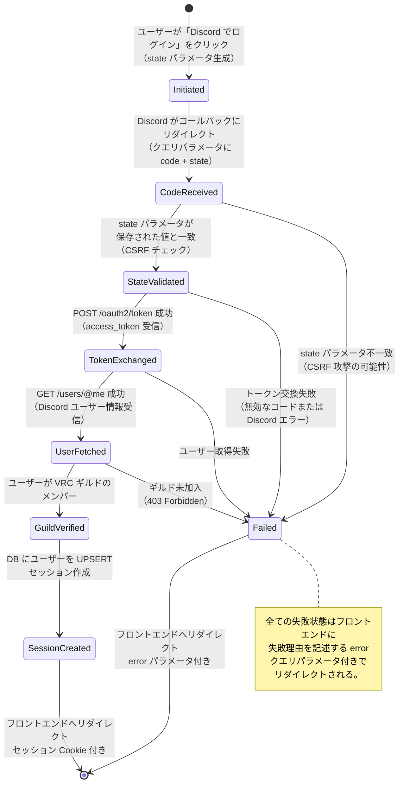

# ステート管理

> **ナビゲーション**: [ドキュメントホーム](../README.md) > [アーキテクチャ](README.md) > ステート管理

## 概要

このドキュメントは、VRC Backend における全ての状態マシンとエンティティライフサイクルを記述します。各ステートフルエンティティは PostgreSQL enum を使用して現在の状態を表現し、遷移はアプリケーション層で強制されます。無効な遷移はドメインエラーとなります。

---

## 1. ユーザーステータス

ユーザーには2つの状態があります。停止は管理者のアクションにより、またはメンバーが Discord ギルドから退出した場合に自動的に発生します。再有効化には管理者の明示的な介入が必要です。

### 遷移テーブル

| 遷移元 | 遷移先 | トリガー | アクター | 副作用 |
|-------|-------|---------|--------|-------|
| — | `active` | 初回 OAuth2 ログイン | システム | ユーザー作成 + デフォルトプロフィール |
| `active` | `suspended` | 管理者アクション | Admin / Super Admin | 全セッション削除、プロフィール非公開化 |
| `active` | `suspended` | メンバー退出 | Discord Bot（System API） | 全セッション削除、プロフィール非公開化、クラブメンバーシップ削除 |
| `suspended` | `active` | 管理者による再有効化 | Admin / Super Admin | なし（ユーザーはセッション作成のために再ログインが必要） |

---

## 2. イベントステータス

イベントは分岐する終端状態を持つ線形ライフサイクルに従います。GAS 経由で作成されたイベントは即座に公開されます。ドラフトイベントは管理者 API 経由で手動作成できます。アーカイブは設定された閾値（デフォルト 30日、大規模イベントは 60日）を超えたイベントに対して自動実行されます。

### 遷移テーブル

| 遷移元 | 遷移先 | トリガー | アクター | 副作用 |
|-------|-------|---------|--------|-------|
| — | `draft` | 手動作成 | Admin | なし |
| — | `published` | GAS 同期 | GAS（System API） | Discord Webhook 通知 |
| `draft` | `published` | 管理者が公開 | Admin | Discord Webhook 通知 |
| `draft` | `cancelled` | 管理者がキャンセル | Admin | なし |
| `published` | `cancelled` | 管理者がキャンセル | Admin | なし |
| `published` | `archived` | 経過日数の閾値超過 | バックグラウンドスケジューラー | なし |

### アーカイブルール

- イベントは `end_time`（`end_time` がない場合は `start_time`）が設定された閾値より古い場合にアーカイブ対象となる
- デフォルト閾値: `end_time` から **30日**
- バックグラウンドスケジューラーは **24時間ごと** にチェック
- アーカイブは不可逆 — アーカイブされたイベントは再公開できない

---

## 3. ギャラリー画像ステータス

ギャラリー画像は公開される前にスタッフのレビューが必要です。モデレーションワークフローにより、コミュニティにアップロードされた全コンテンツがガイドラインを満たすことを保証します。

### 遷移テーブル

| 遷移元 | 遷移先 | トリガー | アクター | 副作用 |
|-------|-------|---------|--------|-------|
| — | `pending` | 画像アップロード | 認証済みユーザー | 画像保存、レビューキューに追加 |
| `pending` | `approved` | スタッフレビュー | Staff / Admin / Super Admin | `reviewer_id` と `reviewed_at` を設定 |
| `pending` | `rejected` | スタッフレビュー | Staff / Admin / Super Admin | `reviewer_id` と `reviewed_at` を設定 |

---

## 4. レポートステータス

レポートはシンプルなトリアージワークフローに従います。スタッフがレポートをレビューし、アクションを取る（`reviewed`）か、アクション不要と判断する（`dismissed`）かを決定します。

### 遷移テーブル

| 遷移元 | 遷移先 | トリガー | アクター | 副作用 |
|-------|-------|---------|--------|-------|
| — | `pending` | レポート送信 | 認証済みユーザー | スタッフレビューキューに追加 |
| `pending` | `reviewed` | スタッフのアクション | Staff / Admin / Super Admin | `reviewer_id`、`reviewer_note`、`resolved_at` を設定。対象に対するアクション実施（例: コンテンツ削除、ユーザー警告）。 |
| `pending` | `dismissed` | スタッフの棄却 | Staff / Admin / Super Admin | `reviewer_id`、`reviewer_note`、`resolved_at` を設定。対象に対するアクションなし。 |

---

## 5. セッションライフサイクル

セッションは OAuth2 ログイン時に作成され、明示的なログアウト、ユーザー停止、または期限切れセッションの自動クリーンアップにより破棄されます。

### セッションプロパティ

| プロパティ | 値 |
|----------|---|
| トークン生成 | 32 バイト、`rand::OsRng`、base64url エンコード |
| ストレージ | `sessions.token_hash` に SHA-256 ハッシュ |
| デフォルト TTL | 7日間 |
| スライディングウィンドウ | 認証済みリクエストごとに `last_accessed_at` を更新 |
| クリーンアップ間隔 | 1時間ごと（バックグラウンドスケジューラー） |
| ユーザーあたりの最大セッション数 | 無制限（マルチデバイスサポート） |

---

## 6. OAuth2 フロー状態

Discord OAuth2 認可コードフローは独自の一時的な状態マシンを持ちます。これらの状態はログインプロセス中にメモリ内に存在し、データベースには永続化されません。

### エラーハンドリング

| 失敗ポイント | HTTP レスポンス | ユーザー向けエラー |
|------------|---------------|-----------------|
| state 不一致 | 302 → `/login?error=csrf` | 「ログインに失敗しました。もう一度お試しください。」 |
| トークン交換失敗 | 302 → `/login?error=discord` | 「Discord 認証に失敗しました。」 |
| ユーザー取得失敗 | 302 → `/login?error=discord` | 「Discord アカウントを取得できませんでした。」 |
| ギルド未加入 | 302 → `/login?error=not_member` | 「VRC Discord サーバーのメンバーである必要があります。」 |

---

## 関連ドキュメント

- [システムコンテキスト](system-context.md) — 状態遷移に関与するアクターと外部システム
- [コンポーネント](components.md) — 状態変更を処理するコンポーネント
- [データモデル](data-model.md) — 状態フィールドのスキーマと enum 定義
- [データフロー](data-flow.md) — 状態遷移をトリガーするリクエストフロー
- [モジュール依存関係](module-dependency.md) — 状態管理に関与するモジュール
