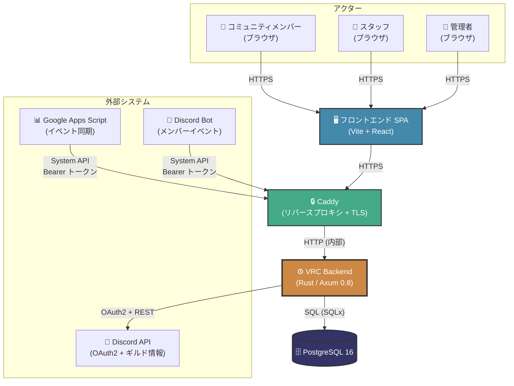

# システムコンテキスト（C4 Level 1）

> **ナビゲーション**: [ドキュメントホーム](../README.md) > [アーキテクチャ](README.md) > システムコンテキスト

## 概要

このドキュメントは、VRC Web-Backend のシステムコンテキストを記述します。これはシステムの最外層のビューであり、ユーザーや外部システムとのインタラクションを示します。VRC Backend は、VRChat コミュニティプラットフォームの中核となる Rust/Axum REST API です。

## システムコンテキスト図



## 外部アクター

| アクター | 種別 | 認証方式 | 説明 |
|---------|------|---------|------|
| **コミュニティメンバー** | 人間（ブラウザ） | Discord OAuth2 → セッション Cookie | VRChat コミュニティの一般メンバー。イベントの閲覧、プロフィール管理、クラブへの参加、ギャラリー画像のアップロードを行う。 |
| **スタッフ** | 人間（ブラウザ） | Discord OAuth2 → セッション Cookie | 昇格権限を持つコミュニティモデレーター。レポートのレビュー、ギャラリー画像の承認、コンテンツのモデレーションを行う。 |
| **管理者 / スーパー管理者** | 人間（ブラウザ） | Discord OAuth2 → セッション Cookie | ユーザー、ロール、システム設定を管理し、完全な CRUD アクセス権を持つコミュニティ管理者。 |
| **Google Apps Script (GAS)** | 自動化システム | Bearer トークン（System API） | Google スプレッドシート / カレンダーからバックエンドにイベントデータを同期する。System API 経由でイベントの作成と更新をプッシュする。 |
| **Discord Bot** | 自動化システム | Bearer トークン（System API） | メンバーの退出/BAN などの Discord ギルドイベントをバックエンドに通知する。連鎖的な状態変更（ユーザー停止、セッションクリーンアップなど）をトリガーする。 |
| **Discord API** | 外部サービス | OAuth2 クライアントクレデンシャル | OAuth2 認証（コード交換、トークンリフレッシュ）およびログイン時のユーザー/ギルド情報の取得に使用。 |
| **PostgreSQL 16** | データベース | 接続文字列（内部） | 全ドメインエンティティのプライマリデータストア。コンパイル時検証済みクエリを使用して SQLx 経由でアクセスする。 |

## トラスト境界

```
┌─────────────────────────────────────────────────────┐
│  インターネット（非信頼）                              │
│  ┌───────────┐  ┌─────┐  ┌────────────┐            │
│  │ ブラウザ   │  │ GAS │  │ Discord Bot│            │
│  └─────┬─────┘  └──┬──┘  └─────┬──────┘            │
│        │           │            │                    │
├────────┼───────────┼────────────┼────────────────────┤
│  DMZ   │           │            │                    │
│  ┌─────▼───────────▼────────────▼──────┐             │
│  │          Caddy (TLS 終端)           │             │
│  │   • レート制限（IP 単位）              │             │
│  │   • セキュリティヘッダー               │             │
│  │   • HTTPS 強制                      │             │
│  └─────────────────┬──────────────────┘             │
│                    │                                 │
├────────────────────┼─────────────────────────────────┤
│  内部ネットワーク    │                                 │
│  ┌─────────────────▼──────────────────┐              │
│  │       VRC Backend (Axum)           │              │
│  │   • CSRF 検証                       │              │
│  │   • セッション認証                    │              │
│  │   • Bearer トークン検証              │              │
│  │   • 入力バリデーション                │              │
│  │   • ロールベース認可                  │              │
│  └─────────────────┬──────────────────┘              │
│                    │                                 │
│  ┌─────────────────▼──────────────────┐              │
│  │       PostgreSQL 16                │              │
│  │   • Unix ソケット経由接続            │              │
│  │   • パラメータ化クエリ（SQLx）        │              │
│  └────────────────────────────────────┘              │
└─────────────────────────────────────────────────────┘
```

### 境界の説明

| 境界 | 実施主体 | 制御項目 |
|------|---------|---------|
| **インターネット → DMZ** | Caddy リバースプロキシ | TLS 終端、レート制限、セキュリティヘッダー、HTTPS リダイレクト |
| **DMZ → 内部** | Caddy + Axum ミドルウェア | リクエストルーティング、CORS ポリシー、リクエストサイズ制限 |
| **Backend → データベース** | SQLx コネクションプール | コンパイル時 SQL 検証、パラメータ化クエリ、接続暗号化 |
| **Backend → Discord API** | HTTPS + OAuth2 | クライアントクレデンシャル、トークン管理、レスポンス検証 |

## 通信プロトコル

| 送信元 | 送信先 | プロトコル | 認証メカニズム |
|-------|-------|----------|-------------|
| ブラウザ | Caddy | HTTPS (TLS 1.3) | — |
| Caddy | Backend | HTTP (ループバック) | 転送ヘッダー |
| GAS / Bot | Caddy | HTTPS (TLS 1.3) | `Authorization: Bearer <token>` |
| Backend | Discord API | HTTPS | OAuth2 アクセストークン |
| Backend | PostgreSQL | TCP / Unix ソケット | 接続文字列クレデンシャル |

---

## 関連ドキュメント

- [コンテナ図（C4 Level 2）](components.md) — バックエンド内部コンポーネントの詳細
- [データフロー](data-flow.md) — 主要ユースケースのリクエスト/レスポンスシーケンス
- [モジュール依存関係](module-dependency.md) — コードレベルのモジュールグラフ
- [ステート管理](state-management.md) — エンティティライフサイクルの状態マシン
- [データモデル](data-model.md) — ER 図とスキーマ詳細
