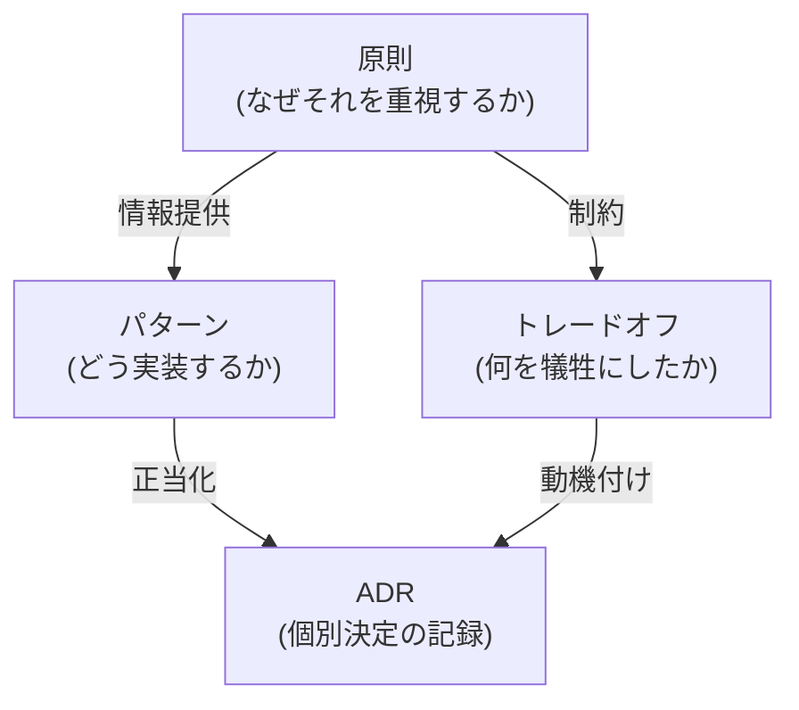

# 設計

> **対象読者**: 全員
>
> **ナビゲーション**: [ドキュメントホーム](../README.md) > 設計

## 概要

VRC Web-Backend は **「ロマンを追求する厳格さ（Romance Through Rigor）」** という哲学に基づいて構築されています。学習と正しさを最大化するために、最も困難な実行可能なパスを選択します。これは複雑さのための複雑さではなく、すべての設計選択はコンパイル時安全性、多層防御、または教育的価値のいずれかに帰着します。

設計の優先事項:

1. ランタイムではなく**コンパイル時にエラーを検出**
2. 型システムによる**無効な状態の表現不可能化**
3. 単一のメカニズムに依存しない**多層セキュリティ**
4. キャッチオールのない**明示的エラーハンドリング**
5. 形式ツールで検証される**数学的正しさ**

## 設計ドキュメント

| ドキュメント | 説明 |
|------------|------|
| [原則](principles.md) | コア設計哲学と指導原則 |
| [パターン](patterns.md) | 使用されるデザインパターンとその根拠 |
| [トレードオフ](trade-offs.md) | 主要なトレードオフの分析 |
| [ADR](adr/README.md) | アーキテクチャ決定記録 |

## ドキュメントの関係

**原則**は何を重視するかを定義します。**パターン**はその価値がコードにどう現れるかです。**トレードオフ**は意識的に犠牲にしたものを記録します。**ADR**は完全なコンテキストと共に個別決定を記録します。

## 関連ドキュメント

- [アーキテクチャ概要](../architecture/README.md)
- [システム仕様](../../../specs/README.md)
- [コントリビューションガイド](../../../CONTRIBUTING.md)
