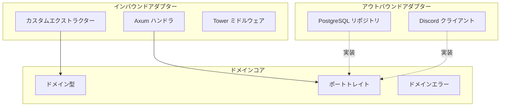

# ADR-0001: ヘキサゴナルアーキテクチャ

> **ナビゲーション**: [ドキュメントホーム](../../README.md) > [設計](../README.md) > [ADR](README.md) > ADR-0001

## ステータス

**承認済み**

## 日付

2025-01-15

## コンテキスト

VRC Web-Backend は以下を実現する明確なアーキテクチャパターンが必要です:

1. **ドメインロジックの分離** — インフラ関心事（データベース、HTTP フレームワーク、サードパーティ API）から
2. **テスト容易性** — PostgreSQL やウェブサーバーなしでビジネスロジックをテスト可能に
3. **将来の変更対応** — DB や フレームワークを交換してもドメインロジックは変更不要
4. **アーキテクチャ思考の教育** — クリーンアーキテクチャと依存性逆転の学習

### 影響する力

- プロジェクトはコンパイル時安全性とクリーンな分離を重視
- コントリビューターは初心者から経験者まで — アーキテクチャは自己文書化であるべき
- 単純なレイヤードアーキテクチャは依存方向を強制しない

## 決定

以下の構造で**ヘキサゴナルアーキテクチャ**（ポートとアダプター）を使用します:

- **ドメインコア**: ドメイン型、ドメインエラー、ポートトレイトを含む。外部依存**ゼロ**
- **インバウンドアダプター**: Axum HTTP ハンドラ、カスタムエクストラクター
- **アウトバウンドアダプター**: PostgreSQL リポジトリ実装、Discord API クライアント

### 依存ルール

すべての依存関係はドメインコアに**向かって内側に**向きます。ドメインはアダプターからインポートしません。

## 結果

### ポジティブ

- 外部依存のない純粋でテスト可能なドメインコア
- インフラ技術の交換がアダプター変更のみで可能
- 自己文書化される境界

### ネガティブ

- より多くのボイラープレート（トレイト定義 + 実装）
- 単純な CRUD にはやり過ぎの可能性

## 関連

- [設計原則](../principles.md)
- [デザインパターン](../patterns.md)
- [コンポーネント](../../architecture/components.md)
