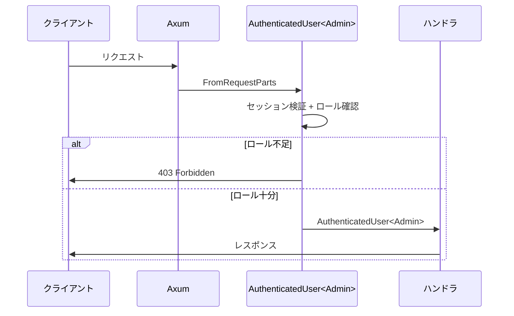

# ADR-0002: 型状態認可

> **ナビゲーション**: [ドキュメントホーム](../../README.md) > [設計](../README.md) > [ADR](README.md) > ADR-0002

## ステータス

**承認済み**

## 日付

2025-01-15

## コンテキスト

VRC Web-Backend には4つのロールによるロールベースアクセス制御（RBAC）があります:

| ロール | 権限 |
|-------|------|
| **Member** | 公開コンテンツ閲覧、自身のプロファイル編集 |
| **Staff** | Member 権限 + イベント管理 |
| **Admin** | Staff 権限 + ユーザー管理、アカウント停止 |
| **SuperAdmin** | Admin 権限 + システム設定管理 |

メカニズムの要件:
1. チェック忘れの防止
2. 自己文書化
3. コンパイル時にエラー検出

## 決定

ファントム型パラメータを使用した**型状態パターン**でユーザーロールを型レベルでエンコードします。

```rust
pub struct AuthenticatedUser<R: Role> {
    pub user_id: UserId,
    pub discord_id: DiscordId,
    _role: PhantomData<R>,
}

// Admin ロールが必要 — Member ではコンパイルされない
async fn suspend_user(admin: AuthenticatedUser<Admin>) -> Result<...> { ... }
```



## 結果

### ポジティブ

- 不正アクセスがコンパイルエラーに
- ハンドラシグネチャが必要ロールを明示
- ロールチェック忘れの可能性ゼロ
- ランタイムオーバーヘッドゼロ

### ネガティブ

- 関数シグネチャの複雑なジェネリック境界
- 動的権限変更に対して柔軟性が低い

## 関連

- [設計原則](../principles.md)
- [セキュリティガイド](../../guides/security.md)
