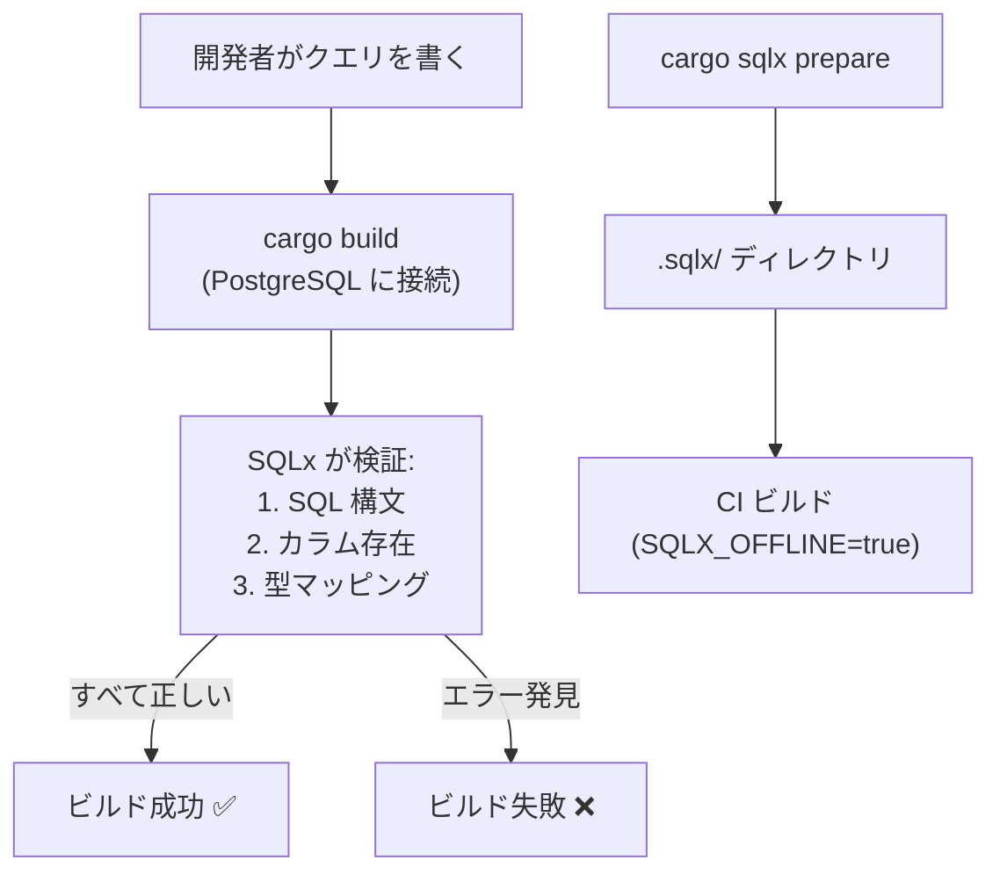

# ADR-0003: コンパイル時 SQL 検証

> **ナビゲーション**: [ドキュメントホーム](../../README.md) > [設計](../README.md) > [ADR](README.md) > ADR-0003

## ステータス

**承認済み**

## 日付

2025-01-20

## コンテキスト

SQL クエリの正しさは3つの次元で必要です:
1. **構文**: SQL が正しくパースされる
2. **スキーマ**: 参照テーブルとカラムが存在する
3. **型**: Rust 型が PostgreSQL カラム型にマッチする

従来のアプローチ（生 SQL 文字列、ORM）はこれらのチェックの1つ以上をランタイムに延期します。

## 決定

**SQLx のコンパイル時クエリ検証**とオフラインモードを使用します。

## 結果

### ポジティブ

- SQL エラーがビルド時に検出される
- スキーマ変更が即座にクエリ不整合を報告
- 型安全な結果マッピング

### ネガティブ

- 開発中に PostgreSQL の実行が必要
- クエリ変更時にオフラインメタデータの手動更新が必要

## 関連

- [ビルドシステム](../../development/build.md)
- [設計原則](../principles.md)
