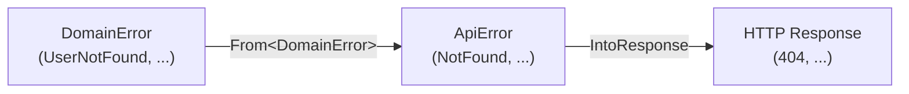

# ADR-0004: 代数的エラー型

> **ナビゲーション**: [ドキュメントホーム](../../README.md) > [設計](../README.md) > [ADR](README.md) > ADR-0004

## ステータス

**承認済み**

## 日付

2025-01-20

## コンテキスト

ウェブバックエンドのエラーハンドリングは複数のレイヤーを含みます:
1. **ドメインレイヤー**: ビジネスロジックエラー
2. **API レイヤー**: HTTP 意味論のエラー
3. **HTTP レスポンス**: ステータスコードとエラーコード付き JSON ボディ

## 決定

**レイヤーごとの代数的エラー型**（Rust enum）と明示的な完全 `From` 変換を使用します。ワイルドカード match アームなし。

## 結果

### ポジティブ

- 新バリアント追加がマッピングされていない変換ポイントでコンパイルエラーを引き起こす
- 各レイヤーのエラーが自己完結的
- `anyhow` なし、情報損失なし

### ネガティブ

- 多くの match アームが必要
- 新しいエラーバリアントの追加がマルチファイル変更を必要とする

## 関連

- [エラーリファレンス](../../reference/errors.md)
- [設計原則](../principles.md)
