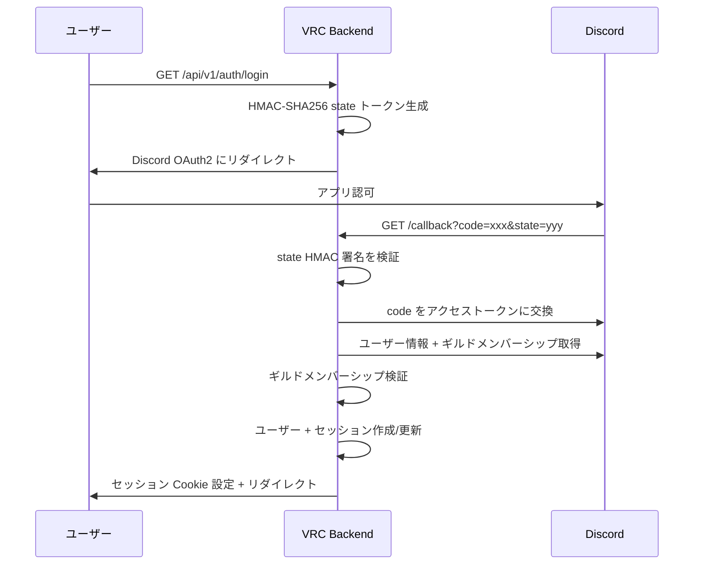

# ADR-0006: Discord 専用認証

> **ナビゲーション**: [ドキュメントホーム](../../README.md) > [設計](../README.md) > [ADR](README.md) > ADR-0006

## ステータス

**承認済み**

## 日付

2025-01-10

## コンテキスト

VRC Web-Backend は Discord で組織された日本語話者 VRChat コミュニティにサービスを提供します。すべてのメンバーが Discord アカウントを持っています。

### 影響する力

- すべてのコミュニティメンバーが Discord アカウントを持っている
- ギルドメンバーシップ検証が不可欠
- パスワード管理は重大なセキュリティ面
- コミュニティは約50-300メンバー

## 決定

**唯一の認証方法として Discord OAuth2 を使用**します。Email/パスワードも代替 OAuth2 プロバイダーもなし。

## 結果

### ポジティブ

- パスワード管理ゼロ（ハッシュ化、リセットフロー、資格情報スタッフィング不要）
- ギルドメンバーシップチェックによる自然なコミュニティ検証
- 攻撃面の縮小

### ネガティブ

- Discord の稼働率への強い依存
- Discord を持たないユーザーの排除
- Discord API レート制限の影響

## 関連

- [セキュリティガイド](../../guides/security.md)
- [トレードオフ](../trade-offs.md)
