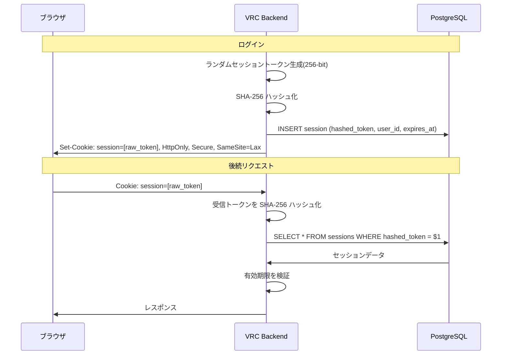

# ADR-0007: サーバーサイドセッション

> **ナビゲーション**: [ドキュメントホーム](../../README.md) > [設計](../README.md) > [ADR](README.md) > ADR-0007

## ステータス

**承認済み**

## 日付

2025-01-10

## コンテキスト

Discord OAuth2 で認証後、ユーザーセッションを維持するメカニズムが必要です。主な2つのアプローチ:

1. **サーバーサイドセッション**: ランダムトークン生成、DB にセッションデータ保存、Cookie としてトークン送信
2. **JWT**: セッションデータを署名トークンにエンコード、クライアントに送信、リクエストごとに署名検証

### 影響する力

- シングルノードアプリケーション — 複数サーバー間のステートレススケーリング不要
- セッション失効は即座でなければならない
- PostgreSQL は既に使用中
- コミュニティサイズ（約50-300）ではセッションテーブルは無視できるサイズ

## 決定

PostgreSQL に SHA-256 ハッシュトークンを保存する**サーバーサイドセッション**を使用します。

## 結果

### ポジティブ

- 即座の失効: `DELETE FROM sessions` で即座にセッション無効化
- 小さなトークンサイズ（JWT と比較）
- 完全なサーバーサイド制御
- JWT の脆弱性なし（アルゴリズム混乱、`none` アルゴリズム攻撃なし）

### ネガティブ

- リクエストごとのデータベースルックアップ
- 水平スケーリングに共有データベースが必要
- 期限切れセッションの定期クリーンアップが必要

## 関連

- [セキュリティガイド](../../guides/security.md)
- [トレードオフ](../trade-offs.md)
