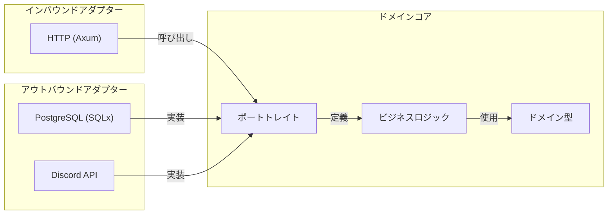
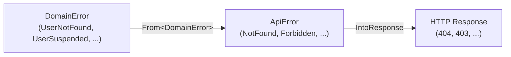

# デザインパターン

> **対象読者**: 開発者
>
> **ナビゲーション**: [ドキュメントホーム](../README.md) > [設計](README.md) > パターン

## 概要

VRC Web-Backend で使用されているデザインパターン、選択理由、コードベース内での適用箇所をカタログ化します。

---

## 1. ヘキサゴナルアーキテクチャ（ポートとアダプター）

### 概要

アプリケーションは純粋なドメインコアとそれを取り囲むアダプターレイヤーで構成されます。ドメインはすべての外部依存関係のためのポートトレイト（インターフェース）を定義し、アダプターが特定の技術（PostgreSQL、HTTP、Discord）でこれらのトレイトを実装します。

### 選択理由

- ドメインロジックがインフラなしでテスト可能
- PostgreSQL を別のデータベースに切り替えるには新しいアダプターのみ必要
- 関心の明確な分離を強制
- [原則 5: ヘキサゴナル純粋性](principles.md#5-ヘキサゴナル純粋性)に整合



### 関連 ADR

- [ADR-0001: ヘキサゴナルアーキテクチャ](adr/0001-hexagonal-architecture.md)

---

## 2. 型状態パターン（ロール強制のためのファントム型）

### 概要

`AuthenticatedUser<R: Role>` はファントム型パラメータ `R` を使用して、ユーザーのロールを型レベルでエンコードします。エクストラクターは HTTP バウンダリでロールを検証し、そこからコンパイラが正しいロールを持つユーザーのみが関数を呼び出せることを強制します。

### 選択理由

- 不正アクセスが**コンパイルエラー**になる（ランタイムバグではない）
- 自己文書化 — 関数シグネチャが必要なロールを宣言
- [原則 2: ランタイムチェックより型安全性](principles.md#2-ランタイムチェックより型安全性)に整合

```rust
// ロールマーカー — ゼロサイズ型、ファントム型パラメータとしてのみ使用
pub struct Member;
pub struct Staff;
pub struct Admin;
pub struct SuperAdmin;

// Admin ロールが必要なハンドラ — Member ではコンパイルされない
async fn suspend_user(
    admin: AuthenticatedUser<Admin>,
    Path(user_id): Path<UserId>,
) -> Result<Json<ApiResponse>, ApiError> {
    // admin はコンパイル時に Admin であることが保証される
}
```

### 関連 ADR

- [ADR-0002: 型状態認可](adr/0002-type-state-authorization.md)

---

## 3. リポジトリパターン（トレイトベースのデータアクセス）

### 概要

データアクセスはドメインレイヤーで定義されたトレイトの背後に抽象化されます。各エンティティに対応するリポジトリトレイトが CRUD 操作を定義し、PostgreSQL アダプターが具象実装を提供します。

### 選択理由

- ドメインロジックがデータベース技術に依存しない
- インメモリモックリポジトリでテスト可能
- ヘキサゴナルアーキテクチャとの自然な適合
- クエリロジックとビジネスロジックの明確な分離

---

## 4. 代数的エラー型（レイヤーごとの enum と完全変換）

### 概要

各アーキテクチャレイヤーが独自のエラー enum を持ちます。エラーは明示的で完全な `From` 変換を通じて外側に流れます — すべてのバリアントがマッピングされ、ワイルドカードアームはありません。

### 選択理由

- 新しいエラーバリアント追加がマッピングされていないすべての変換ポイントでコンパイルエラーを引き起こす
- 各レイヤーのエラーが自己完結的でそのレベルで意味がある
- `anyhow` なし、`Box<dyn Error>` なし、情報損失なし
- [原則 6: エラー網羅性](principles.md#6-エラー網羅性)に整合



---

## 5. カスタム Derive マクロ（ボイラープレート削減）

### 概要

`vrc-macros` クレートが3つのプロシージャルマクロを提供し、ルートハンドラ、入力バリデーション、エラーコード生成のボイラープレートを削減します。

| マクロ | 種別 | 生成内容 |
|-------|------|---------|
| `#[handler]` | アトリビュート | 標準的なエラーハンドリングとロギングのラッパー |
| `#[derive(Validate)]` | Derive | フィールド属性からのバリデーションロジック |
| `#[derive(ErrorCode)]` | Derive | エラーバリアントの構造化エラーコード |

---

## 6. Tower ミドルウェアスタック

### 概要

HTTP ミドルウェアは Tower サービスとして実装され、関心の明確な分離を提供します。各ミドルウェアは単一の責務を持ちます。

| ミドルウェア | 責務 |
|------------|------|
| `request_id` | 全リクエストに ULID を割り当て |
| `security_headers` | 6つのセキュリティヘッダーを追加 |
| `metrics` | リクエストカウンタとレイテンシを記録 |
| `rate_limit` | ティア別レート制限を適用 |
| `csrf` | 変更リクエストの Origin ヘッダーを検証 |

## 関連ドキュメント

- [設計原則](principles.md) — パターンが実装する価値観
- [トレードオフ](trade-offs.md) — パターンに伴うコスト
- [ADR](adr/README.md) — パターン選択の個別決定
- [コンポーネント](../architecture/components.md) — パターンがシステムにどう現れるか
