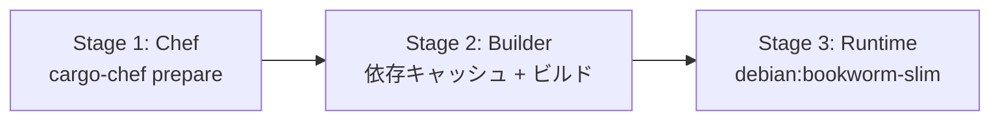

# ビルドシステム

> **ナビゲーション**: [ドキュメントホーム](../README.md) > [開発](README.md) > ビルド

## ビルドモード

### デバッグビルド

```bash
cargo build
# または
make build-debug
```

高速コンパイル、デバッグ情報付き。開発時に使用。

### リリースビルド

```bash
cargo build --release
# または
make build
```

最大パフォーマンス最適化:

| オプション | 値 | 効果 |
|-----------|-----|------|
| `opt-level` | `3` | 最大最適化レベル |
| `lto` | `fat` | リンク時最適化でバイナリサイズ削減・高速化 |
| `codegen-units` | `1` | 単一コード生成単位で最適化精度向上 |
| `strip` | `symbols` | デバッグシンボル除去 |
| `panic` | `abort` | パニック時のアンワインド無効化 |

リリースバイナリ: `target/release/vrc-backend`（< 30 MB）

## Docker ビルド

マルチステージビルドで最小イメージを生成します。



### ステージ詳細

| ステージ | ベースイメージ | 目的 |
|---------|-------------|------|
| Chef | `rust:1.85-bookworm` | cargo-chef で依存関係レシピ生成 |
| Builder | `rust:1.85-bookworm` | 依存キャッシュ後にアプリビルド |
| Runtime | `debian:bookworm-slim` | 最小ランタイム（ca-certificates + curl のみ） |

```bash
# Docker イメージのビルド
docker build -t vrc-backend:latest .

# イメージサイズ確認
docker images vrc-backend
```

ビルド時の特殊設定:
- `SQLX_OFFLINE=true`: データベース不要でコンパイル
- `RUSTFLAGS="-C target-cpu=x86-64-v3"`: AVX2 対応 CPU 向け最適化

## SQLx オフラインモード

SQLx はコンパイル時に SQL クエリをデータベーススキーマと照合します。CI 環境ではデータベースがないため、オフラインモードを使用します。

### クエリメタデータの生成

```bash
# データベースが起動している状態で実行
cargo sqlx prepare --workspace
```

生成されたメタデータは `target/sqlx-prepare-check/` に保存されます。

### CI でのオフラインビルド

```bash
SQLX_OFFLINE=true cargo build
```

> **重要:** スキーマ変更やクエリ追加時は必ず `cargo sqlx prepare` を再実行してください。

## Makefile ターゲット

| ターゲット | 説明 |
|-----------|------|
| `make help` | ヘルプメッセージ表示 |
| `make setup` | 開発環境セットアップ |
| `make run` | 開発サーバー起動 |
| `make run-release` | リリースモードで起動 |
| `make watch` | 自動リロード付き起動 |
| `make build` | リリースビルド |
| `make build-debug` | デバッグビルド |
| `make test` | 全テスト実行 |
| `make test-verbose` | 詳細出力付きテスト |
| `make lint` | clippy + fmt チェック |
| `make fmt` | コード自動フォーマット |
| `make clippy` | clippy リント実行 |
| `make check` | lint + test + build（プリコミット） |
| `make db-up` | PostgreSQL 起動 |

## ワークスペース構成

Cargo ワークスペースには2つのクレートがあります:

```toml
[workspace]
members = ["vrc-backend", "vrc-macros"]
resolver = "3"
```

| クレート | 種別 | 説明 |
|---------|------|------|
| `vrc-backend` | バイナリ | メインアプリケーション |
| `vrc-macros` | proc-macro | カスタムプロシージャルマクロ |

`vrc-macros` はコンパイル時にのみ使用され、ランタイム依存はありません。

## 関連ドキュメント

- [開発セットアップ](setup.md)
- [テスト](testing.md)
- [CI/CD](ci-cd.md)
- [プロジェクト構成](project-structure.md)
