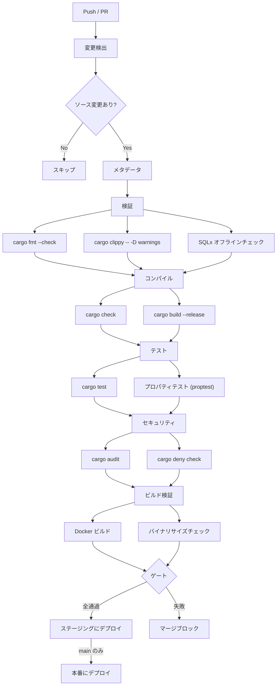
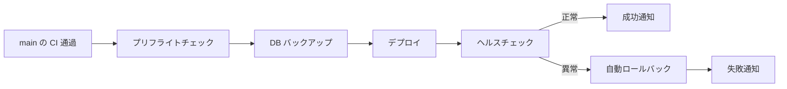

# CI/CD パイプライン

> **ナビゲーション**: [ドキュメントホーム](../README.md) > [開発](README.md) > CI/CD

GitHub Actions ワークフローによるコード品質チェック、テスト、セキュリティスキャン、デプロイメントの自動化について説明します。

## ワークフロー概要

| ワークフロー | トリガー | 目的 |
|------------|---------|------|
| **CI** | `main`/`develop`/`release/**`/`hotfix/**` への Push、PR、マージキュー | フル検証パイプライン |
| **Security** | 週次スケジュール、依存関係/Dockerfile の PR | 依存関係監査、コンテナスキャン、SAST |
| **Nightly** | 毎日 04:00 JST、オンデマンド | 拡張テスト: Miri、Kani、プロパティファジング、ベンチマーク |
| **CD** | `main` マージ後の CI 呼び出し | Docker ビルド、プッシュ、デプロイ |
| **Release** | リリースイベント | バージョン付きリリース成果物 |

## CI パイプライン

CI パイプラインは条件付き実行の多段 DAG です。キャッシュヒット時は約 8〜15 分、コールドスタート時は 20〜30 分で **22 ジョブ** を実行します。

### パイプラインステージ



### フェーズ詳細

#### フェーズ 0: 変更検出

`dorny/paths-filter` を使用してコードベースの変更箇所を検出:

- **rust** — `vrc-backend/src/**`、`Cargo.toml`、`Cargo.lock`
- **macros** — `vrc-macros/src/**`、`vrc-macros/Cargo.toml`
- **migrations** — `vrc-backend/migrations/**`
- **docker** — `Dockerfile`、`docker-compose*.yml`、`Caddyfile`
- **ci** — `.github/**`

関連ファイルが変更されていない場合、後続フェーズのジョブはスキップされます。

#### フェーズ 1: 検証

| ジョブ | コマンド | 目的 |
|-------|---------|------|
| フォーマットチェック | `cargo fmt --check` | 一貫したコードスタイルの強制 |
| Clippy | `cargo clippy -- -D warnings` | 厳格なリント、全警告をエラーとして扱う |
| SQLx チェック | SQLx オフライン検証 | クエリメタデータの最新性確認 |

#### フェーズ 2: コンパイル

| ジョブ | コマンド | 目的 |
|-------|---------|------|
| Check | `cargo check` | バイナリ生成なしの高速型チェック |
| Build | `cargo build --release` | 最適化時の問題検出 |

#### フェーズ 3: テスト

| ジョブ | コマンド | 目的 |
|-------|---------|------|
| 単体 + 結合 | `cargo test` | ワークスペース内の全テスト |
| プロパティテスト | `cargo test -- proptest` | proptest ベースのプロパティチェック |

#### フェーズ 4: セキュリティ

| ジョブ | ツール | 目的 |
|-------|-------|------|
| アドバイザリ監査 | `cargo audit` | 依存関係の既知脆弱性チェック |
| ポリシーチェック | `cargo deny check` | ライセンス、アドバイザリ、禁止ポリシーの適用 |

#### フェーズ 5: ビルド検証

| ジョブ | 目的 |
|-------|------|
| Docker ビルド | Docker イメージが正常にビルドできることを確認 |
| バイナリサイズチェック | ストリップ済みバイナリがサイズ予算内に収まることを確認 |

#### ゲート

PR をマージするには全フェーズが通過する必要があります。`main` では GitHub のマージキューを使用してアトミック性を保証します。

### 環境設定

主要な CI 環境変数:

```yaml
CARGO_TERM_COLOR: always
CARGO_INCREMENTAL: "0"        # インクリメンタルビルド無効（キャッシュ効率向上）
SQLX_OFFLINE: "true"          # CI ではデータベース不要
RUST_BACKTRACE: short
MSRV: "1.85.0"
```

### キャッシュ

CI パイプラインのキャッシュ対象:

- **Cargo レジストリ** — ダウンロードしたクレートソース
- **Cargo ビルド** — コンパイル済み依存関係（`target/`）
- **cargo-chef レイヤー** — 依存関係ビルドの Docker レイヤーキャッシュ

キャッシュキーは `Cargo.lock` のハッシュベースで、依存関係変更時に自動無効化されます。

## セキュリティパイプライン

週次および依存ファイルの PR で実行されます。

| チェック | ツール | 説明 |
|---------|-------|------|
| 依存関係監査 | `cargo audit` | RustSec データベースの既知 CVE/アドバイザリチェック |
| ライセンス & ポリシー | `cargo deny` | ライセンス準拠、アドバイザリ冗長性、クレート禁止 |
| コンテナスキャン | Trivy / Grype | Docker イメージレイヤーの脆弱性スキャン |
| シークレット検出 | — | ソース内の漏洩した資格情報を検出 |

## ナイトリーパイプライン

コミットごとの CI では遅すぎる拡張テスト。毎日 **04:00 JST** に実行。

| ジョブ | ツール | 所要時間 | 説明 |
|-------|-------|---------|------|
| 拡張プロパティテスト | proptest | 約45分 | テストあたり10,000ケース |
| フル結合スイート | cargo test | 約30分 | `--include-ignored` 含む全テスト |
| 未定義動作 | Miri | 約60分 | unsafe コードの UB 検出 |
| 形式検証 | Kani | 約30分 | 有界モデル検査証明 |
| ベンチマーク | criterion | 約15分 | パフォーマンス退行検出 |

失敗が検出された場合は GitHub Issues で報告されます。

## CD パイプライン

`main` での CI 成功後にトリガーされます:



### デプロイフロー

1. **プリフライト** — GHCR にイメージが存在し、環境に到達可能であることを確認
2. **DB バックアップ** — デプロイ前にデータベースのスナップショット（スキップ可能）
3. **デプロイ** — 新しいイメージを pull し、`docker compose up -d`
4. **ヘルスチェック** — `/health` エンドポイントを正常またはタイムアウトまでポーリング
5. **ロールバック** — ヘルスチェック失敗時に自動ロールバック
6. **通知** — 成功または失敗時に Discord Webhook

### Docker イメージ

- **レジストリ**: GitHub Container Registry（`ghcr.io`）
- **タグ**: `sha-<short>`、`latest`（`main` 用）、セマンティックバージョンタグ
- **署名**: サプライチェーンセキュリティのためイメージに署名

## CI をローカルで実行

CI チェックの大部分はローカルで再現可能です:

```bash
# フルプリコミットチェック（CI ゲートと同等）
make check

# 個別チェック
make fmt           # 自動フォーマット
make lint          # clippy + fmt --check
make test          # 全テスト
make audit         # セキュリティ監査
make deny          # ライセンス/アドバイザリチェック

# Docker ビルド検証
make docker-build
```

## 関連ドキュメント

- [テストガイド](testing.md)
- [ビルド](build.md)
- [デプロイメント](../guides/deployment.md)
- [セキュリティ](../guides/security.md)
