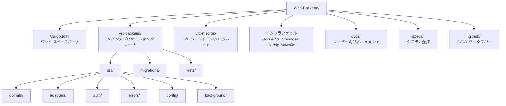
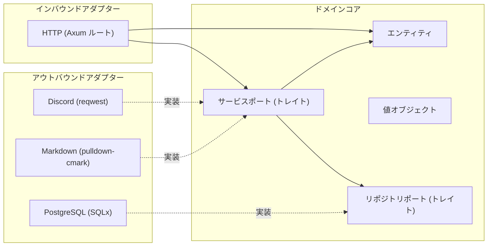

# プロジェクト構成

> **ナビゲーション**: [ドキュメントホーム](../README.md) > [開発](README.md) > プロジェクト構成

VRC Web-Backend コードベースの完全なディレクトリツリーとアーキテクチャ解説です。

## ディレクトリ概要



## 完全なディレクトリツリー

```
Web-Backend/
├── Cargo.toml                    # ワークスペースマニフェスト（メンバー、リリースプロファイル）
├── Cargo.lock                    # 固定された依存バージョン
├── Caddyfile                     # Caddy リバースプロキシ設定
├── docker-compose.yml            # 開発環境（PostgreSQL）
├── docker-compose.prod.yml       # 本番スタック（app + postgres + caddy）
├── Dockerfile                    # マルチステージビルド（cargo-chef + bookworm-slim）
├── Makefile                      # タスクランナー（build, test, lint, db, docker）
├── .env.example                  # 環境変数テンプレート
├── LICENSE                       # プロジェクトライセンス
├── README.md                     # プロジェクト概要とクイックスタート
├── CONTRIBUTING.md               # コントリビューションガイドライン
├── SECURITY.md                   # セキュリティポリシーと報告
├── CHANGELOG.md                  # バージョン履歴
├── CODE_OF_CONDUCT.md            # コミュニティガイドライン
│
├── vrc-backend/                  # ─── メインアプリケーションクレート ───
│   ├── Cargo.toml                # 依存関係: axum, sqlx, tower, tokio 等
│   │
│   ├── migrations/               # SQLx データベースマイグレーション（起動時自動実行）
│   │   ├── 20250101000000_initial_schema.sql        # コアテーブル
│   │   ├── 20250102000000_add_updated_at_columns.sql # 監査タイムスタンプ
│   │   ├── 20250103000000_performance_indexes.sql    # クエリ最適化
│   │   └── 20250104000000_spec_compliance.sql        # 仕様整合性
│   │
│   ├── src/
│   │   ├── main.rs               # エントリポイント: 設定 → DI → サーバー起動
│   │   ├── lib.rs                # AppState 定義、モジュール再エクスポート
│   │   │
│   │   ├── config/               # アプリケーション設定
│   │   │   └── mod.rs            # AppConfig: 環境変数読み取り、設定バリデーション
│   │   │
│   │   ├── domain/               # ── ビジネスロジック（外部依存なし）──
│   │   │   ├── entities/         # コアデータ構造
│   │   │   │   ├── user.rs       # User エンティティ
│   │   │   │   ├── profile.rs    # ユーザープロファイル
│   │   │   │   ├── event.rs      # Event エンティティ
│   │   │   │   ├── club.rs       # Club エンティティ
│   │   │   │   ├── gallery.rs    # Gallery エンティティ
│   │   │   │   ├── report.rs     # Report エンティティ
│   │   │   │   └── session.rs    # Session エンティティ
│   │   │   ├── value_objects/    # ドメイン値型
│   │   │   │   ├── page_request.rs   # ページネーションリクエスト
│   │   │   │   └── page_response.rs  # ページネーションレスポンス
│   │   │   └── ports/            # インターフェース（トレイト定義）
│   │   │       ├── repositories/ # データアクセストレイト
│   │   │       │   ├── user_repository.rs
│   │   │       │   ├── profile_repository.rs
│   │   │       │   ├── event_repository.rs
│   │   │       │   ├── club_repository.rs
│   │   │       │   ├── gallery_repository.rs
│   │   │       │   ├── report_repository.rs
│   │   │       │   └── session_repository.rs
│   │   │       └── services/     # ビジネスロジックサービストレイト
│   │   │
│   │   ├── adapters/             # ── インターフェースアダプター ──
│   │   │   ├── inbound/          # 駆動アダプター（HTTP）
│   │   │   │   ├── routes/       # API サーフェスごとのルートハンドラ
│   │   │   │   │   ├── public.rs     # パブリック API（認証不要）
│   │   │   │   │   ├── internal.rs   # 内部 API（認証済み）
│   │   │   │   │   ├── system.rs     # システム API（管理者）
│   │   │   │   │   ├── auth.rs       # 認証 API（Discord OAuth2）
│   │   │   │   │   ├── admin.rs      # 管理者エンドポイント
│   │   │   │   │   ├── health.rs     # ヘルスチェック
│   │   │   │   │   └── metrics.rs    # Prometheus メトリクス
│   │   │   │   ├── middleware/   # Tower ミドルウェア
│   │   │   │   │   ├── csrf.rs           # CSRF 保護
│   │   │   │   │   ├── rate_limit.rs     # レート制限（governor）
│   │   │   │   │   ├── metrics.rs        # リクエストメトリクス収集
│   │   │   │   │   ├── security_headers.rs # セキュリティヘッダー
│   │   │   │   │   └── request_id.rs     # リクエスト ID 伝播
│   │   │   │   └── extractors/  # Axum エクストラクター
│   │   │   │       ├── validated_json.rs  # バリデーション付き JSON ボディ
│   │   │   │       └── validated_query.rs # バリデーション付きクエリパラメータ
│   │   │   └── outbound/         # 被駆動アダプター（外部サービス）
│   │   │       ├── postgres/     # SQLx リポジトリ実装
│   │   │       │   ├── user_repo.rs
│   │   │       │   ├── profile_repo.rs
│   │   │       │   ├── event_repo.rs
│   │   │       │   ├── club_repo.rs
│   │   │       │   ├── gallery_repo.rs
│   │   │       │   ├── report_repo.rs
│   │   │       │   └── session_repo.rs
│   │   │       ├── discord/      # Discord 連携
│   │   │       │   ├── oauth2.rs     # OAuth2 クライアント
│   │   │       │   └── webhook.rs    # Webhook 送信
│   │   │       └── markdown/     # Markdown 処理
│   │   │           └── mod.rs    # pulldown-cmark レンダリング + ammonia サニタイズ
│   │   │
│   │   ├── auth/                 # 認証・認可
│   │   │   └── mod.rs            # 型状態ロールシステム、AuthenticatedUser エクストラクター
│   │   │
│   │   ├── errors/               # エラー型
│   │   │   └── mod.rs            # DomainError、ApiError、InfraError
│   │   │
│   │   └── background/           # バックグラウンドタスク
│   │       └── mod.rs            # セッションクリーンアップ、イベントアーカイブスケジューラ
│   │
│   └── tests/                    # 結合テスト
│       └── ...
│
├── vrc-macros/                   # ─── プロシージャルマクロクレート ───
│   ├── Cargo.toml                # proc-macro = true
│   └── src/
│       └── lib.rs                # #[handler], #[derive(Validate)], #[derive(ErrorCode)]
│
├── docs/                         # ─── ユーザー向けドキュメント ───
│   ├── README.md                 # ドキュメントハブ
│   ├── en/                       # 英語ドキュメント
│   └── ja/                       # 日本語ドキュメント
│
├── specs/                        # ─── システム仕様 ───
│   ├── 01-requirements/          # 機能要件、非機能要件、制約
│   ├── 02-architecture/          # C4 ダイアグラム、ADR
│   ├── 03-technology/            # 技術スタック決定
│   ├── 04-database/              # スキーマ、マイグレーション、クエリ
│   ├── 05-api/                   # API 設計（REST エンドポイント）
│   ├── 06-security/              # 脅威モデル、認証設計
│   ├── 07-infrastructure/        # Docker、CI/CD、オブザーバビリティ
│   ├── 12-formal-verification/   # Kani 証明、正しさパターン
│   ├── 13-testing/               # テスト戦略
│   └── 15-project-management/    # マイルストーン、リスク、ワークフロー
│
└── target/                       # ─── ビルド出力（git 無視）───
    ├── debug/                    # デバッグビルド成果物
    ├── release/                  # リリースビルド成果物
    └── sqlx-prepare-check/       # SQLx オフラインクエリメタデータ
```

## アーキテクチャレイヤー

プロジェクトは**ヘキサゴナルアーキテクチャ**（ポートとアダプター）パターンに従います。ビジネスロジックとインフラ関心事を分離します。



### レイヤールール

| レイヤー | ディレクトリ | 依存可能 | 依存禁止 |
|---------|------------|---------|---------|
| **ドメイン** | `domain/` | なし（純粋な Rust、std のみ） | `adapters/`、`config/`、外部クレート |
| **ポート** | `domain/ports/` | ドメインエンティティ、値オブジェクト | いかなるアダプター実装 |
| **インバウンドアダプター** | `adapters/inbound/` | ドメイン、ポート | アウトバウンドアダプター直接 |
| **アウトバウンドアダプター** | `adapters/outbound/` | ドメイン、ポート | インバウンドアダプター |
| **認証** | `auth/` | ドメインエンティティ | アダプター内部 |
| **エラー** | `errors/` | ドメインエンティティ | アダプター内部 |
| **設定** | `config/` | なし | ドメイン、アダプター |

**ドメインレイヤー**は外部依存ゼロ — Rust の標準ライブラリのみを使用します。全ての外部インタラクション（データベース、HTTP クライアント等）は `domain/ports/` の**ポートトレイト**で抽象化されます。`adapters/outbound/` のアダプターがこれらのトレイトを実装します。

### 依存性注入

`main.rs` が全てを組み立てます:

1. 設定を読み込み（`AppConfig`）
2. データベースプールを作成（`PgPool`）
3. 具象アダプター実装を構築
4. 全依存関係を含む `AppState` をビルド
5. ルート、ミドルウェア、ステートで Axum ルーターを構築
6. Tokio ランタイムと Axum サーバーを起動

## vrc-macros クレート

`vrc-macros` クレートは別のワークスペースメンバーです。Rust ではプロシージャルマクロは専用クレート（`proc-macro = true`）に配置する必要があるためです。

### 提供されるマクロ

| マクロ | 種別 | 目的 |
|-------|------|------|
| `#[handler]` | アトリビュート | Axum ハンドラを標準的なエラーハンドリングとロギングでラップ |
| `#[derive(Validate)]` | Derive | フィールド属性からバリデーションロジックを生成 |
| `#[derive(ErrorCode)]` | Derive | エラー enum バリアントの構造化 API エラーコードを生成 |

これらのマクロにより、ルートハンドラとエラー定義のボイラープレートが削減されます。`vrc-backend` クレートはワークスペース依存として `vrc-macros` に依存します。

## 主要ファイル

| ファイル | 目的 |
|---------|------|
| `vrc-backend/src/main.rs` | サーバーエントリポイント、設定読込、DI セットアップ |
| `vrc-backend/src/lib.rs` | `AppState` 構造体、モジュールツリー再エクスポート |
| `vrc-backend/src/config/mod.rs` | `AppConfig` — 環境変数から全設定を読み取り |
| `vrc-backend/src/auth/mod.rs` | 型状態ロールシステム、`AuthenticatedUser` Axum エクストラクター |
| `vrc-backend/src/errors/mod.rs` | 統一エラー階層: `DomainError` → `ApiError` → HTTP レスポンス |
| `Cargo.toml` | ワークスペース定義、リリースプロファイル最適化 |
| `Dockerfile` | 本番イメージビルド（4ステージ、cargo-chef） |
| `Makefile` | 開発者タスクランナー（全共通コマンド） |

## 関連ドキュメント

- [セットアップガイド](setup.md) — コードベースの起動手順
- [ビルドシステム](build.md) — コンパイルと Docker ビルド
- [テストガイド](testing.md) — テストの場所と実行方法
- [CI/CD](ci-cd.md) — 自動化パイプライン
- [アーキテクチャ概要](../architecture/README.md) — ハイレベルシステム設計
