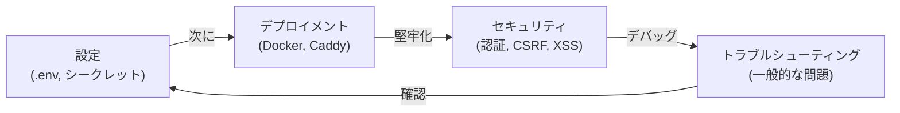

# ガイド

> **対象読者**: ユーザー、オペレーター、コントリビューター
>
> **ナビゲーション**: [ドキュメントホーム](../README.md) > ガイド

## 概要

VRC Web-Backend の設定、デプロイ、セキュリティ強化、トラブルシューティングのための実践的でタスク指向のガイドです。

## ガイドインデックス

| ガイド | 対象読者 | 説明 |
|-------|---------|------|
| [設定](configuration.md) | ユーザー/Ops | 環境変数、シークレット、起動時バリデーション |
| [デプロイメント](deployment.md) | Ops | Proxmox VM 上の Docker による本番デプロイ |
| [セキュリティ](security.md) | Ops/セキュリティ | セキュリティモデル、堅牢化、OWASP 対策 |
| [トラブルシューティング](troubleshooting.md) | 全員 | 一般的な問題の症状、原因、解決策 |

## クイックリファレンス

### やりたいこと別ガイド

| タスク | ガイド | セクション |
|-------|-------|----------|
| 環境変数の設定 | [設定](configuration.md) | 必須変数 |
| シークレットの生成 | [設定](configuration.md) | シークレット生成 |
| 本番環境へのデプロイ | [デプロイメント](deployment.md) | デプロイ手順 |
| SSL/TLS の設定 | [デプロイメント](deployment.md) | Caddy 設定 |
| セキュリティモデルの理解 | [セキュリティ](security.md) | 概要 |
| ログインエラーの修正 | [トラブルシューティング](troubleshooting.md) | 認証問題 |
| ビルドエラーの修正 | [トラブルシューティング](troubleshooting.md) | ビルド問題 |

## 関連ドキュメント

- [アーキテクチャ概要](../architecture/README.md) — システム構造
- [設計原則](../design/principles.md) — 設計の理由
- [API リファレンス](../reference/api/README.md) — エンドポイントドキュメント
