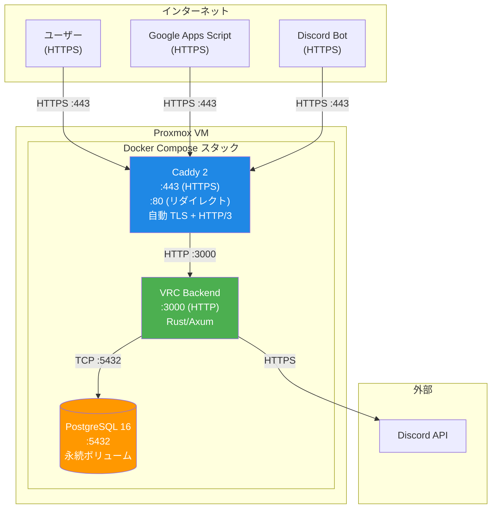

# デプロイメントガイド

> **対象読者**: オペレーター
>
> **ナビゲーション**: [ドキュメントホーム](../README.md) > [ガイド](README.md) > デプロイメント

## 概要

VRC Web-Backend は単一の Proxmox VM 上で Docker Compose スタックとして実行されます。本番スタックは3つのサービスで構成: Rust バックエンド、PostgreSQL、Caddy（自動 TLS 付きリバースプロキシ）。

## デプロイメントトポロジー



## 前提条件

- Proxmox VM（または任意の Linux サーバー）:
  - Docker Engine ≥ 24.0
  - Docker Compose ≥ 2.20
  - 2GB 以上の RAM
  - 20GB 以上のディスク
- サーバーの IP アドレスを指すドメイン名
- Discord アプリケーション設定済み（[設定ガイド](configuration.md)参照）

## シークレット管理

シークレットディレクトリを作成しシークレットを生成:

```bash
mkdir -p secrets

# データベースパスワード
openssl rand -base64 32 > secrets/db_password.txt

# セッションシークレット（最低64文字の16進文字列）
openssl rand -hex 64 > secrets/session_secret.txt

# システム API トークン（最低64文字の16進文字列）
openssl rand -hex 64 > secrets/system_api_token.txt

# パーミッション制限
chmod 600 secrets/*.txt
```

> **重要**: `secrets/` ディレクトリはバージョン管理にコミットしないでください。`.gitignore` に追加してください。

## デプロイ手順

### 初回デプロイ

```bash
# 1. リポジトリのクローン
git clone <repo-url> /opt/vrc-backend
cd /opt/vrc-backend

# 2. シークレット作成
mkdir -p secrets
openssl rand -base64 32 > secrets/db_password.txt
openssl rand -hex 64 > secrets/session_secret.txt
openssl rand -hex 64 > secrets/system_api_token.txt
chmod 600 secrets/*.txt

# 3. Discord 認証情報の .env ファイル作成
cat > .env << 'EOF'
DISCORD_CLIENT_ID=your_client_id
DISCORD_CLIENT_SECRET=your_client_secret
DISCORD_GUILD_ID=your_guild_id
DISCORD_REDIRECT_URI=https://api.your-domain.com/api/v1/auth/callback
FRONTEND_ORIGIN=https://your-domain.com
EOF

# 4. ビルドと起動
docker compose -f docker-compose.prod.yml build
docker compose -f docker-compose.prod.yml up -d

# 5. データベースマイグレーション実行
docker compose -f docker-compose.prod.yml exec app ./vrc-backend migrate

# 6. ヘルスチェック
curl -s https://api.your-domain.com/api/v1/public/health | jq .
```

### アップデート（以降のデプロイ）

```bash
cd /opt/vrc-backend

# 1. 最新コードを pull
git pull origin main

# 2. リビルドと再起動
docker compose -f docker-compose.prod.yml build
docker compose -f docker-compose.prod.yml up -d

# 3. 新しいマイグレーション実行
docker compose -f docker-compose.prod.yml exec app ./vrc-backend migrate

# 4. ヘルスチェック
curl -s https://api.your-domain.com/api/v1/public/health | jq .
```

## Caddy 設定

Caddyfile で自動 TLS、HTTP/3、リバースプロキシを構成:

```caddyfile
api.your-domain.com {
    reverse_proxy app:3000

    header {
        -Server
    }

    log {
        output file /var/log/caddy/access.log
    }
}
```

Caddy は自動的に:
- Let's Encrypt 経由で TLS 証明書を取得・更新
- HTTP を HTTPS にリダイレクト
- HTTP/3 (QUIC) を有効化
- TLS 終端を処理

## 関連ドキュメント

- [設定ガイド](configuration.md) — 環境変数とシークレット
- [セキュリティガイド](security.md) — セキュリティ強化
- [CI/CD](../development/ci-cd.md) — 自動化パイプライン
- [トラブルシューティング](troubleshooting.md) — デプロイ問題
