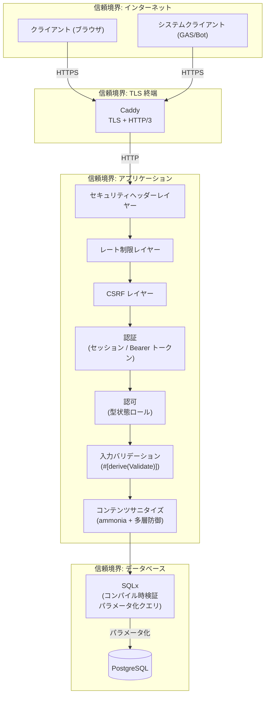
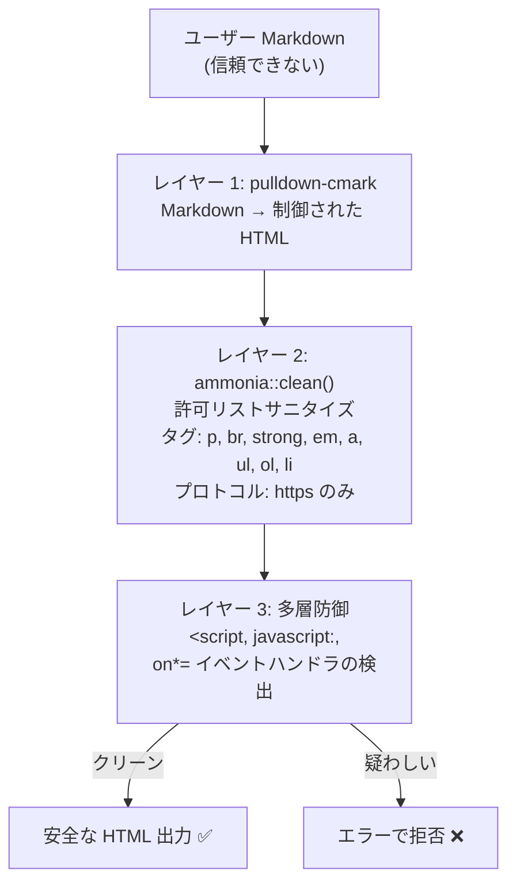

# セキュリティガイド

> **対象読者**: オペレーター、セキュリティレビューアー
>
> **ナビゲーション**: [ドキュメントホーム](../README.md) > [ガイド](README.md) > セキュリティ

## 概要

VRC Web-Backend は多層防御セキュリティモデルを実装しており、複数の重複するレイヤーで構成されています。単一のメカニズムを単独で信頼せず、各レイヤーは前のレイヤーが失敗した可能性を想定します。

## セキュリティモデル

## 認証

### Discord OAuth2 フロー

認証は HMAC-SHA256 署名 state トークンによる CSRF 保護付き Discord OAuth2 を使用。

**state トークンのセキュリティ:**
- `SESSION_SECRET` で HMAC-SHA256 署名 — 偽造不可
- タイムスタンプ含有 — 期限切れ state を拒否（リプレイ攻撃防止）
- ランダム nonce 含有 — 一意性を保証

### セッション管理

| プロパティ | 実装 |
|----------|------|
| トークン生成 | `rand::OsRng` による256ビット暗号学的ランダム |
| トークン保存 | `sessions` テーブルに SHA-256 ハッシュ — 生トークンは永続化されない |
| トークン比較 | SHA-256 ハッシュ + `subtle::ConstantTimeEq`（タイミング安全） |
| Cookie 属性 | `HttpOnly`, `Secure`, `SameSite=Lax`, `Path=/` |
| セッション有効期間 | `SESSION_MAX_AGE_HOURS` で設定可能（デフォルト: 168時間 / 7日） |
| 失効 | 即座 — `sessions` テーブルから行を削除 |

## 認可

### 型状態強制による RBAC

ファントム型パラメータを使用してコンパイル時にロールを強制:

| ロール | レベル | 権限 |
|-------|-------|------|
| **Member** | 1 | 公開コンテンツ閲覧、自身のプロファイル編集 |
| **Staff** | 2 | Member + イベント管理 |
| **Admin** | 3 | Staff + ユーザー管理、アカウント停止 |
| **SuperAdmin** | 4 | Admin + システム設定 |

### 権限マトリクス

| アクション | Member | Staff | Admin | SuperAdmin |
|----------|--------|-------|-------|------------|
| 公開コンテンツ閲覧 | ✅ | ✅ | ✅ | ✅ |
| 自身のプロファイル編集 | ✅ | ✅ | ✅ | ✅ |
| イベント作成/編集 | ❌ | ✅ | ✅ | ✅ |
| ユーザー管理 | ❌ | ❌ | ✅ | ✅ |
| アカウント停止 | ❌ | ❌ | ✅ | ✅ |
| ロール変更 | ❌ | ❌ | ❌ | ✅ |

## 入力バリデーション

すべてのユーザー入力はドメインロジックに到達する前に `#[derive(Validate)]` カスタムマクロでバリデーション:

| フィールド型 | ルール |
|------------|-------|
| 表示名 | 1-100文字、トリミング |
| バイオ/説明 | 最大2000文字、サニタイズ |
| URL | HTTPS のみ、最大512文字 |
| ID | UUID フォーマット |
| ページネーション | Page ≥ 1, per_page 1-100 |

## XSS 防止

### 多層サニタイズ

ユーザー生成コンテンツは3つの独立したレイヤーを通過:

## CSRF 保護

### Origin ヘッダーバリデーション

すべての変更リクエスト（POST, PUT, PATCH, DELETE）で `Origin` ヘッダーを検証:

| 条件 | 結果 |
|-----|------|
| Origin が `FRONTEND_ORIGIN` に一致 | リクエスト続行 |
| Origin が不一致 | `403 Forbidden` (ERR-CSRF-001) |
| Origin ヘッダーなし（変更リクエスト） | `403 Forbidden` (ERR-CSRF-001) |
| GET/HEAD/OPTIONS リクエスト | CSRF チェックスキップ |

## レート制限

### ティア別設定

| ティア | ルート | 制限 | キー | 目的 |
|-------|-------|------|-----|------|
| Public | `/api/v1/public/*` | 60/分 | IP アドレス | スクレイピング防止 |
| Internal | `/api/v1/internal/*` | 120/分 | ユーザー ID | 悪用防止 |
| System | `/api/v1/system/*` | 30/分 | Bearer トークン | 暴走同期防止 |
| Auth | `/api/v1/auth/*` | 10/分 | IP アドレス | ブルートフォース防止 |

## セキュリティヘッダー

すべてのレスポンスに6つのセキュリティヘッダーを追加:

| ヘッダー | 値 | 目的 |
|---------|-----|------|
| `Strict-Transport-Security` | `max-age=63072000; includeSubDomains; preload` | 2年間 HTTPS を強制 |
| `X-Content-Type-Options` | `nosniff` | MIME タイプスニッフィング防止 |
| `X-Frame-Options` | `DENY` | クリックジャッキング防止 |
| `Referrer-Policy` | `strict-origin-when-cross-origin` | リファラー漏洩制御 |
| `Permissions-Policy` | `camera=(), microphone=(), geolocation=()` | 不要なブラウザ機能を無効化 |
| `Content-Security-Policy` | `default-src 'self'; ...` | インラインスクリプト防止、リソース読込制限 |

## 関連ドキュメント

- [設定ガイド](configuration.md) — セキュリティ関連の設定
- [トラブルシューティング](troubleshooting.md) — セキュリティ問題のデバッグ
- [ADR-0006: Discord 専用認証](../design/adr/0006-discord-only-authentication.md)
- [ADR-0007: サーバーサイドセッション](../design/adr/0007-server-side-sessions.md)
- [アーキテクチャ概要](../architecture/README.md)
