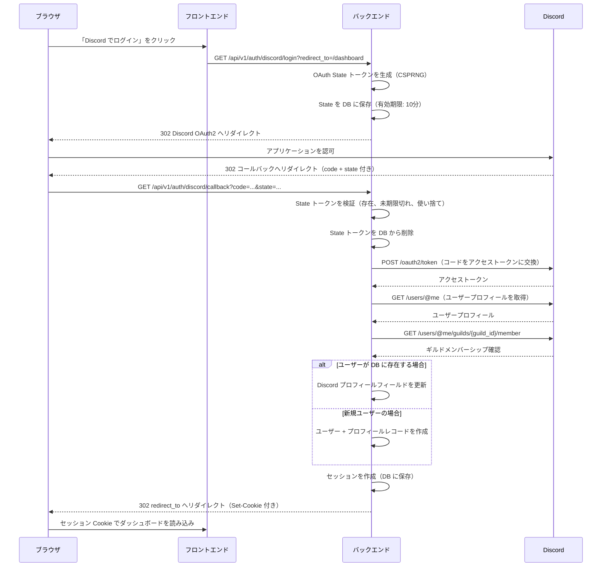

# Auth API リファレンス

> **ナビゲーション**: [ドキュメントホーム](../../README.md) > [リファレンス](../README.md) > [API](README.md) > Auth API

Auth API は Discord OAuth2 認証を処理します。これらのエンドポイントは認証不要で、不正利用防止のため **IP あたり 10リクエスト/分** でレート制限されています。

---

## OAuth2 フロー



---

## エンドポイント

### ログインの開始

```
GET /api/v1/auth/discord/login
```

Discord OAuth2 認可フローを開始します。暗号学的に安全な State トークンを生成し、Discord の認可ページにユーザーをリダイレクトします。

**クエリパラメータ**

| パラメータ | 型 | デフォルト | 説明 |
|-----------|-----|----------|------|
| `redirect_to` | string | `/` | ログイン成功後にリダイレクトする URL パス。`/` で始まる相対パスであること。 |

**リダイレクトバリデーション**

`redirect_to` パラメータはオープンリダイレクト攻撃を防止するため検証されます：
- `/` で始まること
- `//` を含まないこと（プロトコル相対 URL の禁止）
- `@` を含まないこと（URL 内の認証情報の禁止）
- 同一オリジンのパスのみ受け付け

**レスポンス** `302 Found`

Discord の OAuth2 認可 URL にリダイレクトします：

```
https://discord.com/oauth2/authorize?
  client_id={DISCORD_CLIENT_ID}&
  redirect_uri={BACKEND_BASE_URL}/api/v1/auth/discord/callback&
  response_type=code&
  scope=identify+guilds.members.read&
  state={generated_state_token}
```

**エラーコード**

| コード | ステータス | 原因 |
|-------|-----------|------|
| `ERR-AUTH-001` | 302（リダイレクト） | ログイン開始に失敗。エラー付きでフロントエンドにリダイレクト |
| `ERR-RATELIMIT-001` | 429 | レート制限超過 |

---

### OAuth2 コールバック

```
GET /api/v1/auth/discord/callback
```

Discord OAuth2 コールバックを処理します。State トークンを検証し、認可コードをアクセストークンに交換し、ユーザープロフィールを取得し、セッションの作成/更新を行います。

**クエリパラメータ**

| パラメータ | 型 | 説明 |
|-----------|-----|------|
| `code` | string | Discord からの認可コード |
| `state` | string | CSRF 検証用の State トークン |

**State トークンのセキュリティ**

State トークンは CSRF およびリプレイ攻撃に対する保護を提供します：

1. **CSPRNG で生成** — 暗号学的に安全なランダムバイト
2. **データベースに保存** — Cookie や URL には保存しない（クライアント側の改ざんを防止）
3. **時間制限あり** — 10分後に期限切れ
4. **使い捨て** — 検証後すぐに削除
5. **セッションに紐付け** — 異なるログイン試行間で再利用不可

**レスポンス** `302 Found`

成功時、セッション Cookie を設定してフロントエンド URL（元の `redirect_to` パラメータ）にリダイレクトします：

```
Set-Cookie: session_id=<opaque_token>; HttpOnly; Secure; SameSite=Lax; Path=/; Max-Age=604800
```

失敗時、エラークエリパラメータ付きでフロントエンドにリダイレクトします：

```
{FRONTEND_ORIGIN}/auth/error?code=ERR-AUTH-002
```

**Cookie の動作**

| 属性 | 値 | 説明 |
|------|-----|------|
| `HttpOnly` | `true` | JavaScript からアクセス不可 |
| `Secure` | `COOKIE_SECURE` で設定 | 本番環境では `true`（HTTPS のみ） |
| `SameSite` | `Lax` | トップレベルナビゲーションと同一サイトリクエストで送信 |
| `Path` | `/` | すべてのパスで利用可能 |
| `Max-Age` | `SESSION_MAX_AGE_SECS` | デフォルト: 604800（7日間） |

**エラーコード**

| コード | ステータス | 原因 |
|-------|-----------|------|
| `ERR-AUTH-001` | 302（リダイレクト） | OAuth コード交換またはユーザー取得に失敗 |
| `ERR-AUTH-002` | 302（リダイレクト） | State トークンが欠落、期限切れ、または使用済み |
| `ERR-RATELIMIT-001` | 429 | レート制限超過 |

---

## セッションライフサイクル

1. **作成** — OAuth2 コールバック成功後にデータベースにセッションが作成される
2. **使用** — Cookie 内のセッション ID が各 Internal API リクエストで検証される
3. **期限切れ** — セッションは `SESSION_MAX_AGE_SECS`（デフォルト: 7日間）後に期限切れ
4. **クリーンアップ** — バックグラウンドタスクが `SESSION_CLEANUP_INTERVAL_SECS`（デフォルト: 1時間）ごとに期限切れセッションを削除
5. **ログアウト** — `POST /api/v1/internal/auth/logout` でセッションを即座に破棄

---

## 関連ドキュメント

- [API 概要](README.md) — 認証方式の概要
- [Internal API](internal.md) — セッション認証を使用するエンドポイント
- [設定リファレンス](../configuration.md) — セッションと Cookie の設定
- [エラーカタログ](../errors.md) — 全エラーコードのリファレンス
