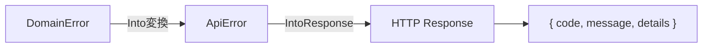

# エラーカタログ

> **ナビゲーション**: [ドキュメントホーム](../README.md) > [リファレンス](README.md) > エラー

本システムで発生する全エラーコードの詳細リファレンスです。各エラーにはユニークなコードが割り当てられており、ログやレスポンスからの原因特定に利用できます。

## エラー変換フロー

ドメインエラーが HTTP レスポンスに変換されるまでの流れです:



1. ビジネスロジック層で `DomainError` が発生
2. `From<DomainError> for ApiError` により `ApiError` に自動変換
3. axum の `IntoResponse` トレイト実装により JSON レスポンスとして返却

## レスポンス形式

全てのエラーレスポンスは以下の JSON 形式で返されます:

```json
{
  "code": "ERR-XXXX-NNN",
  "message": "人間が読めるエラーメッセージ",
  "details": null
}
```

- `code` — 一意のエラーコード（ログやサポート問い合わせ時に使用）
- `message` — エラーの概要説明
- `details` — 追加情報（バリデーションエラーの場合にフィールド毎の詳細を含む）

---

## プロフィールエラー

| コード | HTTP ステータス | メッセージ | 原因 | 対処法 |
|--------|---------------|----------|------|--------|
| `ERR-PROF-001` | 400 Bad Request | プロフィールのバリデーションに失敗しました | 入力値が制約（文字数上限、必須フィールド等）を満たしていない | `details` フィールドで指摘された項目を修正して再送信してください |
| `ERR-PROF-002` | 400 Bad Request | 危険なコンテンツが検出されました | プロフィール内容に禁止ワードまたは危険パターンが含まれている | コンテンツポリシーに違反する内容を削除してください |
| `ERR-PROF-003` | 404 Not Found | プロフィールが見つかりません | 指定された ID に対応するプロフィールが存在しない | プロフィール ID が正しいか確認してください。先にプロフィールを作成する必要がある場合があります |

## 認証エラー

| コード | HTTP ステータス | メッセージ | 原因 | 対処法 |
|--------|---------------|----------|------|--------|
| `ERR-AUTH-003` | 401 Unauthorized | セッションが無効です | セッションが期限切れ、または無効化されている | 再度ログインしてください |
| `ERR-AUTH-004` | 403 Forbidden | アカウントが停止されています | モデレーションによりアカウントが停止状態にある | 管理者に問い合わせてください |

## CSRF エラー

| コード | HTTP ステータス | メッセージ | 原因 | 対処法 |
|--------|---------------|----------|------|--------|
| `ERR-CSRF-001` | 403 Forbidden | CSRF 検証に失敗しました | CSRF トークンが欠落、または不一致 | ページをリロードしてから再試行してください。Cookie が有効であることを確認してください |

## 権限エラー

| コード | HTTP ステータス | メッセージ | 原因 | 対処法 |
|--------|---------------|----------|------|--------|
| `ERR-PERM-001` | 403 Forbidden | 権限が不足しています | 現在のロールでは要求された操作を実行できない | 必要な権限を持つロールへの昇格を管理者に依頼してください |

## ロールエラー

| コード | HTTP ステータス | メッセージ | 原因 | 対処法 |
|--------|---------------|----------|------|--------|
| `ERR-ROLE-001` | 403 Forbidden | admin ロールが必要です | admin 以上のロールが必要な操作を実行しようとした | admin 権限を持つユーザーで操作してください |
| `ERR-ROLE-002` | 403 Forbidden | super_admin ロールが必要です | super_admin ロールが必要な操作を実行しようとした | super_admin 権限を持つユーザーで操作してください |
| `ERR-ROLE-003` | 403 Forbidden | 自分自身のロールは変更できません | 自身のロールを変更しようとした | 別の管理者にロール変更を依頼してください |
| `ERR-ROLE-004` | 403 Forbidden | 上位ロールのユーザーは変更できません | 自分より上位のロールを持つユーザーの権限を変更しようとした | より上位のロールを持つ管理者に操作を依頼してください |

## モデレーションエラー

| コード | HTTP ステータス | メッセージ | 原因 | 対処法 |
|--------|---------------|----------|------|--------|
| `ERR-MOD-001` | 403 Forbidden | 自分自身を停止することはできません | 自身のアカウントを停止しようとした | 別の管理者に依頼してください |
| `ERR-MOD-002` | 403 Forbidden | 上位ロールのユーザーを停止することはできません | 自分より上位のロールを持つユーザーを停止しようとした | より上位の管理者に操作を依頼してください |
| `ERR-MOD-003` | 400 Bad Request | 不正な停止期間です | 停止期間の指定が無効（過去日付、上限超過等） | 有効な期間を指定してください |

## イベントエラー

| コード | HTTP ステータス | メッセージ | 原因 | 対処法 |
|--------|---------------|----------|------|--------|
| `ERR-EVT-001` | 404 Not Found | イベントが見つかりません | 指定された ID に対応するイベントが存在しない、またはアーカイブ済み | イベント ID が正しいか確認してください |

## クラブエラー

| コード | HTTP ステータス | メッセージ | 原因 | 対処法 |
|--------|---------------|----------|------|--------|
| `ERR-CLUB-001` | 404 Not Found | 部活動が見つかりません | 指定された ID に対応する部活動が存在しない | 部活動 ID が正しいか確認してください |

## ギャラリーエラー

| コード | HTTP ステータス | メッセージ | 原因 | 対処法 |
|--------|---------------|----------|------|--------|
| `ERR-GAL-001` | 404 Not Found | ギャラリー画像が見つかりません | 指定された ID に対応するギャラリー画像が存在しない | 画像 ID が正しいか確認してください |
| `ERR-GAL-002` | 400 Bad Request | ギャラリー画像のバリデーションに失敗しました | 画像 URL またはキャプションが制約を満たしていない | URL 形式とキャプションの文字数制限を確認してください |

## ユーザーエラー

| コード | HTTP ステータス | メッセージ | 原因 | 対処法 |
|--------|---------------|----------|------|--------|
| `ERR-USER-001` | 404 Not Found | ユーザーが見つかりません | 指定された ID に対応するユーザーが存在しない | ユーザー ID が正しいか確認してください |

## System API エラー

| コード | HTTP ステータス | メッセージ | 原因 | 対処法 |
|--------|---------------|----------|------|--------|
| `ERR-SYNC-001` | 401 Unauthorized | System API トークンが無効です | `X-System-Token` ヘッダーのトークンが不正、または欠落 | 正しい `SYSTEM_API_TOKEN` を設定してリクエストを再送してください |
| `ERR-SYNC-002` | 400 Bad Request | 同期データのバリデーションに失敗しました | GAS から送信されたデータ形式が不正 | リクエストボディが API 仕様に準拠しているか確認してください |

## レート制限エラー

| コード | HTTP ステータス | メッセージ | 原因 | 対処法 |
|--------|---------------|----------|------|--------|
| `ERR-RATELIMIT-001` | 429 Too Many Requests | リクエスト制限を超過しました | 短時間に大量のリクエストが送信された | `Retry-After` ヘッダーの値（秒）だけ待ってからリクエストを再送してください |

## その他のエラー

| コード | HTTP ステータス | メッセージ | 原因 | 対処法 |
|--------|---------------|----------|------|--------|
| `ERR-VALIDATION` | 400 Bad Request | リクエストのバリデーションに失敗しました | リクエストのパラメータまたはボディが不正 | `details` フィールドの内容に従って入力を修正してください |
| `ERR-INTERNAL` | 500 Internal Server Error | 内部サーバーエラーが発生しました | 予期しないサーバー内部エラー | 時間をおいて再試行してください。問題が続く場合は管理者に連絡してください |

---

## エラーハンドリングのベストプラクティス

### クライアント側

1. **`code` フィールドでの判定** — HTTP ステータスコードだけでなく、`code` フィールドの値で具体的なエラー種別を判定してください
2. **`details` の活用** — バリデーションエラー（`ERR-VALIDATION`, `ERR-PROF-001` 等）では `details` にフィールド毎のエラー情報が含まれます
3. **リトライ戦略** — `429` や `500` 系エラーにはエクスポネンシャルバックオフによるリトライを実装してください
4. **セッション切れの検知** — `ERR-AUTH-003` を受信したら、ユーザーを再ログインフローに誘導してください

### サーバー管理者

1. **ログ監視** — `ERR-INTERNAL` が頻発する場合はサーバーログを確認してください
2. **レート制限の調整** — `ERR-RATELIMIT-001` が多発する場合はレート制限値の見直しを検討してください
3. **Discord 連携の確認** — 認証エラーが多発する場合は Discord OAuth2 の設定を確認してください

## 関連ドキュメント

- [設定リファレンス](configuration.md)
- [環境変数クイックリファレンス](environment.md)
- [用語集](glossary.md)
